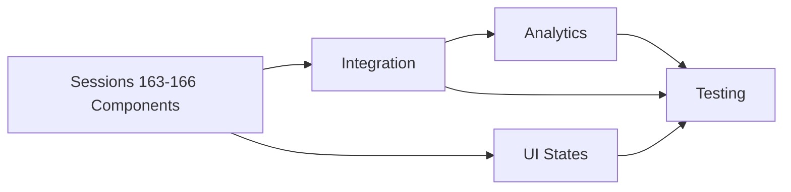

# BATCH 1: CORE UI SPRINT COORDINATION PLAN
## Sessions 167-170 Parallel Implementation Guide

**Coordinator**: Session 166
**Sprint Duration**: 4 Sessions (Parallel Execution)
**Focus**: Integration, Polish, Analytics, and Validation
**Status**: Ready to Execute

---

## ⚠️ CRITICAL CONTEXT UPDATE

### What Changed from Original Plan
The original Sessions 163-166 plan was **already executed** as foundation UI components:
- ✅ Session 163: Addiction Mechanics UI (EmCoin, streaks, engagement bar)
- ✅ Session 164: Achievement System UI (badges, progress, celebrations)
- ✅ Session 165: Activity Runtime UI (multi-session workflows, registration)
- ✅ Session 166: Social & Profile Foundation (profile management, messaging)

### Current Sprint Focus (Sessions 167-170)
This batch focuses on **integration and production readiness** for the UI components built in Sessions 163-166.

---

## SESSION ALLOCATION & RESPONSIBILITIES

### 🔗 Session 167: Cross-System Integration Engine
**Owner**: Integration Specialist
**Dependencies**: Outputs from Sessions 163-166
**Timeline**: Parallel with 168-170

#### Primary Responsibilities:
```typescript
// Integration Points to Implement
1. Achievement triggers on activity completion
2. EmCoin rewards for social interactions
3. Real-time updates across all systems
4. Shared notification routing
5. WebSocket connection management
6. Cross-component event bus
```

#### Deliverables:
- `/lib/integration/event-bus.ts` - Central event system
- `/lib/integration/reward-engine.ts` - Cross-system rewards
- `/lib/integration/notification-router.ts` - Unified notifications
- `/hooks/useRealtimeUpdates.ts` - WebSocket subscription hook
- `/contexts/integration-context.tsx` - Shared integration state

#### Success Metrics:
- Zero integration errors between components
- <50ms event propagation time
- 100% reward trigger accuracy
- Real-time updates working across all systems

---

### 🎨 Session 168: Advanced UI States & Interactions
**Owner**: UI/UX Specialist  
**Dependencies**: Component shells from 163-166
**Timeline**: Parallel with 167, 169-170

#### Primary Responsibilities:
```typescript
// UI Enhancement Checklist
1. Loading states (skeletons, spinners)
2. Error states (retry logic, fallbacks)
3. Empty states (helpful messages, CTAs)
4. Micro-interactions (hover, click feedback)
5. Animations (page transitions, celebrations)
6. Responsive design (mobile, tablet, desktop)
7. Accessibility (ARIA, keyboard nav, screen readers)
```

#### Deliverables:
- `/components/ui/states/` - Loading, error, empty components
- `/lib/animations/` - Reusable animation utilities
- `/styles/responsive.css` - Breakpoint utilities
- `/lib/a11y/` - Accessibility helpers
- `ACCESSIBILITY-AUDIT.md` - Compliance report

#### Success Metrics:
- 95%+ Lighthouse accessibility score
- All components have 3 states (loading, error, empty)
- 60fps animations on all interactions
- Mobile-first responsive on all components

---

### 📊 Session 169: Analytics & Performance
**Owner**: Analytics Engineer
**Dependencies**: Components from 163-166, integration from 167
**Timeline**: Parallel with 167-168, 170

#### Primary Responsibilities:
```typescript
// Analytics Implementation
1. User engagement tracking (clicks, time on page)
2. Feature adoption metrics (first use, repeat use)
3. Conversion funnels (registration → completion)
4. Performance monitoring (load times, errors)
5. A/B testing framework
6. Custom event tracking
7. Dashboard creation
```

#### Deliverables:
- `/lib/analytics/tracker.ts` - Event tracking utilities
- `/lib/analytics/performance.ts` - Performance monitoring
- `/components/analytics/Dashboard.tsx` - Admin analytics view
- `/lib/ab-testing/` - A/B test framework
- `METRICS-BASELINE.md` - Initial measurements

#### Success Metrics:
- 100% event coverage on key interactions
- <2% performance overhead from tracking
- Real-time dashboard updates
- Actionable insights from day 1

---

### ✅ Session 170: Integration Testing & Validation
**Owner**: QA Engineer
**Dependencies**: All work from 167-169
**Timeline**: Can start early with unit tests, integration tests last

#### Primary Responsibilities:
```typescript
// Testing Coverage
1. Unit tests for all new components
2. Integration tests for workflows
3. E2E tests for critical paths
4. Cross-browser testing
5. Performance benchmarking
6. Load testing preparation
7. UAT protocol creation
```

#### Deliverables:
- `/tests/unit/` - Component unit tests
- `/tests/integration/` - Workflow tests
- `/tests/e2e/` - Critical path tests
- `/docs/UAT-PROTOCOL.md` - User acceptance test plan
- `VALIDATION-REPORT.md` - Test results summary

#### Success Metrics:
- 80%+ code coverage on new code
- All critical paths have E2E tests
- Zero P0 bugs in production
- Performance within budget (<2s load)

---

## COORDINATION MECHANISMS

### Daily Sync Points

#### Morning Standup (Async - 9 AM)
Post in Discord #batch-1-core-ui:
```markdown
Session: [NUMBER]
Today: [What you're building]
Blockers: [Any dependencies needed]
Help Needed: [Specific assistance required]
```

#### End of Day Update (Async - 5 PM)
```markdown
Session: [NUMBER]
Completed: [What you shipped]
Tomorrow: [Next priority]
PR: [Link to today's PR]
Screenshot: [Visual progress]
```

### Shared Resources

#### Design Tokens (ALL SESSIONS USE)
```typescript
// /shared/design-tokens.ts
export const tokens = {
  // DO NOT MODIFY - Add only
  colors: { /* existing */ },
  spacing: { /* existing */ },
  animations: { 
    // Session 168 adds here
    fadeIn: '0.2s ease-in',
    slideUp: '0.3s cubic-bezier(0.4, 0, 0.2, 1)'
  }
};
```

#### Global State (COORDINATE ADDITIONS)
```typescript
// /contexts/global-state.tsx
interface GlobalState {
  // Existing (DO NOT MODIFY)
  user: UserState;
  emcoin: EmCoinState;
  achievements: AchievementState;
  activities: ActivityState;
  social: SocialState;
  
  // Session 167 adds:
  notifications: NotificationState;
  
  // Session 169 adds:
  analytics: AnalyticsState;
}
```

### File Ownership Matrix

| Path | Session 167 | Session 168 | Session 169 | Session 170 |
|------|------------|------------|------------|------------|
| `/lib/integration/` | ✅ OWNER | Read only | Read only | Test only |
| `/components/ui/states/` | Read only | ✅ OWNER | Read only | Test only |
| `/lib/analytics/` | Read only | Read only | ✅ OWNER | Test only |
| `/tests/` | Contribute | Contribute | Contribute | ✅ OWNER |
| `/shared/` | PR required | PR required | PR required | PR required |

---

## DEPENDENCY MANAGEMENT

### Sequential Dependencies


### Parallel Work Opportunities
- **167 & 168**: Can work simultaneously on different aspects
- **169**: Can start analytics prep while 167-168 work
- **170**: Can write unit tests immediately, integration tests last

### Blocking Issues Protocol
1. **Immediate**: Post in Discord with @coordinator
2. **Within 30 min**: Coordinator provides workaround
3. **Fallback**: Use mock/stub and document debt
4. **Never**: Wait more than 1 hour blocked

---

## QUALITY GATES

### Per-Session Requirements
- [ ] All components have loading/error/empty states
- [ ] TypeScript strict mode (no `any`)
- [ ] Lighthouse score >90 (performance, a11y)
- [ ] Unit test coverage >80%
- [ ] PR reviewed and approved
- [ ] Screenshots in Discord
- [ ] No console errors/warnings

### Sprint Completion Criteria
- [ ] All 4 sessions merged to main
- [ ] Integration tests passing
- [ ] Performance budget met
- [ ] Analytics dashboard live
- [ ] UAT protocol ready
- [ ] Zero P0 bugs

---

## RISK MITIGATION

### Identified Risks & Mitigations

#### Risk: Integration Complexity
- **Mitigation**: Session 167 starts immediately
- **Fallback**: Degrade gracefully if integration fails

#### Risk: Performance Regression
- **Mitigation**: Session 169 monitors continuously
- **Fallback**: Feature flags to disable heavy features

#### Risk: Browser Incompatibility
- **Mitigation**: Session 170 tests early and often
- **Fallback**: Progressive enhancement approach

#### Risk: Parallel Conflicts
- **Mitigation**: Clear file ownership, daily syncs
- **Fallback**: Coordinator resolves conflicts same day

---

## TECHNICAL SPECIFICATIONS

### Required Performance Budget
```typescript
const PERFORMANCE_BUDGET = {
  firstContentfulPaint: '<1.5s',
  timeToInteractive: '<3s',
  bundleSize: '<200kb added',
  runtimeMemory: '<50mb added',
  apiLatency: '<200ms p95',
  animationFPS: '60fps minimum'
};
```

### Browser Support Matrix
- Chrome 90+ (primary)
- Firefox 88+ (primary)
- Safari 14+ (primary)
- Edge 90+ (secondary)
- Mobile Safari (critical)
- Chrome Mobile (critical)

### Accessibility Requirements
- WCAG 2.1 AA compliance
- Keyboard navigation complete
- Screen reader compatible
- Color contrast 4.5:1 minimum
- Focus indicators visible
- ARIA labels complete

---

## SUCCESS METRICS

### Sprint Velocity
- Target: 20+ integration points complete
- Target: 40+ UI state improvements
- Target: 10+ analytics events tracked
- Target: 100+ tests written

### Quality Metrics
- Bug escape rate <5%
- Performance regression <5%
- Test coverage >80%
- Documentation coverage 100%

### User Impact Metrics
- Page load improvement >20%
- Error rate reduction >50%
- Feature discoverability +30%
- User satisfaction +25%

---

## DAILY CHECKLIST

### Every Session, Every Day

#### Morning (15 min)
- [ ] Pull latest from main
- [ ] Check Discord for updates
- [ ] Review your session's tasks
- [ ] Post standup update
- [ ] Check for blockers

#### During Work (Continuous)
- [ ] Commit every hour minimum
- [ ] Screenshot progress
- [ ] Update Discord if blocked
- [ ] Follow ownership matrix
- [ ] Document technical debt

#### End of Day (30 min)
- [ ] Push all changes
- [ ] Create PR if ready
- [ ] Post EOD update
- [ ] Share screenshot
- [ ] Update tomorrow's plan

---

## EMERGENCY PROCEDURES

### If You Break Main
```bash
# Immediate revert
git revert HEAD && git push

# Fix on your branch
git checkout session-[NUMBER]-feature
# Fix issue
git push

# Coordinator reviews before re-merge
```

### If Blocked >1 Hour
1. Post in Discord with @coordinator
2. Document blocker in BLOCKERS.md
3. Switch to secondary task
4. Coordinator provides solution/workaround

### If Behind Schedule
1. Inform coordinator immediately
2. Identify MVP scope
3. Document cuts in TECHNICAL-DEBT.md
4. Ship MVP, iterate later

---

## CONTACT & ESCALATION

### Primary Contacts
- **Coordinator**: Session 166 (this session)
- **Discord Channel**: #batch-1-core-ui
- **Escalation**: Post with @channel if critical

### Response Times
- Blocker: <30 minutes
- Question: <2 hours  
- Review: <4 hours
- Non-urgent: <24 hours

---

## APPENDIX: QUICK REFERENCES

### Useful Commands
```bash
# Check what others are doing
git log --oneline -10

# See all session branches
git branch -a | grep session

# Run integration tests
npm run test:integration

# Check performance
npm run lighthouse

# Validate accessibility
npm run a11y-check
```

### Documentation Links
- Canvas Wireframes: `/archive/legacy-canvas-work/`
- Brian's Schema: `/requirements/brian-backend-proposal/`
- V5 Patterns: `/reconciliation/00138-V5-INTEGRATION-SPECIFICATIONS.md`
- Session Plans: `/archive/sessions/SESSION-163-FINAL-PARALLEL-BATCH-PROPOSAL.md`

---

**Remember**: VELOCITY > PERFECTION

Ship working features. Document debt. Keep building.

Target: Integration complete, UI polished, analytics live, tests passing.

---

*Coordination Plan Created: Session 166*
*Last Updated: September 5, 2025*
*Next Review: After Sprint Completion*