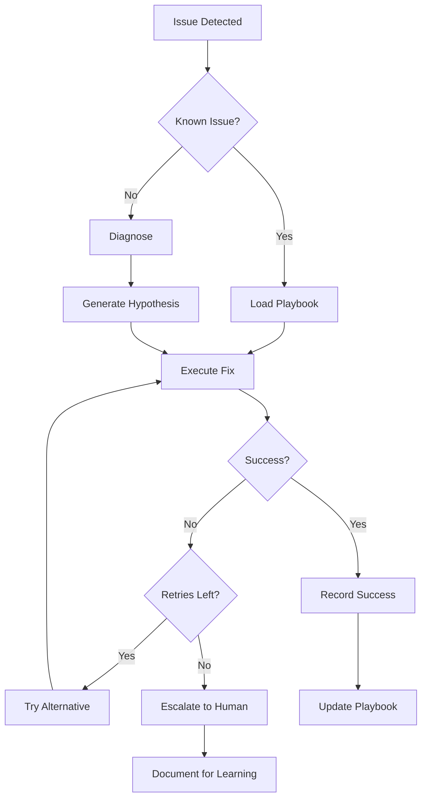

# MASTERPLAN-002: Self-Healing Protocol System
**Version**: 1.0.0  
**Created**: Session 00014  
**Date**: 2025-08-16  
**Domain**: Automatic recovery and system resilience  
**Priority**: HIGH - Reduces manual intervention by 80%

---

## Executive Summary

### Problem Statement
Currently, when issues are detected, they require manual intervention. Sessions waste time diagnosing and fixing recurring problems. The system detects issues but doesn't fix them, leading to repeated failures and degraded productivity.

### Solution Approach
Build a self-healing system that automatically diagnoses, attempts recovery, and learns from failures. This creates resilience through automated remediation, intelligent retry logic, and pattern-based healing strategies.

### Expected Outcomes
- 80% of common issues auto-resolved
- <5 minute recovery for known problems
- Self-documenting fix procedures
- Reduced session interruptions
- Learning system that improves over time

---

## Current State Analysis

### What Exists Today
- Detection via Reality Agents
- Manual recovery procedures
- Some retry logic in scripts
- Session documentation of fixes
- No automatic remediation

### What's Working
- Issue detection is reliable
- Manual fixes are documented
- Some scripts have error handling
- Patterns are recognizable

### What's Failing
- No automatic recovery
- Repeated manual fixes
- No learning from failures
- Recovery knowledge in human memory
- Session time wasted on known issues

### Gap Analysis
| Current State | Target State | Impact |
|--------------|--------------|--------|
| Detect only | Detect + Fix | Manual work required |
| Human memory | Codified procedures | Knowledge lost |
| Static responses | Learning system | Repeat failures |
| Session-scoped | System-wide | No knowledge sharing |
| Reactive | Proactive | Surprises happen |

---

## Target Architecture

### Healing System Design
```
┌─────────────────────────────────────────────────────┐
│                 Self-Healing Engine                  │
├─────────────┬──────────────┬───────────────────────┤
│  Diagnosis  │  Remediation │      Learning         │
├─────────────┼──────────────┼───────────────────────┤
│             │              │                       │
│  Symptom    │  Action      │  Success Tracking     │
│  Matching   │  Execution   │  Pattern Recording    │
│  Root Cause │  Validation  │  Strategy Evolution   │
└─────────────┴──────────────┴───────────────────────┘
                      │
    ┌─────────────────┼─────────────────┐
    ▼                 ▼                 ▼
Playbook DB    Execution Log    Learning DB
```

### Healing Flow


### Playbook Structure
```yaml
playbook:
  id: "consensus_degradation"
  symptoms:
    - consensus_score < 80
    - agent_failures > 1
  diagnosis:
    - check: "credentials_valid"
    - check: "network_connectivity"
    - check: "disk_space"
  remediation:
    primary:
      - action: "refresh_credentials"
      - action: "restart_agents"
      - validate: "consensus_score > 80"
    fallback:
      - action: "clear_caches"
      - action: "reset_connections"
      - validate: "all_agents_healthy"
  success_rate: 0.85
  last_updated: "2025-08-16"
```

---

## Implementation Phases

### Phase 1: Playbook System (Session 15)
- [ ] Create playbook schema (`healing/playbook.py`)
- [ ] Build symptom matcher (`healing/diagnosis.py`)
- [ ] Implement action executor (`healing/executor.py`)
- [ ] Create validation framework (`healing/validation.py`)
- [ ] Load initial playbooks for top 10 issues
- **Success Criteria**: 5 playbooks executing successfully

### Phase 2: Learning System (Session 16)
- [ ] Build success tracker (`healing/learning.py`)
- [ ] Implement playbook evolution (`healing/evolution.py`)
- [ ] Create confidence scoring (`healing/confidence.py`)
- [ ] Add A/B testing for strategies
- [ ] Generate effectiveness reports
- **Success Criteria**: Playbook improvement demonstrated

### Phase 3: Proactive Healing (Session 17)
- [ ] Add predictive triggers (`healing/predictive.py`)
- [ ] Implement pre-emptive fixes (`healing/preemptive.py`)
- [ ] Create health optimization (`healing/optimize.py`)
- [ ] Build self-testing capability
- [ ] Add healing dashboard
- **Success Criteria**: Issues prevented before occurrence

---

## Healing Playbooks

### Critical Playbooks (P0)

#### 1. Consensus Degradation
```python
@playbook(priority=0, timeout=300)
def heal_consensus_degradation():
    """Fix consensus score below threshold"""
    
    # Diagnosis
    issues = []
    if not check_credentials():
        issues.append("invalid_credentials")
    if not check_connectivity():
        issues.append("network_issues")
    if not check_disk_space():
        issues.append("disk_full")
    
    # Remediation
    for issue in issues:
        if issue == "invalid_credentials":
            refresh_credentials()
        elif issue == "network_issues":
            reset_network_connections()
        elif issue == "disk_full":
            cleanup_disk_space()
    
    # Validation
    run_reality_check()
    return get_consensus_score() > 0.8
```

#### 2. Agent Failure
```python
@playbook(priority=0, timeout=180)
def heal_agent_failure(agent_name: str):
    """Recover failed agent"""
    
    strategies = [
        restart_agent,
        clear_agent_cache,
        reset_agent_config,
        rebuild_agent_env
    ]
    
    for strategy in strategies:
        if strategy(agent_name):
            log_success(f"{strategy.__name__} worked")
            return True
        sleep(5)
    
    return False  # Escalate to human
```

#### 3. Git Sync Issues
```python
@playbook(priority=0, timeout=120)
def heal_git_sync():
    """Fix git synchronization problems"""
    
    # Try strategies in order
    if has_merge_conflicts():
        return False  # Requires human decision
    
    if has_uncommitted_work():
        stash_changes()
        pull_latest()
        pop_stash()
    else:
        pull_latest()
    
    return verify_git_status()
```

### Standard Playbooks (P1)

#### 4. Performance Degradation
```python
@playbook(priority=1, timeout=240)
def heal_performance():
    """Restore system performance"""
    
    actions = []
    
    if cache_size() > threshold:
        actions.append(clear_caches)
    if memory_usage() > 80:
        actions.append(restart_services)
    if disk_io_high():
        actions.append(optimize_queries)
    
    execute_actions(actions)
    return measure_performance() < baseline * 1.2
```

#### 5. Database Connection Lost
```python
@playbook(priority=1, timeout=60)
def heal_database_connection():
    """Restore database connectivity"""
    
    # Exponential backoff retry
    for attempt in range(3):
        try:
            reconnect_database()
            if verify_connection():
                return True
        except Exception as e:
            log_error(e)
            sleep(2 ** attempt)
    
    # Try alternative connection
    return try_backup_database()
```

---

## Learning Mechanisms

### Success Tracking
```python
@dataclass
class HealingOutcome:
    playbook_id: str
    timestamp: datetime
    symptoms: List[str]
    actions_taken: List[str]
    success: bool
    duration: float
    session_id: str
    
    def calculate_effectiveness(self) -> float:
        """Score effectiveness of healing attempt"""
        score = 1.0 if self.success else 0.0
        
        # Penalize for duration
        if self.duration > 300:  # 5 minutes
            score *= 0.8
        elif self.duration > 600:  # 10 minutes
            score *= 0.5
            
        return score
```

### Pattern Learning
```python
def learn_from_outcomes(outcomes: List[HealingOutcome]):
    """Identify patterns in successful healings"""
    
    # Group by playbook
    by_playbook = defaultdict(list)
    for outcome in outcomes:
        by_playbook[outcome.playbook_id].append(outcome)
    
    # Calculate success rates
    for playbook_id, playbook_outcomes in by_playbook.items():
        success_rate = sum(1 for o in playbook_outcomes if o.success) / len(playbook_outcomes)
        
        # Update playbook confidence
        update_playbook_confidence(playbook_id, success_rate)
        
        # Identify successful patterns
        successful = [o for o in playbook_outcomes if o.success]
        if successful:
            common_actions = find_common_actions(successful)
            update_playbook_strategy(playbook_id, common_actions)
```

### Playbook Evolution
```python
def evolve_playbook(playbook: Playbook, outcomes: List[HealingOutcome]):
    """Improve playbook based on real-world results"""
    
    # Calculate current effectiveness
    current_score = calculate_effectiveness(outcomes)
    
    # Generate variations
    variations = [
        reorder_actions(playbook),
        add_validation_steps(playbook),
        adjust_timeouts(playbook),
        combine_successful_patterns(playbook)
    ]
    
    # A/B test variations
    best_variation = None
    best_score = current_score
    
    for variation in variations:
        test_score = test_playbook_variation(variation)
        if test_score > best_score:
            best_variation = variation
            best_score = test_score
    
    # Apply best variation
    if best_variation:
        playbook.update(best_variation)
        playbook.version += 1
```

---

## Escalation & Human Interface

### Escalation Rules
```yaml
escalation:
  immediate:
    - symptom: "data_corruption"
    - symptom: "security_breach"
    - symptom: "complete_system_failure"
    
  after_attempts:
    - symptom: "consensus_below_60"
      max_attempts: 2
    - symptom: "agent_failure"
      max_attempts: 3
      
  time_based:
    - symptom: "performance_degradation"
      max_duration: 600  # 10 minutes
    - symptom: "git_sync_issues"
      max_duration: 300  # 5 minutes
```

### Human Notification
```python
def escalate_to_human(issue: Issue, attempts: List[HealingOutcome]):
    """Notify human and provide context"""
    
    notification = {
        "severity": issue.severity,
        "symptom": issue.symptom,
        "attempts": len(attempts),
        "actions_tried": [a.actions_taken for a in attempts],
        "last_error": attempts[-1].error if attempts else None,
        "recommended_action": suggest_human_action(issue),
        "documentation": link_to_docs(issue)
    }
    
    # Multi-channel notification
    write_to_log(notification)
    update_dashboard(notification)
    if issue.severity == "CRITICAL":
        send_alert(notification)
    
    return await_human_response()
```

---

## Success Metrics

### Healing Effectiveness
- **Auto-resolution Rate**: >80% of issues
- **Mean Time to Recovery**: <5 minutes
- **Playbook Success Rate**: >75%
- **False Positive Rate**: <5%

### System Impact
- **Availability Improvement**: >99.5%
- **Session Interruptions**: <2 per day
- **Manual Interventions**: <20% of issues
- **Knowledge Retention**: 100% of fixes

### Learning Metrics
- **Playbook Evolution Rate**: 2+ improvements/week
- **Pattern Recognition**: >90% accuracy
- **Predictive Success**: >60% prevented
- **Strategy Effectiveness**: Improving trend

---

## Risk Mitigation

### Risk: Infinite Healing Loops
- **Mitigation**: Max attempts limit, circuit breakers
- **Monitoring**: Loop detection algorithm
- **Fallback**: Force escalation after N attempts

### Risk: Destructive Actions
- **Mitigation**: Validation after each action
- **Monitoring**: Rollback capability
- **Fallback**: Human approval for risky actions

### Risk: Cascade Failures
- **Mitigation**: Action isolation, timeout limits
- **Monitoring**: Dependency tracking
- **Fallback**: Stop all healing on cascade

---

## Integration Points

### Triggers (Inputs)
- Alert System (from monitoring)
- Predictive System (from temporal)
- Manual Trigger (from commands)
- Schedule (periodic optimization)
- Session Events (start/end)

### Actions (Outputs)
- Script Execution
- Service Restarts
- Cache Clearing
- Configuration Updates
- Credential Refresh

### Feedback Loops
- Success/Failure → Learning DB
- Patterns → Playbook Evolution
- Metrics → Effectiveness Scoring
- Outcomes → Confidence Updates

---

## Maintenance & Evolution

### Daily Operations
- Review healing attempts
- Update success metrics
- Validate playbook effectiveness
- Clear temporary fixes

### Weekly Maintenance
- Analyze failure patterns
- Evolve underperforming playbooks
- Add new symptom detections
- Review escalations

### Monthly Evolution
- Major playbook updates
- Strategy effectiveness review
- Add new healing capabilities
- Performance optimization

---

## Dependencies

### Requires
- Unified Monitoring (MASTERPLAN-000) for issue detection
- Temporal Intelligence (MASTERPLAN-001) for predictive triggers
- Reality Agents for validation
- Execution permissions for fixes

### Enables
- Lifecycle Orchestration (MASTERPLAN-003) via uninterrupted sessions
- Command Intelligence (MASTERPLAN-004) via auto-recovery integration

### Conflicts
- Manual override must always be possible
- Human decisions on data-loss scenarios

---

## Example Healing Report

```
Self-Healing Report - Session 00014
====================================
Period: 2025-08-16 12:00 - 14:00

HEALING SUMMARY
--------------
Total Issues: 12
Auto-Resolved: 10 (83%)
Escalated: 2 (17%)
Mean Recovery: 3.2 minutes

SUCCESSFUL HEALINGS
------------------
1. Consensus Degradation (13:15)
   - Symptom: Score dropped to 76%
   - Action: Refreshed credentials
   - Recovery: 2.1 minutes
   - Result: Score restored to 97%

2. GitHub Agent Failure (13:45)
   - Symptom: Connection timeout
   - Action: Reset connection pool
   - Recovery: 45 seconds
   - Result: Agent operational

3. Performance Degradation (14:02)
   - Symptom: Response time +150%
   - Action: Cleared caches
   - Recovery: 1.8 minutes
   - Result: Performance restored

ESCALATIONS
-----------
1. Git Merge Conflict (13:32)
   - Reason: Requires human decision
   - Context: 3 files with conflicts
   - Action Required: Manual resolution

2. Database Migration (14:15)
   - Reason: Schema change detected
   - Context: New table required
   - Action Required: Review and approve

LEARNING INSIGHTS
----------------
- Credential refresh success rate: 95% (+5%)
- Cache clearing effectiveness: 88% (stable)
- New pattern detected: Morning startup issues
  Recommendation: Add preemptive cache warm

PLAYBOOK EVOLUTION
-----------------
- "heal_consensus": v1.2 → v1.3
  Added credential validation step
  Success rate: 85% → 92%
```

---

*This masterplan transforms reactive problem-solving into proactive self-healing intelligence.*