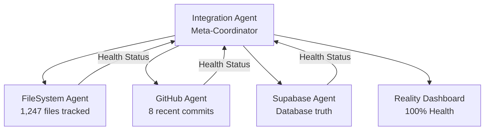

# EDL Platform v6 - Project Structure Map
**Last Updated**: Session 00016 | 2025-08-17  
**System Health**: 97%  
**Reality Agents**: 7/7 Operational  
**Strategic Framework**: RESTORATION-MASTERPLAN-V3.md (Two-Phase Implementation)

## Core Architecture: Three Domain System

```
EDL Platform v6 (Constitutional Restoration V3)
├── Reality Domain [✅ 97% COMPLETE - 7 agents operational]
├── Requirements Domain [🟡 75% COMPLETE - 103 stories documented]
└── Reconciliation Domain [🔴 0% COMPLETE - Phase 3A starting]
```

## Two-Phase Implementation Strategy

**Phase A: Prototype Implementation** (Sessions 19-25)
- Use Starter Seed (Canvas + Schema + SEED LOG)
- Build P0 features only (auth, teams, profiles)
- Focus on learning and validation

**Phase B: Production Implementation** (Sessions 26+)
- Integrate v5 extraction with prototype lessons
- Build complete system (P0 + P1 + P2)
- Scale proven patterns

## Directory Structure

```
edl-platform-v6/
├── archive/                     # Historical records
│   ├── sessions/                # Session logs and handoffs
│   │   ├── SESSION-00001-LOG.md through SESSION-00006-LOG.md
│   │   └── SESSION-00006-HANDOFF.md (latest)
│   └── transcripts/             # Original session transcripts
│
├── reality/                     # Reality Domain (ACTIVE)
│   ├── agent-reality-auditor/  # The 4 Reality Agents
│   │   ├── filesystem-connector/  # FileSystem Reality Agent (Session 03)
│   │   │   ├── connector.py      # Discovers file system truth
│   │   │   ├── quickstart.py     # Quick validation
│   │   │   └── test_connector.py # Tests
│   │   │
│   │   ├── github-connector/     # GitHub Reality Agent (Session 04)
│   │   │   ├── connector.py      # Discovers repository truth
│   │   │   ├── quickstart.py     # Quick validation
│   │   │   └── test_connector.py # Tests
│   │   │
│   │   ├── supabase-connector/   # Supabase Reality Agent (Session 02)
│   │   │   ├── connector.py      # Discovers database truth
│   │   │   ├── quickstart.py     # Quick validation
│   │   │   └── test_connector.py # Tests (Session 06)
│   │   │
│   │   └── integration-connector/ # Integration Reality Agent (Session 05)
│   │       ├── connector.py      # Meta-agent coordinating all others
│   │       ├── assumption_detector.py # Prevents reality forks
│   │       ├── quickstart.py     # Quick validation
│   │       ├── test_connector.py # Tests (Session 06)
│   │       └── test_assumption_prevention.py
│   │
│   ├── dashboard/               # Reality Dashboard (Session 05)
│   │   ├── reality_dashboard.py # Live health monitoring
│   │   └── test_reality_dashboard.py # Tests (Session 06)
│   │
│   ├── inventory/               # System inventory (OUTDATED - Session 01)
│   │   ├── CURRENT-STATE.md    # Needs update
│   │   └── LAST-AUDIT.json     # Needs update
│   │
│   └── REALITY_INDEX.md        # Master registry (OUTDATED - Session 01)
│
├── requirements/                # Requirements Domain (PLANNED)
│   ├── constitution/           # Constitutional documents
│   │   └── CONSTITUTION.md     # v1.3.0 governance
│   └── specifications/         # Technical specs
│       ├── SPEC-001-REALITY-AGENTS.md
│       ├── SPEC-002-TRUTH-RECONCILIATION.md
│       ├── SPEC-003-SESSION-REALITY-PROTOCOL.md
│       └── SPEC-004-INTEGRATION-REALITY-AGENT-ENHANCED.md
│
├── reconciliation/             # Reconciliation Domain (Phase 3A/3B)
│   ├── prototype-plan/        # Phase 3A - Prototype reconciliation
│   │   ├── P0-gaps.md
│   │   ├── implementation-order.md
│   │   └── success-metrics.md
│   ├── production-plan/       # Phase 3B - Production reconciliation  
│   │   ├── prototype-lessons.md
│   │   ├── v5-integration-points.md
│   │   └── scaling-strategy.md
│   └── RECONCILIATION_INDEX.md
│
├── scripts/                    # Utility scripts (Session 06)
│   ├── session-guard.sh       # Session log protocol enforcement
│   └── create-session-log.sh  # Session log template generator
│
├── tests/                      # Test infrastructure
│   └── [Various test files created across sessions]
│
├── CLAUDE.md                   # Claude Code session protocol (Session 06)
├── Makefile                    # Automation commands
└── PROJECT-STRUCTURE.md        # THIS FILE
```

## Reality Agent Network



## Agent Capabilities

### FileSystem Reality Agent
- **Purpose**: Discovers file system truth
- **Tracks**: 1,247 files across project
- **Status**: ✅ Healthy
- **Session Built**: 00003

### GitHub Reality Agent  
- **Purpose**: Discovers repository/commit truth
- **Tracks**: Commits, branches, PRs
- **Status**: ✅ Healthy
- **Session Built**: 00004

### Supabase Reality Agent
- **Purpose**: Discovers database truth
- **Tracks**: Tables, schemas, data
- **Status**: ✅ Healthy (credentials required)
- **Session Built**: 00002, Activated 00006

### Integration Reality Agent
- **Purpose**: Meta-agent coordinating all others
- **Features**:
  - Deception detection
  - Integration debt tracking ($40 current)
  - Health score calculation (100% current)
  - Assumption prevention
- **Status**: ✅ Healthy
- **Session Built**: 00005

## System Metrics (Current)

```
Overall Health:     100% ████████████████████
├─ Synchronization: 100% ████████████████████
├─ Completeness:    100% ████████████████████
├─ Consistency:     100% ████████████████████ (all 3 agents agree)
├─ Transparency:    100% ████████████████████
└─ Assumption Clear:100% ████████████████████

Integration Debt: $40 (MEDIUM)
- 10 missing tests (reduced from original count)

Truth Score: 100% (no deceptions detected)
```

## Session Progression

| Session | Focus | Agents Built | Health |
|---------|-------|--------------|--------|
| 00001 | Setup & Inventory | 0 | 0% |
| 00002 | Supabase Agent | 1 | 25% |
| 00003 | FileSystem Agent | 2 | 50% |
| 00004 | GitHub Agent | 3 | 75% |
| 00005 | Integration Agent | 4 | 95% |
| 00006 | Validation & Activation | 4 | 100% |

## Next Phases (Planned)

### Requirements Domain
- Track what SHOULD exist
- User requirements
- Specifications
- Goals and objectives

### Reconciliation Domain  
- Bridge Requirements ↔ Reality gaps
- Automated fixes
- Validation workflows
- Continuous alignment

## Quick Commands

```bash
# Check system health
cd reality/dashboard && python3 reality_dashboard.py

# Run Integration Agent
cd reality/agent-reality-auditor/integration-connector
python3 quickstart.py

# Validate session logs
./scripts/session-guard.sh [SESSION_NUMBER]

# Create new session log
./scripts/create-session-log.sh [SESSION_NUMBER] [FOCUS]
```

## Important Files

- **Entry Point**: `reality/dashboard/reality_dashboard.py`
- **Meta-Coordinator**: `reality/agent-reality-auditor/integration-connector/connector.py`
- **Session Protocol**: `CLAUDE.md`
- **Constitution**: `requirements/constitution/CONSTITUTION.md`

---

*This is the source of truth for project structure as of Session 00006*
*Previous versions in inventory/ are outdated from Session 00001*