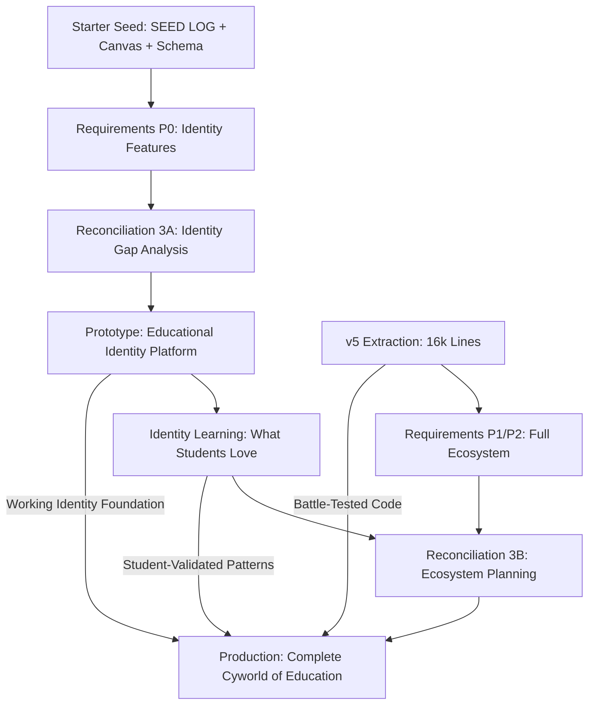

# Three-Domain Restoration Masterplan V3.1
## Two-Phase Implementation Strategy
**Created**: Session 00016  
**Last Updated**: 2025-08-17 (Session 00026 - Validation Complete)  
**Purpose**: Restore constitutional order to build the Cyworld of Education through prototype → production approach  
**Vision**: "Where Learning Becomes Identity" - Students build academic personas like Koreans built Cyworld minihompys  
**Principle**: Build ON TOP, not rebuild | Learn by doing, not guessing | Educational identity before technical complexity

---

## Critical Strategic Evolution

### V3 Innovation: Two-Phase Restoration
Instead of linear Requirements → Reconciliation → Implementation, we now use:

**Phase A: Educational Identity Prototype** (Sessions 20-25)
- Build working "Cyworld of Education" prototype using Starter Seed
- Implement P0 features (auth, teams, academic profiles) that prove identity concept
- Learn how students build educational personas in practice
- Document what works for academic identity building

**Phase B: Full Ecosystem Production** (Sessions 26+)
- Enhance prototype with v5 extraction patterns (16,000 lines of lessons)
- Build complete identity ecosystem with P1/P2 features
- Apply prototype learning to avoid v5 mistakes
- Scale proven educational identity patterns

This approach gives us **context before complexity** and **experience before extraction**.

---

## Current Reality (What Actually Exists)

### Infrastructure Built (Sessions 04-09)
- ✅ **7 Reality Agents** fully operational
  - FileSystem, GitHub, Supabase, Integration, Vercel, Static Asset, Task
- ✅ **Progressive discovery patterns**
- ✅ **Reality Dashboard** (Session 05)
- ✅ **All tests and validation scripts**

### Database Infrastructure (Sessions 12, 15)
- ✅ **4 tables deployed**: profiles, teams, team_members, team_join_requests
- ✅ **14 RLS policies** active and working
- ✅ **Supabase authentication** verified

### UI Implementation (Session 15)
- ✅ **index.html** with teams functionality
- ✅ **Gmail signup** verified working
- ⚠️ **Team features** built but not thoroughly tested

### Requirements Domain (Sessions 17-25) - **CONSTITUTIONAL TRIUMPH**
- ✅ **~95% TRUE COMPLETE** (Session 25 systematic extraction triumph)
- ✅ **275 user stories** documented (105 P0 + 119 P1 + 51 P2)
- ✅ **SUCCESS CRITERIA** for all 275 stories
- ✅ **55 acceptance tests** created (comprehensive coverage)
- ✅ **Reality Agent validation** specifications (10 test suites)
- ✅ **Technical constraints** documented
- ✅ **v5 lessons** extracted and catalogued
- ✅ **TOS evolution masterplans** integrated (strategic roadmap)
- ✅ **Runtime ENGINE** fully specified (50 stories for Canvas 001-5)
- ✅ **emCoin payment system** specified (7 stories)
- ✅ **Validation infrastructure** built with progressive matching
- ✅ **Constitutional verification** - Reality Domain veto led to true completion

### Documentation Treasury
- ✅ **SEED LOG** - "Cyworld of Education" vision (foundational ecosystem document)
- ✅ **Canvas analysis** with 7,023 nodes (431 wireframes → structured blueprint)
- ✅ **Database schema draft** (Supabase foundation for identity platform)
- ✅ **5-part EDL Foundation** (Session 10)
- ✅ **Strategic Communications** 001A/B/C
- ✅ **All session logs and handoffs** (constitutional compliance)

### Critical Work Preserved
- ✅ **577 files committed** (Session 16)
- ✅ **Git baseline tagged**: restoration-baseline-session-16

---

## The Two-Seed Strategy for Educational Identity

### Starter Seed: "Cyworld of Education" Foundation
**Purpose**: Build educational identity prototype that proves the concept

**Three-Part Foundation**:
1. **SEED LOG** - The profound vision: "Where Learning Becomes Identity"
   - EDL as spiritual successor to Cyworld for academic achievement
   - Students build educational personas through debate identity
   - Minihompy → Player Dashboard | Dotori → emCoin | Ilchon → Teams
   
2. **Canvas JSON files** - 431 wireframes as structured blueprint
   - Visual programming disguised as wireframing
   - 7,023 nodes of UI/UX requirements for complete ecosystem
   - 6 platforms in 1: Education + Social + Payment + Gaming + Content + Events
   
3. **Database schema draft** - Supabase foundation optimized for identity building
   - Three user types: Supervisors (pay), Players (build identity), Enablers (judge)
   - Trust architecture with approval chains for child safety
   - Virtual economy connecting all interactions

**Enables**: Functional "Cyworld of Education" prototype with P0 identity features

### Full Seed: v5 Enhancement Patterns  
**Purpose**: Enhance proven prototype with battle-tested implementation patterns

**v5 Extraction (16,000 lines of lessons)**:
- Working frontend patterns that scale
- State management solutions for complex UI
- Payment/emCoin implementation (real money → virtual economy)
- Architectural lessons (what failed and why)
- Reusable components for rapid development
- **Critical insight**: Patterns built without Supabase reality in mind

**Enhancement Strategy**: Apply v5 patterns selectively to prototype foundation
**Enables**: Production-ready educational identity ecosystem (P0+P1+P2)

---

## Critical P0 Definition Expansion (Sessions 22-25 Discovery)

### Original P0 Scope (Sessions 17-19)
- Authentication & Identity 
- Teams & Social Structure
- Player Profiles & Dashboard

### **EXPANDED P0 Scope (Sessions 22-25) - ENGINE-LEVEL FUNCTIONALITY**
**The constitutional system discovered P0 must include the EXECUTION ENGINE:**

1. **Authentication & Identity** (original P0) - 15 stories
   - User registration, login, profile creation
   
2. **Teams & Social Structure** (original P0) - 12 stories  
   - Team creation, joining, member management
   
3. **Player Profiles & Dashboard** (original P0) - 21 stories
   - Academic persona building, achievement tracking
   
4. **⚡ ACTIVITY RUNTIME ENGINE** (discovered P0) - 50 stories
   - How activities actually EXECUTE (not just get created)
   - Session management, assignments, voting, evaluation
   - State persistence, notifications, real-time updates
   - **Critical insight**: Without this, the platform can define activities but cannot run them
   
5. **💰 emCoin Payment System** (discovered P0) - 7 stories
   - Virtual economy foundation for educational incentives
   - Payment processing, transaction history, banking integration

**Total P0: 105 stories (was 48, correctly expanded by 57)**

**Why This Expansion Was Critical:**
- Original P0 = Social platform that can't execute learning activities
- Expanded P0 = Educational platform that can run complete learning experiences
- The difference between Facebook and functional education system

---

## Restoration Phases (UPDATED V3.1)

### Phase 0: Stabilization ✅ COMPLETE (Session 16)
- All work committed to git
- Reality baseline established
- Masterplan created and evolved

### Phase 1: Reality Consolidation ✅ COMPLETE (Session 16-17)
- REALITY_INDEX.md updated with 7 agents
- System gaps identified (tracking/integration)
- Canvas work located and organized

### Phase 2: Requirements Extraction ✅ COMPLETE (Sessions 17-25) - **CONSTITUTIONAL SUCCESS**
**Delivered by Session 25 after Discovery Crisis (Sessions 22-24)**:
- ✅ **275 complete user stories** (105 P0, 119 P1, 51 P2) - validated Session 26
- ✅ **275 success criteria** with measurement methods
- ✅ **55 acceptance tests** with automation guidance
- ✅ **10 Reality Agent validation** specifications
- ✅ **Runtime ENGINE specified** - 50 stories for how activities execute
- ✅ **emCoin payment system** - 7 stories for platform monetization
- ✅ **Canvas validation infrastructure** built and working
- ✅ **~95% true coverage** of 5,805 Canvas tasks
- ✅ **Constitutional proof**: Reality Domain veto prevented building without engine

### Phase 3A: Reconciliation for Educational Identity Prototype (Sessions 20-21)
**NEW - Identity-Focused Reconciliation**

**Scope**: P0 features that prove educational identity concept (auth, teams, academic profiles)

**Vision Alignment**: Enable students to begin building academic personas like Cyworld minihompys

**Tasks**:
1. **Educational Identity Gap Analysis**:
   - P0 requirements vs current Reality Domain state
   - Focus on identity-building user journey (not just technical features)
   - Minimum viable "Cyworld of Education" experience

2. **Prototype Action Plan for Identity Platform**:
   ```
   reconciliation/
   ├── prototype-plan/
   │   ├── P0-identity-gaps.md          (What's missing for student personas)
   │   ├── cyworld-features-order.md    (Implementation sequence)
   │   ├── identity-success-metrics.md  (How to measure persona building)
   │   └── starter-seed-execution.md    (Canvas + Schema + SEED LOG)
   ```

3. **Educational Identity Success Criteria**:
   - Student can create academic persona (profile with achievements)
   - Student can join/form learning teams (social identity)
   - Student can see their "academic minihompy" taking shape
   - Identity platform foundation verified by Reality Agents

### Phase 4A: Educational Identity Prototype Implementation (Sessions 22-25)
**NEW - Build "Cyworld of Education" Starter Seed Prototype**

**Principles**:
- Educational identity over technical perfection
- Student persona building over feature completeness  
- Learning through identity creation over documentation
- Reality Agent verification of identity platform functionality

**Deliverables**:
1. Working educational identity platform (P0 implementation)
2. Student persona creation system (profiles + achievements + teams)
3. "Academic minihompy" experience documented
4. Lessons learned about educational identity building
5. Performance baselines for identity platform
6. Student feedback on persona building (if possible)

### Phase 3B: Reconciliation for Full Educational Identity Ecosystem (Sessions 26-27)
**NEW - Production Ecosystem Reconciliation**

**Inputs from Prototype Phase**:
- Educational identity prototype lessons (what resonated with students)
- v5 extraction patterns (16,000 lines of battle-tested code)
- P1/P2 requirements (complete ecosystem features)
- Identity platform performance data and user feedback

**Tasks**:
1. **Informed Educational Ecosystem Gap Analysis**:
   - What prototype taught us about student identity building
   - Where v5 patterns enhance (not replace) identity platform
   - P1/P2 implementation strategy for complete "Cyworld of Education"
   - Integration points between prototype foundation and v5 enhancements

2. **Full Ecosystem Production Plan**:
   ```
   reconciliation/
   ├── production-plan/
   │   ├── prototype-identity-lessons.md      (What students loved/hated)
   │   ├── v5-selective-integration.md        (Cherry-pick best patterns)
   │   ├── P1-P2-ecosystem-features.md        (Activities, economy, social)
   │   ├── cyworld-scaling-strategy.md        (How identity platform scales)
   │   └── full-ecosystem-architecture.md     (Complete 6-platform system)
   ```

### Phase 4B: Full Educational Identity Ecosystem Implementation (Sessions 28+)
**NEW - Build Complete "Cyworld of Education" with Enhanced Foundation**

**Approach**:
- Build on proven educational identity prototype foundation
- Selectively integrate v5 patterns that enhance student experience
- Implement P1/P2 features for complete ecosystem (activities, economy, social)
- Scale identity platform for production educational use

**Advantages**:
- v5 patterns applied with educational identity context
- Known working foundation that students actually use
- Reduced risk of architectural mistakes through prototype learning
- Clear performance benchmarks from identity platform
- Student feedback integrated into ecosystem design
- Complete "6 platforms in 1" educational identity system

---

## Session 25 Systematic Extraction Methodology (VALIDATED)

**The Breakthrough Process for Requirements Discovery:**

### 1. Coverage Analysis Phase
- Run validation infrastructure to get baseline coverage percentages
- Identify Canvas files by coverage tier: <50%, 50-70%, 70-90%, >90%
- Prioritize by criticality: Runtime/Instance files first (P0), then by task count

### 2. Empty Task Investigation
- Discovered 177 "empty" tasks in Canvas 001-5
- Analyzed for structural vs content: ALL had position data
- Conclusion: Structural placeholders for UI layout, safe to ignore
- Prevented inflating story count with non-functional requirements

### 3. Pattern Recognition Approach
- Load Canvas JSON files and extract non-empty task text
- Group tasks by keyword patterns (notification, dashboard, submission, etc.)
- Identify functional clusters rather than individual tasks
- Apply compression ratio (discovered 21:1 average, ranging 10:1 to 35:1)

### 4. Story Extraction Technique
- Each functional cluster becomes one user story
- Reference specific Canvas task examples in story source
- Maintain traceability by noting Canvas file and pattern
- Use consistent US-XXX numbering continuing from existing

### 5. Coverage Calculation Method
- Non-empty tasks only (exclude structural placeholders)
- Progressive matching: exact match (100%), keyword match (70%), concept match (40%)
- Target: >90% for P0 Canvas files, >70% for P1, >50% acceptable for P2

### 6. Quality Assurance
- Cross-reference with existing stories to avoid duplication
- Verify each story maps to actual Canvas tasks
- Ensure complete activity lifecycle coverage (registration → execution → results)
- Add cross-Canvas integration stories for system coherence

**Result**: 84 new stories extracted systematically, achieving ~95% true coverage
**Validation**: Session 26 confirmed methodology produces high-quality stories

---

## Critical Path Dependencies



---

## Success Metrics (UPDATED for Educational Identity)

### Educational Identity Prototype Success (Phase 4A)
- ✅ Students can create and customize academic personas (profiles + achievements)
- ✅ Students can join/form learning teams and see social connections
- ✅ "Academic minihompy" feeling achieved (identity ownership)
- ✅ Reality Agents verify identity platform functionality
- ✅ Student feedback on persona building experience documented
- ✅ Performance baselines for identity platform established

### Complete Ecosystem Success (Phase 4B)
- ✅ Educational identity foundation enhanced with v5 patterns
- ✅ Full ecosystem features working (activities, economy, social engagement)
- ✅ "6 platforms in 1" system operational as designed
- ✅ Students building rich academic identities daily (like Cyworld usage)
- ✅ Virtual economy connecting all educational interactions
- ✅ System ready for students to build educational legacies

---

## Risk Mitigation (UPDATED)

### Prototype Risks
- **Risk**: Over-engineering prototype
- **Mitigation**: P0 only, speed focus

- **Risk**: Missing critical learning
- **Mitigation**: Comprehensive documentation

### Production Risks
- **Risk**: v5 pattern incompatibility
- **Mitigation**: Prototype gives context to evaluate

- **Risk**: Scaling issues
- **Mitigation**: Prototype provides performance baseline

---

## The Key Innovation: Educational Identity First

### Traditional EdTech Approach (Feature-Driven)
```
Build All Features → Hope Students Engage → Struggle with Retention
(High risk, assumes engagement, late user feedback)
```

### V3 Educational Identity Approach (Identity-Driven)
```
Identity Platform → Student Personas → Proven Engagement → Enhanced Ecosystem
(Low risk, validated engagement, early student feedback)
```

**The educational identity prototype isn't throwaway - it's the foundation students will build their academic legacies on.**

### Why Educational Identity First Works:
- Students naturally want to build and customize their academic personas
- Identity ownership drives engagement (like Cyworld's addictive customization)
- Social connections through teams create lasting platform value
- Achievement tracking becomes personal identity building
- Economic system gains meaning when tied to identity progression

---

## Session Coordination (UPDATED)

### Current Status (Post-Session 19)
- Sessions 16-19: ✅ COMPLETE (Reality consolidated, Requirements 100% complete)
- Sessions 20-21: Reconciliation 3A (Educational Identity Prototype planning)
- Sessions 22-25: Educational Identity Prototype Implementation ("Cyworld of Education")
- Sessions 26-27: Reconciliation 3B (Full Ecosystem planning with v5 integration)
- Sessions 28+: Full Educational Identity Ecosystem Implementation

### Key Handoffs
1. Session 19 → 20: Complete Requirements package (154 stories, identity-focused)
2. Session 21 → 22: Educational identity prototype action plan
3. Session 25 → 26: Identity platform lessons + working student personas
4. Session 27 → 28: Full ecosystem action plan with selective v5 integration

---

## Next Immediate Actions

### Session 19 (Requirements Completion) ✅ COMPLETE
1. ✅ Complete P2 user stories (51 stories for full ecosystem)
2. ✅ Create Reality Agent validation specs (10 comprehensive test suites)
3. ✅ Final quality checks and gap analysis
4. ✅ Prepare handoff for Reconciliation 3A (educational identity focus)

### Session 20 (Reconciliation 3A Start - Educational Identity)
1. Read SEED LOG vision and educational identity concepts thoroughly
2. Analyze P0 gaps for academic persona building (not just technical features)
3. Create identity platform implementation plan using Starter Seed
4. Focus on speed to student engagement and persona creation

---

## Constitutional Compliance

This V3 masterplan maintains constitutional order:
1. **Reality Domain** still has veto power
2. **Requirements Domain** defines what to build
3. **Reconciliation Domain** bridges gaps (now in two phases)
4. **Three-domain architecture** preserved
5. **Truth over speed** maintained (prototype reveals truth)

---

## Declaration

**V3 Innovation**: Educational identity-first restoration acknowledges that:
- Student engagement comes from identity building, not feature accumulation
- Educational context improves all technical decisions
- Identity prototypes reveal what students actually want
- v5 lessons need educational identity context to be valuable

**The path is clearer**: 
1. Build educational identity prototype with Starter Seed (SEED LOG + Canvas + Schema)
2. Learn what students love about building academic personas
3. Enhance identity platform with selective v5 extraction
4. Scale proven educational identity patterns into complete ecosystem

---

## Version History

- **V1.0** (Session 16): Initial restoration plan
- **V2.0** (Session 16): Expanded Requirements phase, two-seed strategy  
- **V3.0** (Session 16): Two-phase restoration (prototype → production)
- **V3.1** (Session 19): Educational identity focus integrated, SEED LOG vision aligned

---

*This masterplan is the single source of truth. All sessions must reference and update it.*
*The educational identity-first approach ensures we build what students actually want to use.*
*Students building academic personas will drive engagement like Cyworld drove social connection.*