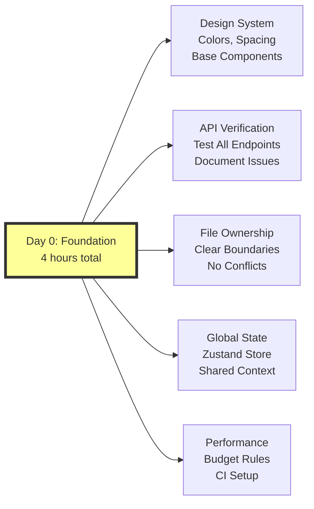

# Complete Batch Strategy Visual Map
## Full Context for Implementation Oversight

---

## 🗺️ MASTER TIMELINE OVERVIEW

```
Week 0 (Day 0): Foundation Setup
├── Shared Design System (1 hour)
├── API Verification (1 hour)
├── File Ownership Map (30 min)
├── Global State Strategy (30 min)
└── Performance Budget (30 min)

Week 1: Batch 1 - Core UI Sprint (4 Parallel Tracks)
├── Track A: Addiction/EmCoin UI (Days 1-3)
├── Track B: Achievement/Badge UI (Days 1-3)
├── Track C: Activity Runtime UI (Days 2-4)
└── Track D: Social/Profile UI (Days 3-5)

Week 2: Batch 2 - Integration & Polish
├── Track E: Cross-System Integration (Days 8-9)
├── Track F: UX Polish & Consistency (Days 10-11)
├── Track G: Advanced Features (Days 12-13)
└── Track H: Testing & Validation (Day 14)

Week 3: Batch 3 - Advanced Systems (Future)
├── Payment Infrastructure
├── Judge/Enabler System
├── Analytics & Rankings
└── Advanced Communication

Week 4: Batch 4 - Complete Vision (Future)
├── Scholarship System
├── Division Management
├── Personality Profiling
└── Instance Chambers
```

---

## 📊 BATCH 1: CORE UI SPRINT - DETAILED MAP

### Day 0: Foundation Setup (REQUIRED BEFORE ANY TRACK STARTS)


### Parallel Track Execution Map
```
┌─────────────────────────────────────────────────────────────┐
│                    BATCH 1: CORE UI SPRINT                   │
├─────────────────────────────────────────────────────────────┤
│                                                               │
│  Track A: Addiction/EmCoin        Track B: Achievements      │
│  ┌─────────────────────┐          ┌─────────────────────┐   │
│  │ Day 1-3             │          │ Day 1-3             │   │
│  │ • AddictionBar 👁️🔥🪙🏆│          │ • AchievementGrid   │   │
│  │ • EmCoinBalance     │          │ • BadgeCard         │   │
│  │ • TransactionList   │          │ • UnlockAnimation   │   │
│  │ • StreakCounter     │          │ • ProgressTracker   │   │
│  │ • DailyBonus        │          │ • LeaderboardWidget │   │
│  └─────────────────────┘          └─────────────────────┘   │
│           ↓                                 ↓                │
│    Uses EmCoin APIs                 Uses Achievement APIs    │
│    Canvas: 003-2                    Canvas: 002-3            │
│                                                               │
│  Track C: Activities              Track D: Social/Profile    │
│  ┌─────────────────────┐          ┌─────────────────────┐   │
│  │ Day 2-4 (offset)    │          │ Day 3-5 (offset)    │   │
│  │ • ActivityCard      │          │ • ProfileEditor     │   │
│  │ • SessionProgress   │          │ • FriendsList       │   │
│  │ • ActivityDashboard │          │ • DirectMessages    │   │
│  │ • TeamSelector      │          │ • NotificationPrefs │   │
│  │ • CompletionCert    │          │ + Backend gaps fill │   │
│  └─────────────────────┘          └─────────────────────┘   │
│           ↓                                 ↓                │
│    Uses Activity APIs               Uses Profile APIs        │
│    Canvas: 001-4, 001-5             Canvas: 002-1, 001-2     │
│                                                               │
└─────────────────────────────────────────────────────────────┘
```

### Component Dependency Matrix
```
        Track A     Track B     Track C     Track D
      ┌─────────┬───────────┬───────────┬───────────┐
Track │    -    │    ✅     │    ✅     │    ✅     │ A: Independent
A     │         │ No deps   │ No deps   │ No deps   │
      ├─────────┼───────────┼───────────┼───────────┤
Track │   ✅    │     -     │    ✅     │    ✅     │ B: Independent  
B     │ No deps │           │ No deps   │ No deps   │
      ├─────────┼───────────┼───────────┼───────────┤
Track │   ✅    │    ✅     │     -     │    ⚠️     │ C: Mostly Independent
C     │ No deps │ No deps   │           │ Team UI?  │
      ├─────────┼───────────┼───────────┼───────────┤
Track │   ⚠️    │    ⚠️     │    ⚠️     │     -     │ D: Needs others for
D     │ Balance │ User data │ User data │           │    full integration
      └─────────┴───────────┴───────────┴───────────┘

✅ = No dependencies
⚠️ = Optional enhancement if other track complete
```

---

## 🔄 BATCH 2: INTEGRATION & POLISH - DETAILED MAP

### Dependency Flow from Batch 1
```
Batch 1 Outputs                    Batch 2 Integration
─────────────────                  ───────────────────

Track A Components ─┐
                    ├──→ Track E: Cross-System Integration
Track B Components ─┤    • Wire up EmCoin ↔ Achievements
                    │    • Connect Activities ↔ Progress  
Track C Components ─┤    • Link Social ↔ All systems
                    │    • Global notification bus
Track D Components ─┘    • WebSocket management

All Track Outputs ────→ Track F: UX Polish
                         • Consistent styling
                         • Animation smoothing
                         • Loading state harmony
                         • Error handling patterns

Polished Components ──→ Track G: Advanced Features
                         • Basic rankings
                         • Team competition
                         • Division display
                         • Achievement celebrations

Everything ───────────→ Track H: Testing & Validation
                         • End-to-end flows
                         • Performance testing
                         • Bug fixing
                         • Documentation
```

---

## 📍 API ENDPOINT MAPPING

### Critical Backend Dependencies by Track
```yaml
Track A - EmCoin/Addiction:
  Required (Must Work):
    - GET /api/emcoin/balance
    - GET /api/emcoin/transactions?limit=10
    - POST /api/emcoin/claim-daily-bonus
  Optional (Can Mock):
    - GET /api/emcoin/leaderboard
    - GET /api/user/streak

Track B - Achievements:
  Required (Must Work):
    - GET /api/achievements/all
    - GET /api/achievements/user/:userId
    - GET /api/achievements/categories
  Optional (Can Mock):
    - POST /api/achievements/unlock
    - GET /api/achievements/leaderboard

Track C - Activities:
  Required (Must Work):
    - GET /api/activities
    - GET /api/activity/:id
    - GET /api/activity/:id/sessions
    - POST /api/activity/:id/register
  Optional (Can Mock):
    - POST /api/activity/:id/complete
    - GET /api/teams

Track D - Social/Profile:
  Required (Must Work):
    - GET /api/profile/:userId
    - PUT /api/profile
    - GET /api/friends
  Need to Build:
    - POST /api/notifications/preferences
    - GET /api/users/search
    - POST /api/messages/send
```

---

## 🎨 CANVAS WIREFRAME ASSIGNMENTS

### Direct Canvas → Track Mapping
```
Canvas File                          → Implementation Track
───────────────────────────────────────────────────────────
003-2 seed.emCoin Transactions Box  → Track A (EmCoin UI)
  • Balance display
  • Transaction history
  • Payment info management

002-3 seed.Badges Box               → Track B (Achievements)
  • Badge gallery layout
  • Progress indicators
  • Earned/Available states

001-4 Activity & Registrar Box      → Track C (Activities)
  • Registration workflow
  • Participant management
  • Division/Genre filtering

001-5 seed.Activity Instance        → Track C (Activities)
  • Session-by-session progress
  • Multi-step workflow
  • Completion tracking

002-1 seed.PlayerID Profile Box     → Track D (Profile)
  • Profile information display
  • School/Grade/Division
  • Personality profile (optional)

001-2 Communication & Invitations   → Track D (Social)
  • Message interface
  • Invitation system
  • Team communication
```

---

## ⚠️ RISK & MITIGATION VISUAL

### Risk Heat Map
```
         Low Impact    Med Impact    High Impact
        ┌────────────┬────────────┬────────────┐
High    │            │            │ API Broken │
Prob    │            │            │ (Pre-test) │
        ├────────────┼────────────┼────────────┤
Med     │ Naming     │ Canvas     │ State      │
Prob    │ Conflicts  │ Ambiguity  │ Chaos      │
        │ (Prefixes) │ (Iterate)  │ (Zustand)  │
        ├────────────┼────────────┼────────────┤
Low     │ Mobile     │ Merge      │ Tech Debt  │
Prob    │ Issues     │ Conflicts  │ Explosion  │
        │ (Accept)   │ (Ownership)│ (Track it) │
        └────────────┴────────────┴────────────┘

() = Mitigation strategy
```

---

## 📈 VELOCITY & SUCCESS METRICS

### Expected Velocity by Track
```
Track A (EmCoin):      ████████████████████ 5 components @ 6/hour = 50 mins each
Track B (Achievement): ████████████████████ 5 components @ 6/hour = 50 mins each  
Track C (Activity):    ███████████████      4 components @ 5/hour = 1 hour each
Track D (Social):      ████████████         3 components @ 4/hour + backend work

Daily Output Target:   ████████████████████ 4-6 components across all tracks
Weekly Sprint Total:   ████████████████████ 15-20 components minimum
```

### Success Validation Checkpoints
```
Day 1 EOD: 
  □ All tracks have 1+ component rendering
  □ Design system being used consistently
  □ No merge conflicts

Day 3 EOD:
  □ Track A & B feature-complete
  □ 10+ components shipped total
  □ API integrations working

Day 5 EOD:
  □ All tracks feature-complete
  □ 15-20 components shipped
  □ Ready for Batch 2 integration
```

---

## 🚦 GO/NO-GO DECISION POINTS

### Before Starting Any Track
```
Requirement                          Status    Track Can Start?
─────────────────────────────────────────────────────────────
Day 0 Setup Complete                 [ ]       No
API Endpoints Verified               [ ]       No
Canvas Wireframes Loaded             [ ]       No
File Ownership Agreed                [ ]       No
Branch Created                       [ ]       No
─────────────────────────────────────────────────────────────
ALL ABOVE CHECKED                              YES → START
```

### Daily Health Check
```
Metric                    Red         Yellow      Green
──────────────────────────────────────────────────────────
Components/Day            <1          1-2         3+
Build Status             Broken       Warnings    Clean
Merge Conflicts          >2           1           0
API Failures             Any          -           None
Performance Budget       Exceeded     At limit    Under
```

---

## 📋 HANDOFF TO SESSION 166

### What Session 166 Needs to Validate

1. **Track Independence Verification**
   - Can Track A-D truly run in parallel?
   - Are there hidden dependencies we missed?

2. **API Reality Check**
   - Test each required endpoint NOW
   - Document any that don't work as expected

3. **Canvas Interpretation Clarity**
   - Load actual Canvas JSON files
   - Confirm component requirements match our understanding

4. **Resource Allocation**
   - Is 2-3 days per track realistic?
   - Should we stagger starts or run truly parallel?

5. **Risk Mitigation Adequacy**
   - Is Day 0 setup sufficient?
   - Are the guardrails tight enough?

### Key Questions for 166

1. Should Track C & D be offset by 1-2 days to learn from A & B?
2. Do we need a dedicated "Track 0" for shared utilities first?
3. Should we have a daily 15-min sync or is async coordination enough?
4. What's the escalation path if a track gets blocked?
5. How do we handle if one track finishes much faster?

---

## 🎯 FINAL SUCCESS CRITERIA

### Batch 1 Success = 
- **15-20 UI components shipped in 5 days**
- **All using shared design system**
- **All connected to real APIs (where available)**
- **Zero blocking dependencies between tracks**
- **Main branch buildable every day**

### Batch 2 Success = 
- **All Batch 1 components integrated**
- **Consistent UX across all features**
- **Advanced features added**
- **<10 critical bugs**
- **Ready for user testing**

---

*This complete visual map provides Session 166 with full context for implementation oversight. The strategy balances velocity with just enough structure to prevent chaos.*