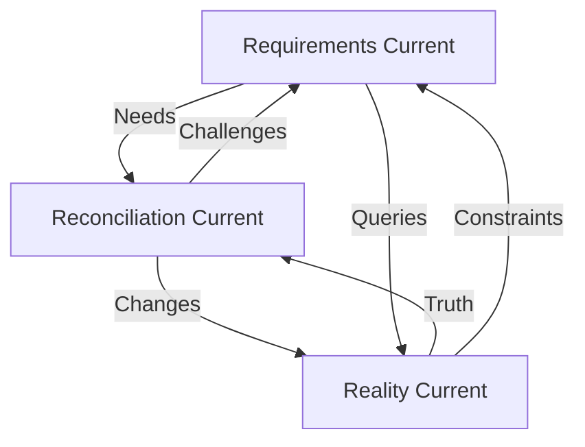

# Three Currents Protocol - Parallel Domain Sessions

**Created**: Session 00073  
**Insight Credit**: Brian Kim  
**Status**: BREAKTHROUGH REALIZATION  

## The Fundamental Insight

The three domains were conceived as **CURRENTS** not steps or phases. Like ocean currents that continuously flow and interact, each domain should be a living, breathing conversation that influences the others.

## Current Problem: Sequential Thinking

```
Current Pattern (WRONG):
Session 73: Requirements → Reality Check → Reconciliation → Done
Session 74: Requirements → Reality Check → Reconciliation → Done

This treats domains as CHECKBOXES not CURRENTS
```

## The Three Currents Model

### 🌊 Current 1: Requirements (Living Needs)
**Purpose**: Continuously discover and refine what's needed
```bash
# Claude Session Window 1
"This is Requirements Current, Session 74R. 
My job is to continuously refine what we need based on:
- User feedback
- Reality reports from Current 2
- Implementation challenges from Current 3"

# Continuous Activities:
- Query incomplete user stories
- Update masterplans based on reality
- Document new requirements discovered
- Maintain priority matrix
```

### 🌊 Current 2: Reality (Living Truth)
**Purpose**: Continuously monitor and report truth
```bash
# Claude Session Window 2
"This is Reality Current, Session 74T (Truth).
My job is to continuously monitor truth:
- Running Reality Agents every 5 minutes
- Detecting drift from expectations
- Reporting blockers and issues"

# Continuous Activities:
while true; do
    ./scripts/00028-reality-check.sh
    python3 scripts/00059-yaml-query.py --broken
    sleep 300  # 5 minutes
done
```

### 🌊 Current 3: Reconciliation (Living Bridge)
**Purpose**: Continuously bridge gaps between needs and reality
```bash
# Claude Session Window 3
"This is Reconciliation Current, Session 74B (Bridge).
My job is to implement solutions based on:
- Requirements from Current 1
- Reality constraints from Current 2"

# Continuous Activities:
- Implement fixes based on both currents
- Create code that respects reality
- Test against truth continuously
```

## How The Currents Interact



## Practical Implementation

### Starting Three Parallel Sessions

**Window 1 - Requirements**:
```bash
./scripts/00028-session-start.sh 00074R "Requirements Current - Living Needs Discovery"
# Focus: What do we need? What's the priority? What's incomplete?
```

**Window 2 - Reality**:
```bash
./scripts/00028-session-start.sh 00074T "Reality Current - Truth Monitoring"
# Focus: What's actually true? What's broken? What's the health?
```

**Window 3 - Reconciliation**:
```bash
./scripts/00028-session-start.sh 00074B "Reconciliation Current - Bridge Building"
# Focus: How do we get from reality to requirements?
```

### Information Flow Example

**Hour 1**:
- Requirements: "We need profile creation after signup"
- Reality: "Profile table exists but no trigger"
- Reconciliation: "Creating trigger based on schema reality"

**Hour 2**:
- Reconciliation: "Trigger created but RLS blocking"
- Reality: "RLS policies missing for profile table"
- Requirements: "Update: Need RLS policies for profile access"

**Hour 3**:
- Reality: "Health dropped to 87% - Integration Agent failing"
- Reconciliation: "Pausing to investigate integration issue"
- Requirements: "Documenting integration agent as P0 blocker"

## YAML Metadata for Current Work

Each current tags their work differently:

```yaml
# Requirements Current
---
session: "00074R"
current: "requirements"
type: "requirement"
---

# Reality Current
---
session: "00074T"
current: "reality"
type: "truth-report"
---

# Reconciliation Current
---
session: "00074B"
current: "reconciliation"
type: "implementation"
---
```

## Benefits of Three Currents

1. **No Context Switching** - Each Claude stays in their domain
2. **Continuous Truth** - Reality never stops monitoring
3. **Living Requirements** - Needs evolve based on reality
4. **Honest Implementation** - Code respects both needs AND truth
5. **Parallel Progress** - Three conversations at once

## Query Patterns for Currents

```bash
# Requirements Current queries
python3 scripts/00059-yaml-query.py --status incomplete
python3 scripts/00059-yaml-query.py --priority P0

# Reality Current queries
python3 scripts/00059-yaml-query.py --broken
python3 scripts/00059-yaml-query.py --status blocked

# Reconciliation Current queries
python3 scripts/00059-yaml-query.py --type fix
python3 scripts/00059-yaml-query.py --status in-progress
```

## The Philosophical Shift

From:
> "First we gather requirements, then check reality, then reconcile"

To:
> "Requirements, Reality, and Reconciliation flow simultaneously, each informing the others in real-time"

This is how ideas become reality - not through sequential steps but through parallel currents of thought, truth, and action.

---

*"The river that flows in three braids is stronger than one that flows alone"*