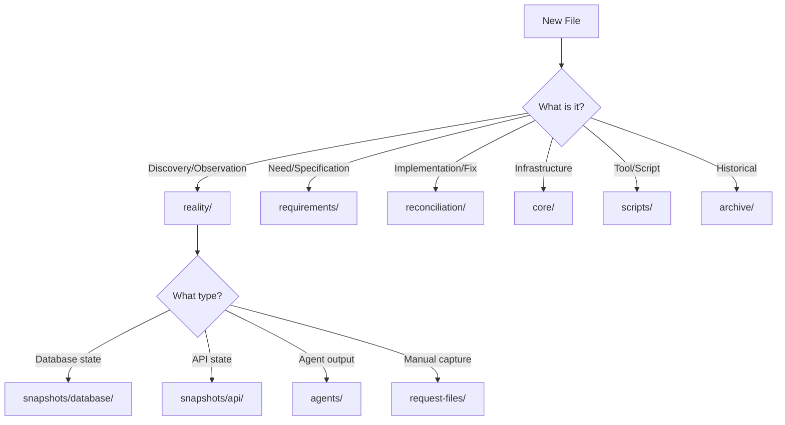

# Reality-First File Organization Protocol

**Version**: 1.0  
**Session**: 00086  
**Date**: 2025-08-27  
**Purpose**: Establish clear, enforceable rules for file organization starting from Reality

## 🌊 Core Principle: Reality → Requirements → Reconciliation

Every piece of work flows through three domains in order:

1. **Reality Domain** - What IS (ground truth)
2. **Requirements Domain** - What's NEEDED (specifications)
3. **Reconciliation Domain** - How to BRIDGE (implementation)

## 📁 Domain Structure & Rules

### Reality Domain (`reality/`)
**Purpose**: Capture and document what actually exists

```
reality/
├── snapshots/              # Point-in-time system state
│   ├── database/           # Supabase schema, data exports
│   ├── api/                # API endpoint states
│   └── filesystem/         # Code structure snapshots
├── agents/                 # Reality agent outputs
│   └── outputs/            # JSON outputs from agents
├── request-files/          # Manual reality captures
│   └── 00XXX-request-*.md # Session-specific captures
├── dashboard/              # Dashboard reality tracking
└── REALITY_INDEX.md        # Central reality index
```

**Rules**:
- ALL discoveries start here
- Document what IS, not what SHOULD BE
- Include timestamps in all captures
- Use `reality_type` in YAML metadata

### Requirements Domain (`requirements/`)
**Purpose**: Extract and document what's needed from reality

```
requirements/
├── user-stories/           # User needs from reality
│   ├── P0-*.md            # Priority 0 stories
│   ├── P1-*.md            # Priority 1 stories
│   └── P2-*.md            # Priority 2 stories
├── specifications/         # Technical requirements
│   └── SPEC-XXX-*.md      # Numbered specifications
├── masterplans/           # Strategic plans
│   ├── AUTH-MASTERPLAN.md
│   └── DASHBOARD-MASTERPLAN.md
├── constraints/           # System limitations
└── REQUIREMENTS_INDEX.md  # Central requirements index
```

**Rules**:
- ONLY create after reality is documented
- Reference reality files in metadata
- Use priority levels consistently
- Link to implementing reconciliation work

### Reconciliation Domain (`reconciliation/`)
**Purpose**: Bridge the gap between reality and requirements

```
reconciliation/
├── active-work/           # Current development
│   ├── auth/              # Auth implementation
│   ├── dashboard/         # Dashboard implementation
│   └── shared/            # Shared components
├── migrations/            # Database changes
│   ├── planned/           # Not yet applied
│   ├── deployed/          # done-batch-*.sql files
│   ├── failed/            # error-batch-*.sql files
│   └── fixes/             # Bug fix migrations
├── integration/           # System integration work
└── RECONCILIATION_INDEX.md # Central reconciliation index
```

**Rules**:
- ONLY start after requirements defined
- Reference both reality and requirements
- Track deployment status in metadata
- Document validation results

## 📝 File Creation Workflow

### Step 1: Capture in Reality
```yaml
---
session: "00086"
type: "snapshot"
status: "current"
created: "2025-08-27"
domain: "reality"
reality_type: "database"  # or api, filesystem, manual
topics: ["auth", "profile"]
---
```

### Step 2: Extract Requirements
```yaml
---
session: "00086"
type: "specification"
status: "current"
created: "2025-08-27"
domain: "requirements"
based_on: ["reality/snapshots/database/00086-profile-state.md"]
priority: "P0"
---
```

### Step 3: Implement Reconciliation
```yaml
---
session: "00086"
type: "implementation"
status: "in-progress"
created: "2025-08-27"
domain: "reconciliation"
implements: ["requirements/specifications/SPEC-001-*.md"]
fixes: ["profile-creation"]
deployment_status: "planned"
---
```

## 🗂️ Special Cases

### Scripts (`scripts/`)
- Numbered with session: `00086-*.sh`
- Include lifecycle metadata
- Status: ON, OFF, or OBSOLETE
- Auto-organization tools exempt from numbering

### Logs & Handoffs (`archive/sessions/`)
- Always in archive
- Named: `SESSION-00086-LOG.md`
- Handoffs: `SESSION-00086-HANDOFF.md`

### Core Infrastructure (`core/`)
- Protocols, guides, critical docs
- Must have `domain: "core"` in metadata
- VERSION tracked for protocols

### Archive (`archive/`)
- Historical records
- Legacy work
- Completed sessions
- Never delete, only archive

## 🚫 Anti-Patterns to Avoid

### ❌ DON'T: Start in Reconciliation
- Never build without requirements
- Never specify without reality
- Never assume without checking

### ❌ DON'T: Mix Domains
- Keep reality observations separate from solutions
- Don't put requirements in reality files
- Don't put implementation in requirements

### ❌ DON'T: Skip Metadata
- Every file needs YAML frontmatter
- Domain field determines location
- Session number for tracking

### ❌ DON'T: Create Ambiguous Names
- Use session numbers
- Be specific about content
- Include type in filename

## 🎯 Decision Tree for File Placement



## 📊 Metadata Requirements by Domain

### Reality Domain
```yaml
required_fields:
  - session
  - type: [snapshot, capture, agent-output]
  - status: [current, historical]
  - created
  - domain: reality
  - reality_type: [database, api, filesystem, manual]
```

### Requirements Domain
```yaml
required_fields:
  - session
  - type: [story, specification, masterplan]
  - status: [draft, approved, implemented]
  - created
  - domain: requirements
  - priority: [P0, P1, P2]
  - based_on: [reality file references]
```

### Reconciliation Domain
```yaml
required_fields:
  - session
  - type: [implementation, migration, fix]
  - status: [planned, in-progress, deployed, failed]
  - created
  - domain: reconciliation
  - implements: [requirement references]
  - deployment_status: [planned, deployed, verified]
```

## 🔄 Migration from Current State

### Phase 1: Audit (Session 86)
1. Scan all files with wrong locations
2. Create migration plan
3. Identify duplicates

### Phase 2: Reorganize (Session 86)
1. Use `git mv` to preserve history
2. Update all references
3. Fix broken imports

### Phase 3: Validate (Session 86)
1. Run YAML queries
2. Test all scripts
3. Verify servers start

## ✅ Enforcement

### Pre-commit Hook
- Check YAML metadata matches location
- Verify required fields
- Ensure session numbering

### Auto-Organization
```bash
python3 scripts/00067-auto-organize-files.py --execute [file]
```

### Regular Audits
```bash
python3 scripts/00086-audit-file-locations.py
```

## 📚 Quick Reference

| If you have... | Put it in... | With metadata... |
|----------------|--------------|------------------|
| Database snapshot | reality/snapshots/database/ | reality_type: database |
| User story | requirements/user-stories/ | priority: P0/P1/P2 |
| Bug fix | reconciliation/fixes/ | fixes: [issue] |
| Protocol doc | core/ | domain: core |
| Session script | scripts/ | session: 00086 |
| Old file | archive/ | status: archived |

## 🎉 Success Metrics

- No files in root directory (except required configs)
- All files have correct YAML metadata
- Domain field matches physical location
- No broken cross-references
- YAML queries return correct results
- Clear separation of concerns

---

**Remember**: Reality First, Always!

1. Document what IS (Reality)
2. Define what's NEEDED (Requirements)  
3. Build the BRIDGE (Reconciliation)