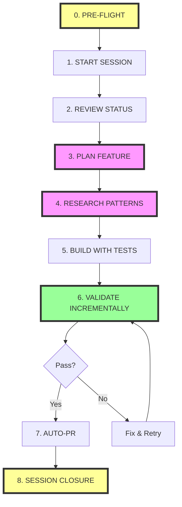

# 🚀 DEFINITIVE BUILD WORKFLOW - The Only Way to Build v6 Features

## ⚠️ ENFORCEMENT NOTICE
**This workflow is MANDATORY for all feature development. Session start scripts will automatically load and enforce this workflow.**

---

## 📊 The Complete 8-Phase Build Cycle (4-6x Faster)



---

## Phase 0: PRE-FLIGHT CHECK (1 min) 🆕

```bash
# AUTOMATIC - Runs with session start
echo "🔍 Pre-flight checks..."

# 1. Load tool inventory
cat reconciliation/00141-COMPREHENSIVE-TOOL-INVENTORY.md | head -20

# 2. Set environment variables
export SUPABASE_URL="https://bbrheacetxlnqbibjwsz.supabase.co"
export SUPABASE_ANON_KEY="$(mcp__supabase-dev__get_anon_key)"

# 3. Check MCP servers
echo "MCP Servers: edl-v6-session ✓ supabase-dev ✓ github-server ✓"
```

---

## Phase 1: START SESSION (2 min)

```bash
# ALWAYS use MCP-integrated start
./scripts/00140-mcp-integrated-session-start.sh [SESSION] "[FOCUS]"

# Then initialize MCP tracking
mcp__edl-v6-session__start_session({
  sessionId: "[SESSION]",
  focus: "[What you're building]",
  estimatedHours: 2
})
```

**Automatic Actions:**
- ✅ Reality Agents run (97% health check)
- ✅ YAML health check
- ✅ Dynamic context loaded
- ✅ Session log created
- ✅ Previous handoff loaded

---

## Phase 2: REVIEW STATUS (5 min)

```bash
# 1. Check current priorities
cat reconciliation/00136-MISSION-AND-PRIORITIES.md | grep "P0"

# 2. Query existing work on your feature
python3 scripts/00059-yaml-query.py --topic "[FEATURE]"

# 3. Check tool availability
grep "[FEATURE]" reconciliation/00141-COMPREHENSIVE-TOOL-INVENTORY.md

# 4. Load dynamic context
./scripts/00138-dynamic-context-loader.sh
```

**MCP Tracking:**
```javascript
mcp__edl-v6-session__add_task({
  title: "Review [FEATURE] status",
  priority: "high",
  status: "in-progress"
})
```

---

## Phase 3: PLAN FEATURE (5 min with AI)

### For NEW SYSTEMS (10+ thoughts):
```javascript
mcp__sequential-thinking__sequentialthinking({
  thought: "Design [SYSTEM] with tables, API, UI considerations",
  totalThoughts: 10,
  thoughtNumber: 1,
  nextThoughtNeeded: true
})
```

### For FEATURE ADDITIONS (5 thoughts):
```javascript
mcp__sequential-thinking__sequentialthinking({
  thought: "Implement [FEATURE] extending existing [SYSTEM]",
  totalThoughts: 5,
  thoughtNumber: 1,
  nextThoughtNeeded: true
})
```

---

## Phase 4: RESEARCH PATTERNS (2 min)

```javascript
// Find best practices
mcp__brave-search__brave_web_search({
  query: "[FEATURE] implementation Next.js Supabase best practices",
  count: 5
})

// Avoid known issues
mcp__brave-search__brave_web_search({
  query: "[FEATURE] common mistakes anti-patterns",
  count: 3
})
```

**Then create informed test:**
```bash
python3 scripts/00136-create-informed-test.py [feature]
```

---

## Phase 5: BUILD WITH TESTS (30-60 min)

### Database Work (Use MCP - 3.2x faster):
```javascript
mcp__supabase-dev__apply_migration({
  name: "[feature]_foundation",
  query: "CREATE TABLE ..."
})

// Verify immediately
mcp__supabase-dev__list_tables()
```

### Code Implementation:
1. **Write baseline test FIRST**
2. **Follow existing patterns** (check truth-seed)
3. **No empty .insert({})** calls
4. **Add real-time from start** (no 95% syndrome)

### Track Progress:
```javascript
mcp__edl-v6-session__track_deliverable({
  path: "path/to/file.tsx",
  type: "component",
  linesOfCode: 150
})
```

---

## Phase 6: VALIDATE INCREMENTALLY (Continuous)

### After EACH component/table:
```javascript
// Quick validation (3 seconds)
mcp__reality-server__orchestrate({
  critical_only: true,
  include_performance: true
})

// If issues found
mcp__edl-v6-session__log_failure({
  what: "Empty insert at line 17",
  impact: "Blocks guardian onboarding",
  lesson: "Always specify fields",
  prevention: "Add linter rule"
})
```

### Full Validation Before PR:
```bash
# Complete orchestrator run
python3 reality/agent-reality-auditor/orchestrator.py

# Run baseline tests
npm test -- edl-ui-tests/baseline/[feature].baseline.test.js
```

**Success Criteria:**
- ✅ Overall health >90%
- ✅ No 95% syndrome detected
- ✅ Baseline tests pass
- ✅ No performance regression

---

## Phase 7: AUTO-PR (30 seconds)

```bash
# Automated PR with all evidence
python3 scripts/00136-auto-pr.py "[Feature Name]" [SESSION]
```

**PR Includes:**
- Validation results
- Performance metrics
- Test results
- Session accomplishments

---

## Phase 8: SESSION CLOSURE (1 min) 🆕

```javascript
// MANDATORY - Creates handoff
mcp__edl-v6-session__end_session({
  summary: "What was accomplished",
  accomplishments: ["Table created", "UI implemented"],
  nextPriorities: ["Next feature to build"],
  honestAssessment: "Any issues or concerns"
})
```

**Automatic Actions:**
- Creates SESSION-[NUMBER]-HANDOFF.md
- Updates session log
- Records metrics

---

## 🚨 ENFORCEMENT MECHANISMS

### 1. Session Start Integration
Every session start script will:
```bash
echo "📋 Loading DEFINITIVE WORKFLOW..."
echo "➡️  core/00141-DEFINITIVE-BUILD-WORKFLOW.md"
echo ""
echo "Phase 1: START SESSION ✓"
echo "Phase 2: REVIEW STATUS - Run now: ./scripts/00138-dynamic-context-loader.sh"
echo "Phase 3: PLAN FEATURE - Use: mcp__sequential-thinking__sequentialthinking"
# ... etc
```

### 2. MCP Session Tracking
The `edl-v6-session` server enforces:
- Cannot end session without accomplishments
- Warns if no deliverables tracked
- Requires validation before PR

### 3. Workflow Validator Script
```bash
./scripts/00141-workflow-validator.sh --check-phase 6
# Returns: "⚠️ Phase 6 requires orchestrator run"
```

---

## 📊 SPEED MULTIPLIERS (Evidence-Based)

| Tool | Speed Gain | Proof |
|------|------------|-------|
| Sequential Thinking | 6x planning | No rework needed |
| Brave Search | 10x research | Instant patterns |
| Supabase MCP | 3.2x DB ops | Session 126 benchmarks |
| GitHub MCP | 30x PR creation | 30s vs 15min |
| Reality Server | 3x validation | <3s checks |
| **COMBINED** | **4-6x overall** | Session 137: 45min vs 3hr |

---

## 🔴 COMMON VIOLATIONS TO AVOID

1. **Skipping Phase 0** - Missing environment vars causes Reality Agent failures
2. **Skipping Phase 4** - Building without research leads to anti-patterns
3. **Skipping Phase 6** - Finding issues after PR wastes time
4. **Forgetting Phase 8** - No handoff confuses next session
5. **Not using MCP** - Manual operations are 3-10x slower

---

## ✅ WORKFLOW CHECKLIST

Before starting ANY feature, verify:

- [ ] Running `00140-mcp-integrated-session-start.sh`
- [ ] MCP session tracking initialized
- [ ] Environment variables set
- [ ] Tool inventory reviewed
- [ ] Previous handoff read
- [ ] Dynamic context loaded
- [ ] YAML queried for existing work
- [ ] Sequential Thinking plan created
- [ ] Brave Search research done
- [ ] Informed test created
- [ ] Incremental validation running
- [ ] Final orchestrator passed
- [ ] PR created with evidence
- [ ] Session properly closed

---

## 📌 QUICK REFERENCE CARD

```bash
# Copy-paste workflow starter
export SESSION=141
export FEATURE="emcoin"

# Phase 0-1: Start
./scripts/00140-mcp-integrated-session-start.sh $SESSION "$FEATURE"

# Phase 2: Review
./scripts/00138-dynamic-context-loader.sh
python3 scripts/00059-yaml-query.py --topic "$FEATURE"

# Phase 3-4: Plan & Research  
python3 scripts/00136-create-informed-test.py $FEATURE

# Phase 5-6: Build & Validate
python3 reality/agent-reality-auditor/orchestrator.py

# Phase 7-8: PR & Close
python3 scripts/00136-auto-pr.py "$FEATURE" $SESSION
```

---

*This workflow is the result of 18 sessions of learning and optimization. Follow it exactly for maximum efficiency.*

**ENFORCEMENT LEVEL: MANDATORY**