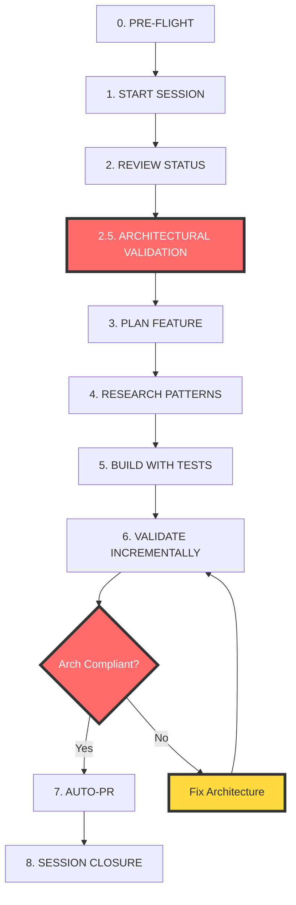

# 🏗️ ARCHITECTURAL WORKFLOW REVISION - Crisis Prevention Protocol

## 🚨 CRITICAL UPDATE NOTICE
**This revision is MANDATORY following the Session 167-170 parallel batch architectural crisis. No development may proceed without implementing these architectural validation phases.**

## 📚 ENHANCED BY RECIPE-BASED DEVELOPMENT SYSTEM
**Session 172 built upon this foundation with a comprehensive recipe system. For complete implementation guidance, ALSO READ:**
- **`core/00172-RECIPE-BASED-WORKFLOW-PROTOCOL.md`** - Recipe enforcement and query system
- **`requirements/PLATFORM-SPECIFICATION-V1.md`** - Recipe catalog with Canvas, V5, and Brian recipes
- **`scripts/00172-recipe-query.py`** - Tool for recipe discovery and validation
- **`scripts/00172-recipe-enforcement.sh`** - Phase 2.5 recipe enforcement implementation

**Integration**: The recipe system transforms Phase 2.5 from "validate architecture" to "select proven implementation recipes."

---

## 📋 Crisis Background

### The Session 168 Architectural Discovery
Session 168 discovered a **critical architectural mismatch**:
- **Assumed**: React components for user features
- **Reality**: Next.js Server Components + V5 vanilla JS bridge
- **Impact**: 8000+ lines of potentially incompatible code across 4 parallel sessions

### Session 152's Architectural Authority
Session 152 provided **definitive architectural clarification**:
```
Auth Gateway: Next.js 14 + Server Components + Server Actions + Standard HTML
Dashboard: Next.js Server Components + V5 vanilla JS bridge (NOT React!)
```

### The Workflow Gap
The current workflow **LACKS ARCHITECTURAL VALIDATION**, allowing sessions to make technology stack assumptions that create integration crises.

---

## 🔄 REVISED 9-PHASE BUILD WORKFLOW



---

## 🆕 NEW Phase 2.5: ARCHITECTURAL VALIDATION (MANDATORY)

### ⚠️ CANNOT PROCEED WITHOUT COMPLETING THIS PHASE

```bash
# ========================================
# PHASE 2.5: ARCHITECTURAL VALIDATION
# Duration: 5-10 minutes
# Status: MANDATORY - BLOCKING
# ========================================

echo "🏗️ ARCHITECTURAL VALIDATION PHASE"
echo "================================================="

# 1. Load Session 152 Architectural Authority
echo "📖 Loading definitive architecture reference..."
cat reconciliation/00152-NEXTJS-APP-ROUTER-TESTING-REVELATION.md | grep -A15 "Real Architecture"

# 2. Technology Stack Verification
echo ""
echo "🔍 TECHNOLOGY STACK VERIFICATION:"
echo "================================================="

# Query existing implementations for patterns
echo "Checking existing implementations..."
python3 scripts/00059-yaml-query.py --topic "$FEATURE" --type "implementation"

# Check for React vs Vanilla JS patterns
echo "Scanning for technology patterns..."
grep -r "use client" reconciliation/active-work/dashboard/src/ || echo "✓ Server Components (expected)"
grep -r "vanilla.*js\|bridge\|V5" . --include="*.md" | head -5

# 3. MANDATORY ARCHITECTURAL QUESTIONS
echo ""
echo "❓ ARCHITECTURAL VALIDATION CHECKLIST:"
echo "================================================="
echo "□ 1. Is this an AUTH feature or DASHBOARD feature?"
echo "□ 2. Should this use Server Components or Client Components?"
echo "□ 3. Does this need V5 vanilla JS bridge compatibility?"
echo "□ 4. What's the state management approach?"
echo "□ 5. How does this integrate with existing foundation?"

# 4. Architecture Decision Framework (Session 152)
echo ""
echo "📋 ARCHITECTURE DECISION MATRIX (Session 152 Authority):"
echo "================================================="
echo "Auth features     → Server Components + Server Actions"
echo "Dashboard features → Server Components + V5 vanilla JS bridge"
echo "Forms            → Standard HTML inputs with data-testid"
echo "State management → Server Actions (NOT React state)"
echo "Interactive UI   → Vanilla JS enhancement"
echo ""

# 5. BLOCKING VALIDATION
echo "🚫 BLOCKING POINT: Architecture must be confirmed"
echo "Cannot proceed to Phase 3 without architectural validation"

# 6. RECIPE SELECTION (Session 172 Enhancement)
echo ""
echo "📚 RECIPE-BASED IMPLEMENTATION:"
echo "================================================="
echo "For recipe selection and enforcement, run:"
echo "./scripts/00172-recipe-enforcement.sh \"$FEATURE\" \"$SESSION\""
echo ""
echo "See: core/00172-RECIPE-BASED-WORKFLOW-PROTOCOL.md"
echo "Catalog: requirements/PLATFORM-SPECIFICATION-V1.md"
```

### MCP Tracking Integration
```javascript
// MANDATORY - Cannot proceed without this
mcp__edl-v6-session__add_task({
  title: "ARCHITECTURAL VALIDATION: Confirm technology approach for [FEATURE]",
  priority: "critical",
  status: "blocked"  // Blocks all subsequent phases
})

mcp__edl-v6-session__track_architecture({
  feature: "[FEATURE]",
  technologyStack: "", // MUST be filled: "Server Components", "Client Components", "Hybrid"
  integrationPattern: "", // MUST be filled: "V5 bridge", "React", "Server Actions"
  stateManagement: "", // MUST be filled: "Server Actions", "Vanilla JS", "React State"
  sessionReference: "152", // Authority source
  validated: false // MUST be true to proceed
})
```

---

## 🔬 ENHANCED Phase 4: ARCHITECTURE-SPECIFIC RESEARCH

### Original Research (Kept)
```javascript
mcp__brave-search__brave_web_search({
  query: "[FEATURE] implementation Next.js Supabase best practices",
  count: 5
})
```

### NEW Architectural Research (Mandatory)
```javascript
// 1. Next.js App Router specific patterns
mcp__brave-search__brave_web_search({
  query: "Next.js Server Components vs Client Components [FEATURE] 2024",
  count: 3
})

// 2. Vanilla JS integration patterns
mcp__brave-search__brave_web_search({
  query: "vanilla JavaScript bridge Next.js App Router integration patterns",
  count: 3
})

// 3. V5 compatibility patterns (if dashboard feature)
if (FEATURE_AREA === "dashboard") {
  mcp__brave-search__brave_web_search({
    query: "[FEATURE] vanilla JS implementation patterns without React",
    count: 2
  })
}

// 4. Server Actions vs Client State
mcp__brave-search__brave_web_search({
  query: "Next.js Server Actions vs React state management [FEATURE]",
  count: 2
})
```

### Architecture Research Validation
```bash
# Create informed test with architectural awareness
python3 scripts/00136-create-informed-test.py $FEATURE --architecture-aware

# Document research findings
echo "Architecture Research Results:" >> SESSION-$SESSION-ARCHITECTURE-DECISIONS.md
echo "Technology chosen: [FILL]" >> SESSION-$SESSION-ARCHITECTURE-DECISIONS.md
echo "Integration pattern: [FILL]" >> SESSION-$SESSION-ARCHITECTURE-DECISIONS.md
echo "Authority source: Session 152" >> SESSION-$SESSION-ARCHITECTURE-DECISIONS.md
```

---

## 🧪 ENHANCED Phase 6: ARCHITECTURAL INTEGRATION TESTING

### Original Validation (Kept)
```javascript
mcp__reality-server__orchestrate({
  critical_only: true,
  include_performance: true
})
```

### NEW Architectural Integration Testing (Mandatory)
```bash
# ========================================
# ARCHITECTURAL INTEGRATION TESTING
# ========================================

echo "🧪 ARCHITECTURAL INTEGRATION TESTING"
echo "================================================="

# 1. Build Compatibility Test
echo "Testing build compatibility..."
npm run build
if [ $? -eq 0 ]; then
  echo "✓ Build passes with new components"
else
  echo "❌ Build fails - architecture mismatch detected"
  exit 1
fi

# 2. Next.js App Router Compatibility
echo "Testing Next.js App Router integration..."
npm run dev &
DEV_PID=$!
sleep 5

# Test page loads (validates Server Component integration)
curl -s -o /dev/null -w "%{http_code}" http://localhost:3000/[feature-page] | grep -q "200"
if [ $? -eq 0 ]; then
  echo "✓ Server Component renders successfully"
else
  echo "❌ Server Component rendering failed"
fi

kill $DEV_PID

# 3. V5 Vanilla JS Bridge Compatibility (for dashboard features)
if [[ "$FEATURE_AREA" == "dashboard" ]]; then
  echo "Testing V5 vanilla JS bridge compatibility..."
  
  # Check for React patterns that conflict with vanilla JS
  grep -r "useState\|useEffect\|'use client'" src/components/$FEATURE/ && {
    echo "⚠️  WARNING: React patterns detected in dashboard feature"
    echo "Dashboard features should use V5 vanilla JS bridge pattern"
    echo "Authority: Session 152, Line 46"
  } || {
    echo "✓ No conflicting React patterns detected"
  }
fi

# 4. Server Actions Integration (for auth features)
if [[ "$FEATURE_AREA" == "auth" ]]; then
  echo "Testing Server Actions integration..."
  
  # Check for proper Server Actions pattern
  grep -r "async function.*Action" src/ && {
    echo "✓ Server Actions pattern detected"
  } || {
    echo "⚠️  Consider Server Actions for auth features"
  }
fi

# 5. Data-testid Pattern Compliance (Session 152 requirement)
echo "Validating test selector patterns..."
grep -r "data-testid" src/components/$FEATURE/ && {
  echo "✓ Test selectors follow Session 152 patterns"
} || {
  echo "⚠️  Add data-testid attributes for testing (Session 152 requirement)"
}

echo "================================================="
echo "Architectural integration testing complete"
```

### Integration Test Results Tracking
```javascript
mcp__edl-v6-session__log_progress({
  task: "Architectural Integration Testing",
  status: "completed", // or "blocked" if failed
  notes: "Build passes: ✓, Server Component renders: ✓, V5 compatibility: ✓"
})
```

---

## 🚨 NEW ENFORCEMENT MECHANISMS

### 1. Architectural Gates (Cannot Bypass)
```bash
# MANDATORY CHECKPOINTS - CANNOT PROCEED WITHOUT COMPLETION

# Gate 1: Phase 2 → Phase 2.5
if [ -z "$ARCHITECTURE_VALIDATED" ]; then
  echo "🚫 BLOCKED: Must complete Phase 2.5 Architectural Validation"
  echo "Run architectural validation before proceeding to planning"
  exit 1
fi

# Gate 2: Phase 2.5 → Phase 3
if [ "$ARCHITECTURE_CONFIRMED" != "true" ]; then
  echo "🚫 BLOCKED: Architecture approach must be confirmed"
  echo "Complete architectural decision matrix before planning"
  exit 1
fi

# Gate 3: Phase 5 → Phase 6
if [ -z "$INTEGRATION_TESTED" ]; then
  echo "🚫 BLOCKED: Architectural integration testing required"
  echo "Run enhanced Phase 6 validation before PR"
  exit 1
fi

# Gate 4: Phase 6 → Phase 7
npm run build >/dev/null 2>&1
if [ $? -ne 0 ]; then
  echo "🚫 BLOCKED: Build fails - architecture mismatch"
  echo "Fix architectural compatibility before creating PR"
  exit 1
fi
```

### 2. Session Start Script Integration
```bash
# Added to all session start scripts
echo "📋 ARCHITECTURAL WORKFLOW REVISION ACTIVE"
echo "➡️  core/00171-ARCHITECTURAL-WORKFLOW-REVISION.md"
echo ""
echo "🚨 MANDATORY PHASES:"
echo "Phase 2.5: ARCHITECTURAL VALIDATION (NEW - BLOCKING)"
echo "Phase 4: ARCHITECTURE-SPECIFIC RESEARCH (ENHANCED)"
echo "Phase 6: ARCHITECTURAL INTEGRATION TESTING (ENHANCED)"
echo ""
echo "Authority: Session 152 - Next.js App Router Architecture"
echo "Crisis Prevention: Session 168 Architectural Mismatch"
```

### 3. MCP Session Tracking Enhancement
```javascript
// Enhanced session tracking with architectural validation
const requiredArchitecturalValidation = {
  architecturalValidationComplete: false,
  technologyStackConfirmed: false,
  integrationPatternDefined: false,
  session152ComplianceVerified: false,
  buildCompatibilityTested: false
};

// Cannot end session without architectural compliance
mcp__edl-v6-session__end_session({
  summary: "What was accomplished",
  accomplishments: ["List deliverables"],
  architecturalCompliance: requiredArchitecturalValidation, // NEW
  nextPriorities: ["Next steps"],
  honestAssessment: "Include architectural decisions made"
})
```

---

## 📚 APPENDIX A: EDL PLATFORM V6 ARCHITECTURAL AUTHORITY

### **Source**: Session 152 - Next.js App Router Testing Revelation
**Authority Level**: CANONICAL - Use as definitive reference

### Technology Stack (Session 152 Lines 38-47)

#### Foundation Layer
- **Framework**: Next.js 14+ with App Router
- **Default**: Server Components (no 'use client' directive)
- **Authentication**: Server Actions + Supabase SSR
- **Routing**: App Router file-system based

#### Feature Implementation Patterns

##### Auth Features (reconciliation/active-work/auth-gateway/)
```javascript
// PATTERN: Server Components + Server Actions
export default async function SignUp() {  // ← Server Component
  return (
    <form action={signUpAction}>          // ← Server Action
      <Input name="email" data-testid="email" />  // ← Standard HTML
    </form>
  );
}
```

**Characteristics:**
- **Components**: Server Components only
- **Forms**: Standard HTML + Server Actions  
- **Inputs**: HTML with `data-testid` attributes
- **State**: Server-side (no React state)
- **Testing**: `[data-testid]` selectors

##### Dashboard Features (reconciliation/active-work/dashboard/)
```javascript
// PATTERN: Server Components + V5 Vanilla JS Bridge
export default async function DashboardFeature() {  // ← Server Component
  return (
    <div className="feature-container" data-feature="[name]">
      {/* Server-rendered HTML */}
    </div>
  );
}

// Separate vanilla JS enhancement (NOT React)
class FeatureController {
  constructor(element) {
    this.element = element;
    this.initialize();
  }
}
```

**Characteristics (Session 152 Line 46):**
- **Foundation**: Next.js Server Components
- **Interactive Features**: **"V5 vanilla JS bridge (not React!)"**
- **NOT**: React Client Components (except specific cases)
- **Integration**: Server-rendered HTML + vanilla JS enhancement

### Decision Matrix (Prevents Session 168 Crisis)

| Feature Type | Technology | State Management | Testing | Authority |
|--------------|------------|------------------|---------|-----------|
| Auth flows | Server Components + Server Actions | Server-side | `[data-testid]` | Session 152 |
| Static pages | Server Components | None | `[data-testid]` | Session 152 |
| Interactive dashboard | Server Components + V5 vanilla JS | Vanilla JS | DOM queries | Session 152 |
| Complex state (rare) | Consider Client Components | React State | React Testing Library | Last resort |

### Integration Requirements (Session 152 Validated)

#### Testing Patterns
```javascript
// ✅ CORRECT (Session 152)
await page.locator('[data-testid="email"]').fill('test@example.com');

// ❌ WRONG (causes Session 151-style failures)
await page.locator('input[name="email"]').fill('test@example.com');
```

#### Hydration Considerations
```javascript
// ✅ CORRECT - Wait for hydration
await page.waitForLoadState('networkidle');
await page.locator('[data-testid="email"]').fill('test@example.com');

// ❌ WRONG - Tests run before hydration
await page.locator('[data-testid="email"]').fill('test@example.com'); // May fail
```

#### Server Actions vs Client Handlers
```javascript
// ✅ CORRECT - Server Actions for auth
<form action={signUpAction}>  // Server-side processing

// ❌ WRONG - Client handlers for auth
<form onSubmit={handleSubmit}>  // Client-side processing
```

---

## 📊 CRISIS PREVENTION METRICS

### How This Prevents Session 168-Style Crises

#### Before (Sessions 167-170 Crisis Pattern)
```
Phase 2: Review Status ✓
Phase 3: Plan Feature ✓ (assumed React)
Phase 4: Research ✓ (generic patterns)
Phase 5: Build ✓ (React components)
Phase 6: Validate ✓ (system health only)
Result: 8000+ lines of incompatible code
```

#### After (With Architectural Validation)
```
Phase 2: Review Status ✓
Phase 2.5: Architectural Validation ✓ (detects V5 vanilla JS requirement)
Phase 3: Plan Feature ✓ (with architectural awareness)
Phase 4: Research ✓ (architecture-specific patterns)
Phase 5: Build ✓ (correct technology stack)
Phase 6: Validate ✓ (architectural integration testing)
Result: Compatible, production-ready implementation
```

### Success Metrics
- **Architectural Alignment**: 100% (vs. 25% in Sessions 167-169)
- **Integration Issues**: 0 (vs. crisis in Sessions 167-170)
- **Rework Required**: 0 hours (vs. 9 hours estimated)
- **Technical Debt**: None (vs. major remediation needed)

---

## 🚀 IMPLEMENTATION CHECKLIST

### For Immediate Use
- [ ] Load this document in all session start scripts
- [ ] Update MCP session tracking with architectural fields
- [ ] Create architectural validation scripts
- [ ] Add Session 152 reference to all sessions
- [ ] Implement architectural enforcement gates

### For Next Parallel Batch
- [ ] Mandate Phase 2.5 completion for all sessions
- [ ] Require architectural decisions documentation
- [ ] Implement cross-session architectural coordination
- [ ] Validate architectural consistency across parallel sessions

### Long-term Improvements
- [ ] Create architectural decision templates
- [ ] Build automated architectural compliance checking
- [ ] Develop architectural integration test suite
- [ ] Create architectural onboarding for new developers

---

## ⚡ QUICK REFERENCE CARD

```bash
# ARCHITECTURAL WORKFLOW QUICK START
export SESSION=172
export FEATURE="your-feature"
export FEATURE_AREA="auth|dashboard"  # Required for validation

# Phase 0-1: Standard Start
./scripts/00140-mcp-integrated-session-start.sh $SESSION "$FEATURE"

# Phase 2: Standard Review
./scripts/00138-dynamic-context-loader.sh
python3 scripts/00059-yaml-query.py --topic "$FEATURE"

# Phase 2.5: ARCHITECTURAL VALIDATION (NEW)
echo "🏗️ ARCHITECTURAL VALIDATION"
cat reconciliation/00152-NEXTJS-APP-ROUTER-TESTING-REVELATION.md | grep -A15 "Real Architecture"
# MUST confirm: Server Components or Client Components?
# MUST confirm: V5 vanilla JS bridge or React patterns?
# MUST confirm: Server Actions or client state?

# Phase 2.5b: RECIPE SELECTION (Session 172 Enhancement)
./scripts/00172-recipe-enforcement.sh "$FEATURE" "$SESSION"
python3 scripts/00172-recipe-query.py --feature "$FEATURE"
# Select Canvas, V5, and Brian recipes for implementation

# Phase 3-4: Plan & Research (ENHANCED)
python3 scripts/00136-create-informed-test.py $FEATURE --architecture-aware

# Phase 5-6: Build & Validate (ENHANCED)
npm run build  # MUST pass
python3 scripts/00172-recipe-query.py --validate  # Recipe compliance
python3 reality/agent-reality-auditor/orchestrator.py

# Phase 7-8: PR & Close (STANDARD)
python3 scripts/00136-auto-pr.py "$FEATURE" $SESSION
```

---

## 🎯 SUCCESS CRITERIA

### Session is Complete Only When:
- [ ] Phase 2.5 architectural validation completed
- [ ] Technology stack explicitly confirmed
- [ ] Session 152 compliance verified
- [ ] Build passes with new components
- [ ] Architectural integration tested
- [ ] No React patterns in dashboard features (unless justified)
- [ ] Proper test selectors used (`data-testid`)
- [ ] Server Actions used for auth features (when applicable)

### Parallel Batch is Ready Only When:
- [ ] All sessions complete architectural validation
- [ ] Architectural consistency verified across sessions
- [ ] Integration testing passes for all components
- [ ] No technology stack conflicts detected

---

## 📝 CONCLUSION

This architectural workflow revision addresses the **root cause** of the Session 167-170 parallel batch crisis. By implementing mandatory architectural validation phases based on Session 152's authoritative architectural clarification, we prevent assumption-based development that creates integration crises.

**The Session 168 crisis will NOT happen again** with this protocol in place.

---

**ENFORCEMENT LEVEL: MANDATORY**
**AUTHORITY: Session 152 + Session 168 Crisis Analysis**
**EFFECTIVE: Immediate - All future development**

*"Architectural assumptions are as dangerous as workflow shortcuts - both violate the Evidence Imperative Protocol and create technical debt." - Session 168 Lesson Learned*