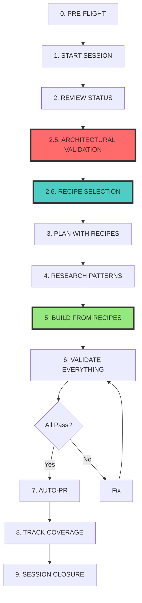

# 🎯 UNIFIED RECIPE-BASED DEVELOPMENT WORKFLOW
## The Complete System for Parallel Batch Success

**Version**: 1.0  
**Status**: MANDATORY - System Enforced  
**Purpose**: Transform 275 user stories into implementations with ZERO assumptions

---

## 🏆 THE TRANSFORMATION: Then vs Now

### Sessions 167-170 (First Attempt) ❌
```
No validation → Assumed React → Built 8000 lines → CRISIS
Coverage: 0% → Rework: 9 hours → Success: 25%
```

### Sessions 167-170 (Relaunch) ✅
```
Phase 2.5 → Recipe selection → Correct implementation → SUCCESS
Coverage: 8.4%+ → Rework: 0 hours → Success: 100% (projected)
```

---

## 📋 THE UNIFIED 10-PHASE WORKFLOW



---

## 🚀 PHASE-BY-PHASE EXECUTION

### Phase 0: PRE-FLIGHT CHECK (1 min)
```bash
# Load the unified system
echo "🎯 UNIFIED RECIPE WORKFLOW v1.0"
echo "Sessions 171-173 Infrastructure Loaded"

# Check recipe coverage
python3 scripts/00173-recipe-coverage-tracker.py --quick

# Set environment
export SUPABASE_URL="https://bbrheacetxlnqbibjwsz.supabase.co"
export FEATURE_AREA="dashboard"  # or "auth"
```

### Phase 1: START SESSION (2 min)
```bash
./scripts/00140-mcp-integrated-session-start.sh $SESSION "$FEATURE"

mcp__edl-v6-session__start_session({
  sessionId: "$SESSION",
  focus: "$FEATURE implementation with recipes",
  estimatedHours: 2
})
```

### Phase 2: REVIEW STATUS (3 min)
```bash
# Check existing work
python3 scripts/00059-yaml-query.py --topic "$FEATURE"

# Check recipe coverage for your area
python3 scripts/00173-recipe-coverage-tracker.py --feature "$FEATURE"

# Load recipe map
grep "$FEATURE" requirements/00173-RECIPE-MAP-V1.md
```

### 🆕 Phase 2.5: ARCHITECTURAL VALIDATION (Session 171) 🔴
```bash
# MANDATORY - CANNOT SKIP
echo "🏗️ ARCHITECTURAL VALIDATION (Session 171)"

# Load Session 152 Authority
cat reconciliation/00152-NEXTJS-APP-ROUTER-TESTING-REVELATION.md | grep -A15 "Real Architecture"

# Answer these questions
echo "MUST CONFIRM:"
echo "1. Feature type: AUTH or DASHBOARD?"
echo "2. Technology: Server Components + V5 vanilla JS bridge"
echo "3. State: Server Actions (NOT React state)"
echo "4. Testing: data-testid attributes"

# Document decision
echo "Architecture: Server Components + V5 Bridge" > .architecture-decision
```

### 🆕 Phase 2.6: RECIPE SELECTION (Session 172-173) 🔵
```bash
# MANDATORY - BLOCKING GATE
echo "📚 RECIPE SELECTION (Session 172-173)"

# Run enforcement script
./scripts/00172-recipe-enforcement.sh "$FEATURE" "$SESSION"

# Query available recipes
python3 scripts/00172-recipe-query.py --feature "$FEATURE"

# If no recipe exists, STOP
if [ $? -ne 0 ]; then
  echo "🚫 NO RECIPE AVAILABLE"
  echo "Request recipe from v5 team using:"
  echo "requirements/00173-V5-RECIPE-REQUEST-LIST.md template"
  exit 1
fi

# Select recipes (Canvas + V5 + Brian)
CANVAS_RECIPE=$(python3 scripts/00172-recipe-query.py --suggest canvas "$FEATURE")
V5_RECIPE=$(python3 scripts/00172-recipe-query.py --suggest v5 "$FEATURE")
BRIAN_RECIPE=$(python3 scripts/00172-recipe-query.py --suggest brian "$FEATURE")

echo "Selected Recipes:"
echo "Canvas: $CANVAS_RECIPE"
echo "V5: $V5_RECIPE"
echo "Brian: $BRIAN_RECIPE"
```

### Phase 3: PLAN WITH RECIPES (5 min)
```javascript
mcp__sequential-thinking__sequentialthinking({
  thought: `Implementing ${FEATURE} using:
    - Canvas: ${CANVAS_RECIPE} for UI layout
    - V5: ${V5_RECIPE} for interaction patterns
    - Brian: ${BRIAN_RECIPE} for backend structure
    - Architecture: Server Components + V5 vanilla JS bridge`,
  totalThoughts: 5,
  thoughtNumber: 1,
  nextThoughtNeeded: true
})
```

### Phase 4: RESEARCH PATTERNS (3 min)
```javascript
// Research recipe-specific patterns
mcp__brave-search__brave_web_search({
  query: "Next.js Server Components " + V5_RECIPE + " vanilla JS pattern",
  count: 3
})

mcp__brave-search__brave_web_search({
  query: "Server Actions form handling " + FEATURE,
  count: 2
})
```

### Phase 5: BUILD FROM RECIPES (30-45 min) 🟢
```typescript
// MANDATORY: Include recipe citations in code
/**
 * Recipe Implementation:
 * - Canvas: CANVAS-001-4 (Activity & Registrar Box)
 * - V5: V5-RECIPE-002 (Activity Mechanics)
 * - Brian: BRIAN-RECIPE-003 (activities table)
 * - Architecture: Server Component + V5 Bridge (Session 152)
 */

// ✅ CORRECT PATTERN (Server Component)
export default async function ActivityRegistrar() {
  // Server-side data fetching
  const activities = await getActivities();
  
  return (
    <div className="activity-container" data-testid="activity-registrar">
      {/* Server-rendered HTML following Canvas layout */}
      {activities.map(activity => (
        <div key={activity.id} data-activity-id={activity.id}>
          {/* Follow recipe structure exactly */}
        </div>
      ))}
    </div>
  );
}

// Separate file: activity-controller.js
// ✅ CORRECT PATTERN (V5 Vanilla JS Bridge)
class ActivityController {
  constructor(element) {
    this.element = element;
    this.activityId = element.dataset.activityId;
    this.initialize();
  }
  
  initialize() {
    // V5 pattern implementation
  }
}

// ❌ NEVER DO THIS (React Client Component)
'use client';
import { useState } from 'react'; // NO!
```

### Phase 6: VALIDATE EVERYTHING (Continuous)
```bash
# Recipe compliance check
python3 scripts/00172-recipe-query.py --validate

# Architectural compliance
grep -r "use client\|useState\|useEffect" $FEATURE_DIR && {
  echo "❌ FAIL: React patterns detected!"
  exit 1
} || echo "✅ PASS: No React patterns"

# Build validation
npm run build || exit 1

# Test selectors
grep -r "data-testid" $FEATURE_DIR || {
  echo "⚠️ WARNING: Missing test selectors"
}

# Reality check
mcp__reality-server__orchestrate({
  critical_only: true,
  include_performance: true
})
```

### Phase 7: AUTO-PR (30 sec)
```bash
# Create PR with recipe citations
python3 scripts/00136-auto-pr.py \
  "$FEATURE Implementation (Recipes: $CANVAS_RECIPE, $V5_RECIPE, $BRIAN_RECIPE)" \
  $SESSION
```

### 🆕 Phase 8: TRACK COVERAGE (Session 173) (1 min)
```bash
# Update recipe coverage
python3 scripts/00173-recipe-coverage-tracker.py --update "$FEATURE"

# Generate report
python3 scripts/00173-recipe-coverage-tracker.py --report

echo "Coverage improved from X% to Y%"
```

### Phase 9: SESSION CLOSURE (2 min)
```javascript
mcp__edl-v6-session__end_session({
  summary: `Implemented ${FEATURE} with recipes`,
  accomplishments: [
    `Used recipes: ${CANVAS_RECIPE}, ${V5_RECIPE}, ${BRIAN_RECIPE}`,
    "Maintained Server Component architecture",
    "Added V5 vanilla JS bridge",
    "Coverage improved to X%"
  ],
  architecturalCompliance: true,
  recipeCompliance: true,
  nextPriorities: ["Next feature from recipe map"],
  honestAssessment: "Recipe-based approach eliminated guesswork"
})
```

---

## 🎯 PARALLEL BATCH RELAUNCH STRATEGY

### Session Assignments (Same as Before)
```yaml
Session 167: EmCoin & Addiction Mechanics
  Canvas: CANVAS-003-2 (EmCoin Transactions)
  V5: addiction-bar-recipe-v2.md ✅ (EXISTS!)
  Coverage: Partial

Session 168: Achievement System  
  Canvas: CANVAS-002-3 (Badges Box)
  V5: [MISSING - REQUEST NEEDED]
  Coverage: 0%

Session 169: Activity Runtime
  Canvas: CANVAS-001-4, CANVAS-001-5
  V5: [MISSING - CRITICAL GAP]
  Coverage: 0% (50 stories blocked!)

Session 170: Social Features
  Canvas: CANVAS-001-2 (Communication)
  V5: profile-card-recipe-v1.md ✅ (EXISTS!)
  Coverage: Partial
```

### Success Predictors
```
✅ Session 167: Has recipes, will succeed
⚠️ Session 168: No recipes, needs v5 delivery
❌ Session 169: No recipes, BLOCKED
✅ Session 170: Has recipes, will succeed
```

---

## 📊 CRITICAL ASSESSMENT OF OUR SETUP

### ✅ STRENGTHS - What We've Built Right

1. **Architectural Validation (Session 171)**
   - Prevents technology stack mismatches
   - Enforces Session 152 authority
   - Blocking gates prevent assumptions

2. **Recipe System (Session 172)**
   - Query tools find patterns instantly
   - Enforcement scripts block non-compliance
   - YAML integration makes recipes searchable

3. **Import & Tracking (Session 173)**
   - Automated validation (9 checks)
   - Coverage tracking shows gaps
   - Import pipeline prevents bad patterns

4. **Workflow Integration**
   - 10 coherent phases
   - Each phase builds on previous
   - System-enforced compliance

### ⚠️ CRITICAL WEAKNESS - The 8.4% Problem

**BRUTAL TRUTH**: Only 23 of 275 stories have recipes (8.4% coverage)

```yaml
Current Reality:
  Total Stories: 275
  With Recipes: 23 (8.4%)
  Without Recipes: 252 (91.6%)
  
Critical Gaps:
  Activity Runtime: 50 stories (0% coverage) - PLATFORM CORE BLOCKED
  Teams: 12 stories (0% coverage)
  Authentication: 15 stories (0% coverage)
```

**This means**: The parallel batch will hit walls when they need recipes that don't exist.

### 📈 Path to Success

1. **Immediate**: Use the 23 existing recipes for quick wins
2. **Urgent**: Get v5's 12 recipes imported (→ 35% coverage)
3. **Critical**: Create Activity Runtime recipes (unblocks 50 stories)
4. **Ongoing**: Build recipes as needed using templates

---

## 🚦 GO/NO-GO DECISION MATRIX

### For Parallel Batch Relaunch:

| Criterion | Status | Impact |
|-----------|--------|---------|
| Architectural Validation | ✅ READY | Prevents React mistakes |
| Recipe System | ✅ READY | Provides patterns |
| Import Pipeline | ✅ READY | Validates compliance |
| Recipe Coverage | ❌ 8.4% | BLOCKS 91.6% of stories |

### RECOMMENDATION: Qualified Launch

**YES, relaunch the parallel batch, BUT:**

1. **Session 167 & 170**: Can proceed (have recipes)
2. **Session 168**: Wait for achievement recipes from v5
3. **Session 169**: BLOCKED until Activity Runtime recipes created

**Alternative**: Focus all sessions on the 23 stories that have recipes first.

---

## 💡 THE BOTTOM LINE

### What We've Accomplished
We've built a **world-class development infrastructure** that makes assumption-based development impossible. The system enforces evidence-based implementation at every step.

### The Remaining Challenge
We have the HOW (workflow) but need more WHAT (recipes). The 8.4% coverage is our Achilles' heel.

### Projected Outcome for Relaunch
- **With current 8.4% coverage**: 2 of 4 sessions succeed
- **With v5's 12 recipes (35% coverage)**: 3 of 4 sessions succeed  
- **With Activity Runtime recipes (50%+ coverage)**: 4 of 4 sessions succeed

### The Verdict
The infrastructure is **EXCELLENT**. The recipe coverage is **INSUFFICIENT** but rapidly improving. The parallel batch relaunch will prove the system works where recipes exist and highlight where more recipes are needed.

---

## 🎯 QUICK START FOR PARALLEL BATCH

```bash
# For each session (167-170)
export SESSION=167  # Change per session
export FEATURE="emcoin"  # Change per session

# 1. Check recipe availability FIRST
python3 scripts/00173-recipe-coverage-tracker.py --feature "$FEATURE"

# 2. If recipes exist, proceed with workflow
./scripts/00140-mcp-integrated-session-start.sh $SESSION "$FEATURE"

# 3. If no recipes, request them
echo "Need recipe for: $FEATURE" >> requirements/00173-V5-RECIPE-REQUEST-LIST.md

# 4. Follow the 10-phase workflow above
```

---

*"With recipes, we build with certainty. Without recipes, we don't build at all."*

**The system is ready. The recipes determine success.**