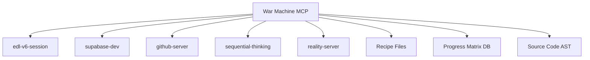

# War Machine MCP Server Masterplan
## Transforming Lessons into Living Enforcement

**Version**: 1.0  
**Session**: 181  
**Status**: Ready for Implementation  
**Purpose**: Create an MCP server that makes architectural failures impossible

---

## Executive Summary

The War Machine MCP server unifies three battle-tested systems (Recipe Workflows, Definitive Build, Progress Matrix) into a single programmatic enforcement mechanism. This transforms our hard-won lessons from 14,000 lines of wrong code into an active guardian that prevents architectural violations in real-time.

---

## 🎯 Core Mission

Transform the War Machine Trio from methodology into **active enforcement**:

```
Manual Processes → Programmatic Enforcement
Documentation → Validation Gates  
Best Practices → Impossible to Bypass
Human Memory → System Memory
```

---

## 🏗️ Architecture Overview

### Server Location
```
/home/b4sho/mcp-servers/war-machine/
├── package.json
├── index.js
├── lib/
│   ├── recipe-manager.js      # Recipe selection & validation
│   ├── workflow-enforcer.js   # 8-phase workflow gates
│   ├── progress-tracker.js    # Matrix updates & visibility
│   ├── architecture-guard.js  # AST-based violation detection
│   └── integration-bridge.js  # Connect to other MCP servers
├── recipes/
│   ├── canvas/                # Canvas wireframe recipes
│   ├── v5/                    # V5 pattern recipes
│   └── brian/                 # Brian's architecture recipes
└── validators/
    ├── server-component.js    # Validate Server Components
    ├── v5-bridge.js          # Validate V5 patterns
    └── react-violations.js    # Detect React hooks misuse
```

### Integration Points


---

## 📦 Core Components

### 1. Recipe Management System

**Purpose**: Eliminate assumptions about WHAT to build

**Key Functions**:
```javascript
// Recipe Discovery
war_machine.list_recipes({
  type: "canvas|v5|brian",
  feature: "authentication"
})
// Returns: Available recipes for the feature

// Recipe Selection
war_machine.select_recipe({
  feature: "login",
  recipe_id: "CANVAS-001-1"
})
// Returns: Recipe details, requirements, patterns

// Recipe Validation
war_machine.validate_implementation({
  file: "components/login.tsx",
  recipe_id: "CANVAS-001-1"
})
// Returns: Compliance report with violations

// Recipe Citation
war_machine.add_recipe_citation({
  file: "login.tsx",
  recipes: {
    canvas: "CANVAS-001-1",
    v5: "V5-RECIPE-AUTH-001",
    brian: "BRIAN-BACKEND-AUTH"
  }
})
// Updates YAML frontmatter with citations
```

**Data Sources**:
- Canvas wireframes (11 files in `archive/legacy-canvas-work/`)
- V5 patterns from `truth-seed/` reference
- Brian's architecture from backend specs
- Existing implementations with proven patterns

### 2. Workflow Enforcement Engine

**Purpose**: Enforce HOW we build correctly

**Key Functions**:
```javascript
// Phase Management
war_machine.start_phase({
  phase: 0, // Pre-flight
  session: "181"
})
// Returns: Checklist for phase

war_machine.validate_phase({
  phase: 2, // Review Status
  checks: {
    yaml_queried: true,
    existing_work_reviewed: true,
    tool_inventory_checked: true
  }
})
// Returns: Pass/fail with missing items

// Gate Enforcement
war_machine.check_gate({
  from_phase: 5, // Build
  to_phase: 6    // Validate
})
// Returns: Boolean - can proceed?

// Workflow Status
war_machine.get_workflow_status({
  session: "181"
})
// Returns: Current phase, completed phases, blockers
```

**The 8 Phases Enforced**:
```yaml
Phase 0: Pre-flight Check
  - Environment variables set
  - Build cache health
  - MCP servers connected
  
Phase 1: Session Start
  - Reality agents run
  - YAML queries executed
  - Context loaded

Phase 2: Review Status
  - Existing work queried
  - Priorities checked
  - Tool inventory reviewed

Phase 3: Plan Feature
  - Sequential thinking deployed
  - Recipe selected
  - Architecture validated

Phase 4: Research Patterns
  - Evidence gathered
  - Patterns verified
  - Similar work found

Phase 5: Build with Tests
  - Defensive programming
  - Test coverage
  - Type safety

Phase 6: Validate Incrementally
  - Build passes
  - Tests pass
  - No violations

Phase 7: Auto-PR
  - Changes committed
  - PR created
  - CI/CD passes

Phase 8: Session Closure
  - Handoff created
  - Progress updated
  - MCP session ended
```

### 3. Progress Matrix Tracker

**Purpose**: Provide VISIBILITY and accountability

**Key Functions**:
```javascript
// Progress Updates
war_machine.update_progress({
  feature: "user-authentication",
  status: "implemented", // planned|in-progress|implemented|validated
  session: "181",
  recipe_used: "CANVAS-001-1"
})
// Updates platform_progress_matrix table

// Coverage Tracking
war_machine.get_coverage({
  priority: "P0" // P0|P1|P2|all
})
// Returns: {total: 12, completed: 7, percentage: 58.3}

// Session Attribution
war_machine.track_deliverable({
  session: "181",
  feature: "login-component",
  lines_of_code: 245,
  files: ["login.tsx", "auth.ts"]
})
// Records who built what

// Blocker Management
war_machine.report_blocker({
  feature: "real-time-updates",
  blocked_by: "websocket-infrastructure",
  severity: "critical"
})
// Updates dependency tracking
```

**Database Schema**:
```sql
-- Connects to existing platform_progress_matrix
-- Fields: id, feature_name, canvas_reference, status, 
--         priority, session_implemented, recipe_used, etc.
```

### 4. Architecture Guardian

**Purpose**: Detect and prevent violations in real-time

**Key Functions**:
```javascript
// Component Validation
war_machine.validate_component({
  file: "app/page.tsx",
  content: "..."
})
// Returns: {
//   type: "Server Component",
//   violations: ["useState found", "missing 'use server'"],
//   suggestions: ["Use Server Actions instead"]
// }

// Pattern Detection
war_machine.detect_patterns({
  directory: "components/",
  pattern: "react-hooks"
})
// Returns: Files using React patterns incorrectly

// V5 Bridge Validation
war_machine.check_v5_bridge({
  file: "addiction-bar.tsx"
})
// Returns: V5 integration compliance

// AST Analysis
war_machine.analyze_ast({
  file: "component.tsx",
  rules: ["no-client-hooks", "v5-bridge-required"]
})
// Returns: AST-based violation report
```

**Violation Rules**:
```javascript
const violations = {
  "no-client-hooks-in-server": {
    detect: ["useState", "useEffect", "useContext"],
    in: "Server Components",
    suggest: "Use Server Actions or V5 bridge"
  },
  "missing-recipe-citation": {
    detect: "No recipe in YAML frontmatter",
    suggest: "Add recipe citation before implementation"
  },
  "wrong-component-type": {
    detect: "Client Component for Server task",
    suggest: "Convert to Server Component with V5 bridge"
  }
}
```

---

## 🔌 Integration Strategy

### With Existing MCP Servers

```javascript
// Integration with edl-v6-session
war_machine.on_session_start = async (session) => {
  await edl_session.start_session({sessionId: session})
  await war_machine.start_phase({phase: 0, session})
}

// Integration with supabase-dev
war_machine.on_progress_update = async (update) => {
  await supabase.execute_sql({
    query: "UPDATE platform_progress_matrix SET ..."
  })
}

// Integration with sequential-thinking
war_machine.on_planning = async (feature) => {
  await sequential_thinking.think({
    thought: `Planning ${feature} with recipes...`
  })
}
```

### With Existing Tools

```bash
# Session start integration
./scripts/00140-mcp-integrated-session-start.sh
# Automatically connects to war-machine server

# YAML query integration
python3 scripts/00059-yaml-query.py --recipe "CANVAS-001"
# War machine validates recipe usage

# Progress tracker integration
python3 scripts/00142-progress-tracker.py
# Pulls data from war machine
```

---

## 📊 Success Metrics

### Enforcement Metrics
- **Architectural Violations**: Target 0 per session
- **Recipe Coverage**: 100% of new implementations
- **Workflow Compliance**: All 8 phases completed
- **Progress Visibility**: Real-time updates

### Efficiency Metrics
- **Time to Recipe Selection**: < 2 minutes
- **Validation Speed**: < 500ms per file
- **Progress Update Latency**: < 1 second
- **Session Startup**: < 10 seconds with war machine

### Quality Metrics
- **Server Component Compliance**: 100%
- **V5 Bridge Pattern Usage**: 100% where needed
- **Test Coverage**: Enforced minimums
- **Documentation**: Auto-generated from recipes

---

## 🚀 Implementation Phases

### Phase 1: Core Infrastructure (Session 182)
- Set up MCP server structure
- Create basic recipe manager
- Implement phase tracking
- Connect to progress matrix

### Phase 2: Recipe System (Session 183)
- Import Canvas wireframes
- Parse V5 patterns
- Create recipe selection UI
- Implement citation system

### Phase 3: Workflow Engine (Session 184)
- Implement 8-phase tracker
- Create validation gates
- Add checklist system
- Integrate with session start

### Phase 4: Architecture Guardian (Session 185)
- Implement AST parser
- Create violation rules
- Add real-time detection
- Generate fix suggestions

### Phase 5: Full Integration (Session 186)
- Connect all MCP servers
- Update existing scripts
- Create CLI interface
- Add dashboard UI

---

## 🛡️ Risk Mitigation

### Technical Risks
- **AST Parsing Complexity**: Start with simple pattern matching
- **Integration Conflicts**: Test each integration separately
- **Performance Impact**: Cache recipe data, async validation

### Process Risks
- **Adoption Resistance**: Make it helpful, not punitive
- **Over-Engineering**: Start minimal, expand based on need
- **False Positives**: Tune violation detection iteratively

---

## 📝 Configuration

### Environment Variables
```bash
WAR_MACHINE_PORT=3004
WAR_MACHINE_RECIPE_PATH=/path/to/recipes
WAR_MACHINE_ENFORCE_MODE=strict|warn|off
WAR_MACHINE_PROGRESS_DB=platform_progress_matrix
```

### MCP Registration
```json
{
  "mcpServers": {
    "war-machine": {
      "command": "node",
      "args": ["/home/b4sho/mcp-servers/war-machine/index.js"],
      "env": {
        "SUPABASE_URL": "...",
        "ENFORCE_MODE": "strict"
      }
    }
  }
}
```

---

## 🎯 Expected Outcomes

### Immediate Benefits
- Zero architectural violations
- 100% recipe-based development
- Real-time progress visibility
- Automated workflow compliance

### Long-term Impact
- No more parallel batch disasters
- Consistent architecture across sessions
- Knowledge preserved programmatically
- 4-6x faster development with confidence

---

## 📚 Reference Documentation

### Source Materials
- `archive/sessions/SESSION-179-PARALLEL-BATCH-RECOVERY-REPORT.md`
- `core/00171-UNIFIED-RECIPE-WORKFLOW-V1.md`
- `core/00141-DEFINITIVE-BUILD-WORKFLOW.md`
- `core/00162-WORKFLOW-REVISION-APPENDIX.md`

### Related Systems
- Admin Dashboard: `reconciliation/active-work/admin-dashboard/`
- Progress Matrix: `migrations/00142_progress_tracking_system.sql`
- Recipe Files: `archive/legacy-canvas-work/*.canvas`

---

## 🔥 The War Machine Promise

> "Never again will we build 14,000 lines of wrong code.  
> Never again will architecture be a suggestion.  
> Never again will progress be invisible.  
> The War Machine ensures victory through enforcement."

---

*Session 181 - War Machine MCP Masterplan*  
*Ready for Implementation*  
*The Lessons Have Become the Law*