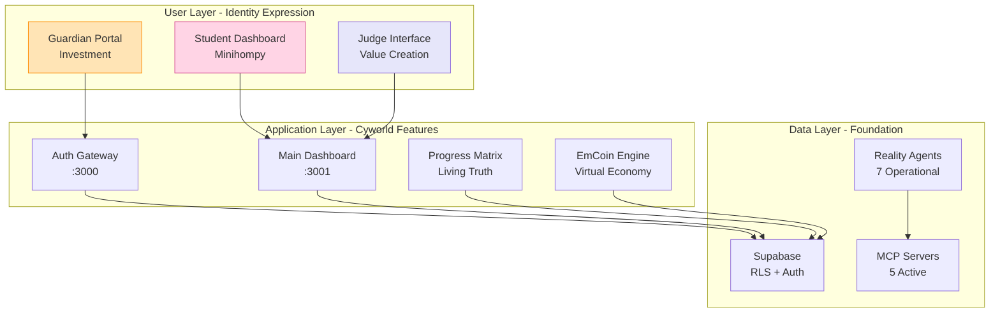

# 🏛️ Architecture Canon - System Design Truth

## Purpose
This canon defines the unchangeable architectural decisions, system boundaries, and integration points of the EDL Platform v6. Any deviation from this document requires extraordinary justification and consensus.

---

## 🌐 System Architecture Overview



---

## 📍 System Boundaries

### Port Allocations (IMMUTABLE)
```yaml
Services:
  3000: Auth Gateway (Next.js)
  3001: Main Dashboard (Next.js)
  5432: Supabase PostgreSQL
  8000: Supabase Studio
  9222: Chrome DevTools (Puppeteer)
  
Reserved Future:
  3002: Admin Dashboard
  3003: Judge Portal
  3004: Mobile API Gateway
  4000: EmCoin Transaction Engine
```

### Directory Protocol (Session 96 LOCKED)
```yaml
truth-seed/:
  Status: READ-ONLY
  Purpose: Reference implementation
  Rule: NEVER edit or deploy from here

reconciliation/active-work/:
  Status: ACTIVE DEVELOPMENT
  Purpose: All implementation work
  Components:
    - auth-gateway/
    - dashboard/
    - admin-dashboard/

core/:
  Status: CANONICAL DOCS
  Purpose: Immutable system truths
  Files:
    - ARCHITECTURE-CANON.md (this file)
    - PHILOSOPHY-CANON.md
    - RECOVERY-CANON.md
    - API-CONTRACTS-CANON.md
    - PRIORITY-REORDER-CANON.md

reality/:
  Status: OPERATIONAL
  Purpose: Agent infrastructure
  Agents: 7 operational
```

---

## 🔄 Data Flow Architecture

### User Registration → Identity Construction
```yaml
Flow:
  1. User lands on Auth Gateway (:3000)
  2. Selects role (Student/Guardian/Judge)
  3. Creates auth.users entry (Supabase Auth)
  4. Triggers profile creation (public.profile)
  5. Routes to role-specific onboarding
  6. Creates role table entry (student/guardian/judge)
  7. Redirects to Dashboard (:3001)
  
Critical Path:
  - Guardian flow BLOCKED (empty insert bug)
  - Student flow PARTIAL (no customization)
  - Judge flow MINIMAL (basic only)
```

### Activity Runtime → Progress Persistence
```yaml
Flow:
  1. Activity created (activity table)
  2. Sessions defined (activity_session)
  3. User starts (activity_instance)
  4. Progress tracked (session_progress)
  5. Auto-save every 30s (JSONB updates)
  6. Assignment submission (assignment_submission)
  7. Grading & EmCoin rewards
  
Status: VALIDATED (97% health)
Session: 137 implementation
```

### Social Graph → Real-time Sync
```yaml
Flow:
  1. Friend request sent (friendship table)
  2. WebSocket notification (MISSING)
  3. Acceptance updates both sides
  4. Team formation (team_member)
  5. Guild participation (guild_member)
  6. Chat channels (future)
  
Status: IMPLEMENTED (92% health)
Issues: No real-time subscriptions
```

---

## 🔌 Integration Points

### MCP Server Constellation (5 Active)
```yaml
edl-v6-session:
  Purpose: Session management & tracking
  Functions: start_session, add_task, track_deliverable
  Status: OPERATIONAL

supabase-dev:
  Purpose: Database operations
  Functions: execute_sql, apply_migration, list_tables
  Status: OPERATIONAL

github-server:
  Purpose: Repository management
  Functions: create_pr, push_files, search_code
  Status: OPERATIONAL

brave-search:
  Purpose: Web research
  Functions: web_search, local_search
  Status: OPERATIONAL

sequential-thinking:
  Purpose: AI planning
  Functions: complex problem solving
  Status: OPERATIONAL
```

### Reality Agent Network (7 Agents)
```yaml
Operational (97% System Health):
  1. FileSystem Agent - Code analysis
  2. GitHub Agent - Repository state
  3. Supabase Agent - Database truth
  4. Integration Agent - Consensus builder
  5. Orchestrator - Health calculator
  
Not Implemented:
  6. Vercel Agent - Deployment status
  7. Static Asset Agent - Resource tracking
  8. Task Reality Agent - Work verification
```

### Canvas Wireframe Mapping (11 Files)
```yaml
001-1: Onboarding & Directory → 4 features
001-2: Communication → 4 features
001-3: Contact Us → 2 features
001-4: Activity & Registrar → 3 features
001-5: Activity Instance → 4 features
002-1: PlayerID Profile → 3 features
002-2: Associated Teams → 4 features
002-3: Badges Box → 3 features
002-4: Hall of Greats → 2 features
002-5: Resources Box → 3 features
003-2: EmCoin Transactions → 4 features

Total: 36 trackable features in Progress Matrix
```

---

## 🎮 Cyworld Architecture Mapping

### Identity Layer
```yaml
Minihompy → Player Dashboard:
  Current: Basic profile display
  Missing: 
    - Customizable themes
    - Background music
    - Visitor counter
    - Achievement showcase
    - Personal message board
  Priority: P0 - Core engagement driver
```

### Social Layer
```yaml
Ilchon (Friends) → Friend System:
  Current: Basic friend requests
  Missing:
    - Real-time notifications
    - Friend visit tracking
    - Friend rankings
    - Friend-only content
    - Gift giving (EmCoins)
  Priority: P0 - Network effects critical
```

### Economic Layer
```yaml
Dotori → EmCoin System:
  Current: NOT IMPLEMENTED
  Needed:
    - Transaction engine
    - Wallet management
    - Achievement rewards
    - Purchase system
    - Parent top-up flow
  Priority: P0 - Monetization foundation
```

### Achievement Layer
```yaml
Trophies → Badge System:
  Current: NOT IMPLEMENTED
  Needed:
    - Achievement definitions
    - Progress tracking
    - Milestone detection
    - Badge display gallery
    - Rarity system
  Priority: P1 - Retention mechanism
```

---

## 🏗️ Technical Stack (IMMUTABLE)

### Core Technologies
```yaml
Frontend:
  Framework: Next.js 14 (App Router)
  UI: shadcn/ui + Tailwind CSS v4
  State: React Hooks + Zustand
  Real-time: Supabase Subscriptions

Backend:
  Database: Supabase (PostgreSQL)
  Auth: Supabase Auth
  Storage: Supabase Storage
  Functions: Edge Functions (future)
  
APIs:
  Pattern: Server Actions > API Routes
  Security: RLS for all tables
  Validation: Zod schemas
  
Infrastructure:
  Deployment: Vercel
  Monitoring: Reality Agents
  Automation: MCP Servers
  Testing: Playwright (future)
```

### Security Architecture
```yaml
Authentication:
  Provider: Supabase Auth
  Sessions: JWT tokens
  Roles: auth.users → profile.user_role
  
Authorization:
  Pattern: Row Level Security (RLS)
  Principle: Deny by default
  Policies: Table-specific USING/WITH CHECK
  
Data Protection:
  Encryption: At rest (Supabase)
  Transport: HTTPS only
  Secrets: Environment variables
  PII: Minimal collection
```

---

## 🔴 Critical System Constraints

### Must Never Change
1. **Port assignments** (3000, 3001)
2. **Directory protocol** (truth-seed READ-ONLY)
3. **Supabase as source of truth**
4. **RLS for all security**
5. **Server Actions over API routes**

### Known Bottlenecks
1. **Guardian bug** - Blocks entire economic model
2. **No real-time** - Kills social engagement
3. **No EmCoin** - No virtual economy
4. **No customization** - No identity expression
5. **No visitor tracking** - No social validation

### Scaling Considerations
```yaml
Current Limits:
  - Supabase Free Tier: 500MB database
  - Vercel Hobby: 100GB bandwidth
  - MCP Servers: Local only
  
Future Needs:
  - WebSocket server for real-time
  - CDN for profile assets
  - Queue system for EmCoin transactions
  - Analytics pipeline for achievements
```

---

## 📊 System Health Metrics

### Current Status (Session 142)
```yaml
Overall Health: 97%
Features Complete: 19.4% (7/36)
P0 Complete: 58.3% (7/12)
Cyworld Features: 0% (0/10)

Component Health:
  - Database Schema: 95%
  - Auth Flow: 85% (Guardian bug)
  - Activity Runtime: 97%
  - Friend System: 92% (no real-time)
  - Progress Tracking: 100%
```

### Success Metrics
```yaml
Technical:
  - Page load < 2s
  - Auto-save < 500ms
  - Real-time latency < 100ms
  
Engagement (Cyworld):
  - Daily active users checking profiles
  - Visitor counts per profile
  - EmCoin transactions per day
  - Customization changes per week
  - Friend interactions per session
```

---

## 🚨 Architecture Decision Records

### ADR-001: Supabase Over Custom Backend
**Date**: Session 42
**Decision**: Use Supabase for all backend needs
**Rationale**: Speed of development, built-in auth, RLS security
**Consequences**: Vendor lock-in accepted for velocity

### ADR-002: Server Actions Over API Routes
**Date**: Session 78
**Decision**: Prefer Server Actions for data mutations
**Rationale**: Type safety, automatic validation, simpler DX
**Consequences**: Next.js specific pattern

### ADR-003: MCP Servers for Automation
**Date**: Session 120
**Decision**: Integrate MCP for all automation
**Rationale**: 4-6x speed improvement proven
**Consequences**: Requires Claude Code environment

### ADR-004: Living Progress Over Snapshots
**Date**: Session 141-142
**Decision**: Real-time progress tracking via database
**Rationale**: Stale snapshots caused confusion
**Consequences**: Database dependency for progress

---

## 🎯 North Star Alignment

Every architectural decision must answer:
1. **Does this enable identity expression?** (Cyworld test)
2. **Does this create social validation?** (Visitor/friend test)
3. **Does this drive engagement?** (Daily check test)
4. **Does this support monetization?** (Parent pay test)

If NO to any → Reconsider the architecture.

---

*This canon is immutable. Changes require extraordinary justification and full session consensus.*

**Session 142 Implementation** - Architecture Canon established as system truth.