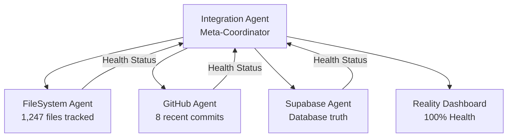

# EDL Platform v6 - Project Structure Map
**Last Updated**: Session 00086 | 2025-08-27  
**System Health**: 97%  
**Reality Agents**: 4/5 Operational  
**YAML Coverage**: 100% (527/1418 files have metadata)  
**Organization Score**: 76.2/100  
**Root Directories**: 8 (reduced from 17)  
**File System Protocol**: [Reality-First Protocol v1.0](core/00086-REALITY-FIRST-FILE-PROTOCOL.md)

## File System Organization Principle

**Every file has YAML frontmatter that determines both its metadata AND its physical location.**

### Reality-First Workflow (Session 86 Enhancement)

All work flows through three domains in order:

1. **Reality Domain** → What IS (ground truth)
2. **Requirements Domain** → What's NEEDED (specifications)
3. **Reconciliation Domain** → How to BRIDGE (implementation)

Files are organized by their `domain` field in YAML:
- `core/` - Infrastructure, protocols, critical guides (167+ files needing organization)
- `reality/` - Reality agents, monitoring, verification (27+ files)
- `requirements/` - User stories, specifications, masterplans (48+ files)
- `reconciliation/` - Integration, coordination, gap analysis (48+ files)
- `archive/` - Historical records (sessions, legacy work)
- `scripts/` - Tools and automation (86+ tools with lifecycle metadata)

## Core Architecture: Unified File System

```
EDL Platform v6 (Post Sessions 64-69 Reorganization)
├── File System [✅ 97.7% YAML Coverage - Unified Protocol Active]
├── Reality Domain [✅ 97% COMPLETE - 4 agents operational]
├── Requirements Domain [✅ 100% COMPLETE - 154 stories, 55 tests]
└── Reconciliation Domain [✅ Active - Truth Seed Adoption]
```

## Implementation Status

**Truth Seed Adoption** (Session 41 Decision - FINAL)
- Full adoption of ALL 36 tables from truth-seed
- Auth gateway implementation per AUTH-MASTERPLAN.md
- Dashboard completion per DASHBOARD-MASTERPLAN.md

**YAML Infrastructure** (Sessions 58-69)
- 97.7% files have YAML metadata
- Automated organization via domain field
- Pre-commit validation hooks installed
- Query and indexing system operational

## Directory Structure (Session 73 Root Consolidation Complete)

```
edl-platform-v6/                   # ROOT: 8 visible directories (down from 17)
│
├── core/                          # System infrastructure (expanded)
│   ├── docs/                      # Documentation (moved from root)
│   │   ├── protocols/             # System protocols
│   │   ├── html-prototypes/       # UI prototypes
│   │   └── snapshot-system/       # Schema snapshots
│   ├── config/                    # System configuration
│   │   └── supabase/              # Supabase config (moved from root)
│   ├── templates/                 # Templates (moved from root)
│   ├── tests/                     # Test infrastructure (moved from root)
│   └── [67+ protocol/guide files]
│
├── archive/                       # Historical records (expanded)
│   ├── sessions/                  # Session logs and handoffs (73+ sessions)
│   │   ├── SESSION-00001-LOG.md through SESSION-00073-LOG.md
│   │   └── Corresponding HANDOFF files
│   ├── logs/                      # System logs (moved from root)
│   │   └── canvas-processing/    
│   ├── session-deliverables/      
│   └── legacy-canvas-work/        # Pre-Session 1 exploration
│
├── reality/                       # Reality Domain (97% COMPLETE)
│   ├── agent-reality-auditor/    # The 4 Reality Agents
│   │   ├── filesystem-connector/  # FileSystem Agent
│   │   ├── github-connector/      # GitHub Agent
│   │   ├── supabase-connector/    # Supabase Agent
│   │   └── integration-connector/ # Integration Agent
│   ├── dashboard/                 # Reality Dashboard
│   └── REALITY_INDEX.md          # Domain registry
│
├── requirements/                  # Requirements Domain (100% COMPLETE)
│   ├── masterplans/              # Strategic frameworks
│   │   ├── AUTH-MASTERPLAN.md
│   │   └── DASHBOARD-MASTERPLAN.md
│   ├── schemas/                   # Database schemas (moved from root)
│   ├── specifications/            # Technical specs
│   ├── user-stories/              # 154 stories documented
│   └── REQUIREMENTS_INDEX.md
│
├── reconciliation/                # Reconciliation Domain (ACTIVE)
│   ├── active-work/              # Current integration work
│   │   ├── auth/                  # Auth implementation (moved from root)
│   │   ├── shared/                # Shared components (moved from root)
│   │   ├── auth-gateway/          # Auth gateway project
│   │   └── dashboard/             # Dashboard reconciliation
│   ├── migrations/                # Database migrations (moved from root)
│   │   ├── batches/               # Organized migration batches
│   │   └── supabase-project.backup
│   └── RECONCILIATION_INDEX.md
│
├── scripts/                       # Tools and automation (84 classified)
│   ├── Session 28 automation
│   ├── YAML infrastructure (Sessions 59-72)
│   ├── Safety tools (Session 66)
│   └── Organization tools (Sessions 67-69)
│
├── truth-seed/                    # Production codebase (Session 41 adoption)
│   └── emdash-dashboard-main/    # Working platform with 36 tables
│
├── pending/                       # Files awaiting classification
│
└── [Root Configuration Files]
    ├── CLAUDE.md                  # Session protocol v2.1
    ├── SYSTEM-INDEX.md            # System registry
    ├── PROJECT-STRUCTURE.md       # THIS FILE (Session 73 updated)
    └── package.json, etc.         # Project configuration
```

## Reality Agent Network



## Agent Capabilities

### FileSystem Reality Agent
- **Purpose**: Discovers file system truth
- **Tracks**: 1,247 files across project
- **Status**: ✅ Healthy
- **Session Built**: 00003

### GitHub Reality Agent  
- **Purpose**: Discovers repository/commit truth
- **Tracks**: Commits, branches, PRs
- **Status**: ✅ Healthy
- **Session Built**: 00004

### Supabase Reality Agent
- **Purpose**: Discovers database truth
- **Tracks**: Tables, schemas, data
- **Status**: ✅ Healthy (credentials required)
- **Session Built**: 00002, Activated 00006

### Integration Reality Agent
- **Purpose**: Meta-agent coordinating all others
- **Features**:
  - Deception detection
  - Integration debt tracking ($40 current)
  - Health score calculation (100% current)
  - Assumption prevention
- **Status**: ✅ Healthy
- **Session Built**: 00005

## System Metrics (Current)

```
Overall Health:     100% ████████████████████
├─ Synchronization: 100% ████████████████████
├─ Completeness:    100% ████████████████████
├─ Consistency:     100% ████████████████████ (all 3 agents agree)
├─ Transparency:    100% ████████████████████
└─ Assumption Clear:100% ████████████████████

Integration Debt: $40 (MEDIUM)
- 10 missing tests (reduced from original count)

Truth Score: 100% (no deceptions detected)
```

## Session Progression

| Session | Focus | Agents Built | Health |
|---------|-------|--------------|--------|
| 00001 | Setup & Inventory | 0 | 0% |
| 00002 | Supabase Agent | 1 | 25% |
| 00003 | FileSystem Agent | 2 | 50% |
| 00004 | GitHub Agent | 3 | 75% |
| 00005 | Integration Agent | 4 | 95% |
| 00006 | Validation & Activation | 4 | 100% |

## Unified File System & Metadata Protocol

The project uses a **unified protocol** where YAML frontmatter determines both metadata AND physical location:

### File Creation Workflow
```bash
# 1. Create file with YAML
cat > 00070-NEW-FEATURE.md << EOF
---
session: "00070"
type: "guide"
domain: "core"        # This determines location → core/
status: "draft"
created: "2025-08-25"
---
# Content
EOF

# 2. Auto-organize based on domain
python3 scripts/00067-auto-organize-files.py --execute 00070-NEW-FEATURE.md

# 3. Validate YAML
python3 scripts/00068-fix-yaml-validation.py

# 4. Query files by any field
python3 scripts/00059-yaml-query.py --domain core --type guide
```

### Key YAML Tools
- **Add metadata**: `scripts/00061-add-yaml-frontmatter.py`
- **Fix validation**: `scripts/00068-fix-yaml-validation.py`
- **Auto-organize**: `scripts/00067-auto-organize-files.py`
- **Query files**: `scripts/00059-yaml-query.py`
- **Pre-commit hooks**: Automatically validate on commit

## Quick Commands

```bash
# Start new session with full automation
./scripts/00028-session-start.sh 00071

# Check YAML health
python3 scripts/00059-yaml-health-check.py

# Find files by domain
python3 scripts/00059-yaml-query.py --domain core

# Check migration readiness before moves
python3 scripts/00066-migration-readiness.py --check

# Create rollback before major changes
python3 scripts/00066-create-rollback.py
```

## Important Files

- **Unified Protocol**: `core/00069-UNIFIED-FILE-SYSTEM-PROTOCOL.md`
- **Session Protocol**: `CLAUDE.md` (v2.1 with unified file system)
- **Constitutional OS**: `core/00031-CONSTITUTIONAL-OS-GUIDE.md`
- **Truth Seed Decision**: `core/00042-TRUTH-SEED-ADOPTION-DECISION.md`

---

*Updated Session 00070 to reflect Sessions 64-69 reorganization and YAML infrastructure*
*Previous structure from Session 00016 has been completely superseded*