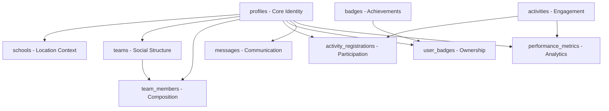

# Database Design from Canvas Analysis
**Session**: 00011  
**Date**: 2025-08-16  
**Source**: 002-1.seed.PlayerID Profile Box.canvas  
**Principle**: Every table exists for a documented reason

## Design Philosophy
Starting fresh with meticulous attribution. Each table creation documents:
1. **WHY** it exists (Canvas requirement)
2. **WHAT** UI component needs it
3. **HOW** it connects to other tables
4. **WHO** decided this (Session attribution)
5. **WHEN** it was identified as needed

---

## Tables Required from PlayerID Dashboard Canvas

### 1. `profiles` (Core Identity)
**WHY EXISTS**: Canvas shows "callSign Profile" as central identity  
**CANVAS NODES**: 
- Node `152f5f791b5529a7`: "callSign" Profile
- Node `97721f755ce8f9db`: Profile image
- Node `e52173378952f989`: School & Location
- Node `620f938237f10092`: Grade & Division
- Node `45c39f4f9b33bfcc`: Linked Users

**SCHEMA**:
```sql
CREATE TABLE profiles (
    id UUID PRIMARY KEY DEFAULT gen_random_uuid(),
    call_sign VARCHAR(50) UNIQUE NOT NULL,  -- User's display name
    profile_image_url TEXT,
    school_id UUID REFERENCES schools(id),
    location_id UUID REFERENCES locations(id),
    grade INTEGER CHECK (grade BETWEEN 4 AND 12),
    division VARCHAR(20) CHECK (division IN ('Village', 'Lower', 'Upper', 'Senior')),
    created_at TIMESTAMP DEFAULT NOW(),
    updated_at TIMESTAMP DEFAULT NOW(),
    created_by_session VARCHAR(10) DEFAULT '00011',
    
    -- Attribution
    _why_exists TEXT DEFAULT 'Central player identity from Canvas PlayerID Dashboard',
    _canvas_source TEXT DEFAULT '002-1.seed.PlayerID Profile Box.canvas'
);
```

### 2. `schools` (Location Context)
**WHY EXISTS**: Canvas shows "School & Location" as profile attributes  
**CANVAS NODES**: Node `e52173378952f989`

**SCHEMA**:
```sql
CREATE TABLE schools (
    id UUID PRIMARY KEY DEFAULT gen_random_uuid(),
    name VARCHAR(200) NOT NULL,
    location_id UUID REFERENCES locations(id),
    division_mapping JSONB, -- Maps grades to divisions for this school
    
    -- Attribution
    created_by_session VARCHAR(10) DEFAULT '00011',
    _why_exists TEXT DEFAULT 'Schools provide context for player matching and regional competitions',
    _canvas_source TEXT DEFAULT '002-1.seed.PlayerID Profile Box.canvas'
);
```

### 3. `teams` (Social Structure)
**WHY EXISTS**: Canvas Section "Associated Teams" + Scenario I shows team dynamics  
**CANVAS NODES**: 
- Node `81b4538e57cfbe23`: Associated Teams
- Node `af8524ef4793efaf`: TeamID Details
- Node `d01432be27e6cb85`: Founder role
- Node `4eb6a4e8430f5d97`: Mate01 role

**SCHEMA**:
```sql
CREATE TABLE teams (
    id UUID PRIMARY KEY DEFAULT gen_random_uuid(),
    name VARCHAR(100) NOT NULL,
    logo_url TEXT,
    description TEXT,
    founder_id UUID REFERENCES profiles(id) NOT NULL,
    status VARCHAR(20) DEFAULT 'seeking_mates',
    max_members INTEGER DEFAULT 4,
    created_at TIMESTAMP DEFAULT NOW(),
    
    -- Attribution
    created_by_session VARCHAR(10) DEFAULT '00011',
    _why_exists TEXT DEFAULT 'Teams are core social unit for debates per Canvas Scenario I',
    _canvas_source TEXT DEFAULT '002-1.seed.PlayerID Profile Box.canvas'
);
```

### 4. `team_members` (Team Composition)
**WHY EXISTS**: Canvas shows Founder/Mate roles and join request flow  
**CANVAS NODES**: 
- Node `f656008f5795601c`: Scenario I - Player requests to join Team
- Node `5d4f41434e09c64d`: Join Request mechanism

**SCHEMA**:
```sql
CREATE TABLE team_members (
    id UUID PRIMARY KEY DEFAULT gen_random_uuid(),
    team_id UUID REFERENCES teams(id) ON DELETE CASCADE,
    player_id UUID REFERENCES profiles(id),
    role VARCHAR(20) CHECK (role IN ('Founder', 'Mate01', 'Mate02', 'Mate03')),
    status VARCHAR(20) DEFAULT 'pending', -- pending, active, left
    joined_at TIMESTAMP,
    join_request_message TEXT,
    
    -- Attribution
    created_by_session VARCHAR(10) DEFAULT '00011',
    _why_exists TEXT DEFAULT 'Tracks team composition and join request status per Scenario I',
    _canvas_source TEXT DEFAULT '002-1.seed.PlayerID Profile Box.canvas',
    
    UNIQUE(team_id, player_id),
    UNIQUE(team_id, role) -- Only one person per role per team
);
```

### 5. `activities` (Core Engagement)
**WHY EXISTS**: Canvas Section "Activities & Registrar" central to platform  
**CANVAS NODES**: 
- Node `9f7cd5fa0929835d`: Activities & Registrar
- Node `78fddd97f244e38d`: Upcoming/Register/History

**SCHEMA**:
```sql
CREATE TABLE activities (
    id UUID PRIMARY KEY DEFAULT gen_random_uuid(),
    name VARCHAR(200) NOT NULL,
    activity_type VARCHAR(50) NOT NULL, -- debate, workshop, tournament
    description TEXT,
    supervisor_id UUID REFERENCES profiles(id),
    max_participants INTEGER,
    scheduled_at TIMESTAMP,
    duration_minutes INTEGER,
    status VARCHAR(20) DEFAULT 'upcoming',
    
    -- Attribution
    created_by_session VARCHAR(10) DEFAULT '00011',
    _why_exists TEXT DEFAULT 'Activities are primary engagement mechanism shown in Canvas',
    _canvas_source TEXT DEFAULT '002-1.seed.PlayerID Profile Box.canvas'
);
```

### 6. `activity_registrations` (Participation Tracking)
**WHY EXISTS**: Canvas shows "Register for Activities" as key action  
**CANVAS NODES**: Node `78fddd97f244e38d`

**SCHEMA**:
```sql
CREATE TABLE activity_registrations (
    id UUID PRIMARY KEY DEFAULT gen_random_uuid(),
    activity_id UUID REFERENCES activities(id),
    player_id UUID REFERENCES profiles(id),
    team_id UUID REFERENCES teams(id), -- Optional team registration
    registered_at TIMESTAMP DEFAULT NOW(),
    status VARCHAR(20) DEFAULT 'registered',
    
    -- Attribution
    created_by_session VARCHAR(10) DEFAULT '00011',
    _why_exists TEXT DEFAULT 'Tracks who registered for which activities',
    _canvas_source TEXT DEFAULT '002-1.seed.PlayerID Profile Box.canvas',
    
    UNIQUE(activity_id, player_id)
);
```

### 7. `badges` (Achievement System)
**WHY EXISTS**: Canvas Section "Badges" with Available/Earned  
**CANVAS NODES**: 
- Node `1c5519675c3f7f76`: Badges
- Node `387fca1acb041bca`: Available Badges | Badges Earned

**SCHEMA**:
```sql
CREATE TABLE badges (
    id UUID PRIMARY KEY DEFAULT gen_random_uuid(),
    name VARCHAR(100) NOT NULL,
    description TEXT,
    icon_url TEXT,
    criteria JSONB, -- Structured criteria for earning
    category VARCHAR(50), -- participation, excellence, leadership
    points INTEGER DEFAULT 10,
    
    -- Attribution
    created_by_session VARCHAR(10) DEFAULT '00011',
    _why_exists TEXT DEFAULT 'Gamification through achievements shown in Badges Box',
    _canvas_source TEXT DEFAULT '002-1.seed.PlayerID Profile Box.canvas'
);
```

### 8. `user_badges` (Badge Ownership)
**WHY EXISTS**: Canvas shows "Badges Earned" requiring ownership tracking  
**CANVAS NODES**: Node `387fca1acb041bca`

**SCHEMA**:
```sql
CREATE TABLE user_badges (
    id UUID PRIMARY KEY DEFAULT gen_random_uuid(),
    player_id UUID REFERENCES profiles(id),
    badge_id UUID REFERENCES badges(id),
    earned_at TIMESTAMP DEFAULT NOW(),
    earned_for TEXT, -- Context of earning (which activity, achievement, etc)
    
    -- Attribution
    created_by_session VARCHAR(10) DEFAULT '00011',
    _why_exists TEXT DEFAULT 'Tracks which players earned which badges',
    _canvas_source TEXT DEFAULT '002-1.seed.PlayerID Profile Box.canvas',
    
    UNIQUE(player_id, badge_id)
);
```

### 9. `messages` (Communication Hub)
**WHY EXISTS**: Canvas Section "emDash Comm" with messaging features  
**CANVAS NODES**: 
- Node `d7b9bcd2bbae1208`: emDash Comm
- Node `63742cb31c4f9226`: recent msg
- Node `6685b691b77e1922`: Message sending in Scenario I

**SCHEMA**:
```sql
CREATE TABLE messages (
    id UUID PRIMARY KEY DEFAULT gen_random_uuid(),
    from_player_id UUID REFERENCES profiles(id),
    to_player_id UUID REFERENCES profiles(id),
    team_id UUID REFERENCES teams(id), -- Optional team context
    message_type VARCHAR(20) DEFAULT 'direct', -- direct, team, broadcast
    content TEXT NOT NULL,
    sent_at TIMESTAMP DEFAULT NOW(),
    read_at TIMESTAMP,
    
    -- Attribution
    created_by_session VARCHAR(10) DEFAULT '00011',
    _why_exists TEXT DEFAULT 'emDash Comm section requires messaging capability',
    _canvas_source TEXT DEFAULT '002-1.seed.PlayerID Profile Box.canvas'
);
```

### 10. `performance_metrics` (Analytics)
**WHY EXISTS**: Canvas Section "Performance Tracking" with ballots/rankings  
**CANVAS NODES**: 
- Node `385cb44ed34e1a2b`: Performance Tracking
- Node `cf02746de3bdd80d`: Ballots, Rankings, Analytics

**SCHEMA**:
```sql
CREATE TABLE performance_metrics (
    id UUID PRIMARY KEY DEFAULT gen_random_uuid(),
    player_id UUID REFERENCES profiles(id),
    activity_id UUID REFERENCES activities(id),
    metric_type VARCHAR(50), -- ballot, ranking, feedback
    metric_value JSONB, -- Flexible structure for different metrics
    recorded_at TIMESTAMP DEFAULT NOW(),
    recorded_by UUID REFERENCES profiles(id), -- Who gave the feedback
    
    -- Attribution
    created_by_session VARCHAR(10) DEFAULT '00011',
    _why_exists TEXT DEFAULT 'Performance Tracking section needs metrics storage',
    _canvas_source TEXT DEFAULT '002-1.seed.PlayerID Profile Box.canvas'
);
```

---

## Relationship Map



---

## Implementation Priority

### Phase 1: Core Identity (P0)
1. `profiles` - Must exist first
2. `schools` - Required by profiles
3. `locations` - Required by schools and profiles

### Phase 2: Social Layer (P0)
4. `teams` - Core social unit
5. `team_members` - Team composition

### Phase 3: Engagement (P0)
6. `activities` - Primary platform purpose
7. `activity_registrations` - Participation tracking

### Phase 4: Gamification (P1)
8. `badges` - Achievement definitions
9. `user_badges` - Achievement tracking

### Phase 5: Communication (P1)
10. `messages` - Player interaction
11. `performance_metrics` - Feedback and analytics

---

## Why This Approach Prevents V5 Problems

1. **Every table has WHY** - No assumption-based tables
2. **Canvas-driven** - Each table traces to specific UI needs
3. **Attribution built-in** - Tables know their origin session
4. **Relationships explicit** - No hidden dependencies
5. **Fresh start** - No legacy confusion from v5

---

**Session 00011 Attestation**: This database design is derived directly from Canvas analysis, not assumptions. Every table exists because the UI explicitly needs it.