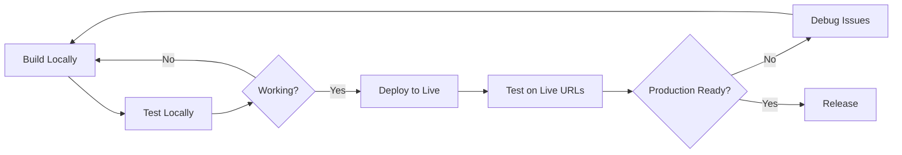

# Hybrid Development Workflow Plan - Local + Live Testing

**Session**: 114
**Date**: 2025-08-30
**Context**: Post-deployment workflow optimization
**Goal**: Best of both worlds - fast local development + realistic live testing

---

## 🎯 Executive Summary

Establish a hybrid workflow that maintains **fast local development** while enabling **realistic production testing** on live URLs. This approach maximizes development velocity while ensuring production readiness.

---

## ✅ Yes - Update Supabase Configuration

### Step 1: Supabase Dashboard Configuration

**Go to**: Supabase Dashboard → Project Settings → API → URL Configuration

**Site URL (Primary)**:
```
https://auth-gateway-7kke6yhrm-briankims-projects.vercel.app
```

**Redirect URLs (Add ALL of these)**:
```
https://auth-gateway-7kke6yhrm-briankims-projects.vercel.app/thank-you
https://auth-gateway-7kke6yhrm-briankims-projects.vercel.app/auth/callback
https://dashboard-562yhrmup-briankims-projects.vercel.app/auth/callback
http://localhost:3000/thank-you
http://localhost:3000/auth/callback
http://localhost:3001/auth/callback
```

**Why This Works**:
- Primary Site URL ensures production emails/redirects work correctly
- Multiple Redirect URLs support both environments simultaneously
- No breaking changes to existing local development

---

## 📋 Hybrid Workflow Protocol

### 🏠 Phase 1: Local Development (Speed Focus)

**Use For**:
- Building new features
- Debugging issues
- Rapid iteration
- Database schema changes
- UI/UX experiments

**Commands**:
```bash
# Start local development
cd reconciliation/active-work/auth-gateway
npm run dev  # Port 3000

# In new terminal
cd reconciliation/active-work/dashboard  
npm run dev  # Port 3001

# Test locally
open http://localhost:3000
open http://localhost:3001
```

**Benefits**:
- ⚡ Instant hot reload
- 🔍 Full error visibility
- 🛠️ Dev tools access
- 🔄 Rapid iteration cycle

### 🌐 Phase 2: Live Testing (Reality Check)

**Use For**:
- Authentication flow testing
- User acceptance testing
- Performance validation
- Cross-device testing
- Stakeholder demos

**URLs**:
```bash
# Production URLs
Auth Gateway: https://auth-gateway-7kke6yhrm-briankims-projects.vercel.app
Dashboard:    https://dashboard-562yhrmup-briankims-projects.vercel.app
```

**Benefits**:
- 🎯 Real user experience
- 📧 Actual email delivery
- 📱 Mobile device testing
- 🔒 Real SSL/security behavior

---

## 🔄 Development Cycle Protocol

### Standard Feature Development Flow:



### Detailed Steps:

#### Step 1: Local Development
```bash
# 1. Make changes in reconciliation/active-work/
# 2. Test on localhost:3000/3001
# 3. Verify features work locally
# 4. Commit changes
```

#### Step 2: Live Deployment
```bash
# From reconciliation/active-work/auth-gateway
vercel --prod

# From reconciliation/active-work/dashboard
vercel --prod
```

#### Step 3: Live Validation
```bash
# Test auth flow on live URLs
# Verify email delivery works
# Test cross-device compatibility
# Share with stakeholders if needed
```

---

## 🛠️ Environment Management Tools

### Tool 1: Quick Environment Checker
```bash
# scripts/00114-check-environment.sh
#!/bin/bash

echo "🔍 Environment Check"
echo ""

echo "📍 Local Development:"
echo "  Auth:      http://localhost:3000"
echo "  Dashboard: http://localhost:3001"
echo "  Status:    $(curl -s -o /dev/null -w "%{http_code}" http://localhost:3000 || echo "Down")"

echo ""
echo "🌐 Live Production:"
echo "  Auth:      https://auth-gateway-7kke6yhrm-briankims-projects.vercel.app"
echo "  Dashboard: https://dashboard-562yhrmup-briankims-projects.vercel.app"
echo "  Status:    $(curl -s -o /dev/null -w "%{http_code}" https://auth-gateway-7kke6yhrm-briankims-projects.vercel.app)"
```

### Tool 2: Deployment Helper
```bash
# scripts/00114-deploy-both.sh
#!/bin/bash

echo "🚀 Deploying Both Applications"

echo "📦 Deploying Auth Gateway..."
cd reconciliation/active-work/auth-gateway
vercel --prod --confirm

echo ""
echo "📦 Deploying Dashboard..."
cd ../dashboard
vercel --prod --confirm

cd ../../..
echo ""
echo "✅ Both deployments complete!"
echo "🌐 Auth:      https://auth-gateway-7kke6yhrm-briankims-projects.vercel.app"
echo "🌐 Dashboard: https://dashboard-562yhrmup-briankims-projects.vercel.app"
```

### Tool 3: Environment Validator
```bash
# scripts/00114-validate-environment.sh
#!/bin/bash

echo "✅ Environment Validation"

# Check local .env files
echo "📋 Local Environment Variables:"
if [ -f "reconciliation/active-work/auth-gateway/.env.local" ]; then
    echo "  ✅ Auth .env.local exists"
else
    echo "  ❌ Auth .env.local missing"
fi

if [ -f "reconciliation/active-work/dashboard/.env.local" ]; then
    echo "  ✅ Dashboard .env.local exists"
else
    echo "  ❌ Dashboard .env.local missing"
fi

# Check Vercel env vars
echo ""
echo "🌐 Vercel Environment Variables:"
cd reconciliation/active-work/auth-gateway
vercel env ls | head -5
cd ../dashboard
vercel env ls | head -5
cd ../../..
```

---

## 📊 Testing Protocols

### Protocol A: Feature Development Testing

**Local Testing Checklist**:
- [ ] Feature builds without errors
- [ ] UI renders correctly
- [ ] Basic functionality works
- [ ] No console errors
- [ ] Database operations successful

**Live Testing Checklist**:
- [ ] Feature works on production URLs
- [ ] Performance acceptable
- [ ] Mobile responsive
- [ ] Cross-browser compatible
- [ ] Real data integration works

### Protocol B: Authentication Flow Testing

**Must Test on Live URLs**:
- [ ] User signup with real email
- [ ] Email verification works
- [ ] Login redirects correctly
- [ ] Session persistence
- [ ] Logout functionality
- [ ] Password reset flow

**Can Test Locally**:
- [ ] Form validation
- [ ] UI feedback
- [ ] Error handling
- [ ] Loading states

### Protocol C: User Acceptance Testing

**Always Use Live URLs**:
- [ ] Share live URLs with stakeholders
- [ ] Test on multiple devices
- [ ] Verify email delivery
- [ ] Test complete user journeys
- [ ] Performance under realistic conditions

---

## 🚨 When to Use Which Environment

### Use Localhost When:
- 🔧 **Building new features** - Fast iteration needed
- 🐛 **Debugging issues** - Need full error visibility
- 🎨 **UI/UX work** - Rapid visual feedback required
- 📝 **Writing code** - Hot reload essential
- 🧪 **Experimenting** - Safe to break things

### Use Live URLs When:
- 🔐 **Testing auth flows** - Real email/redirect behavior
- 👥 **User testing** - Realistic experience needed
- 📱 **Device testing** - Cross-platform validation
- 🎯 **Stakeholder demos** - Professional presentation
- ⚡ **Performance testing** - Real world conditions
- 🚀 **Release validation** - Final verification

### Use Both When:
- 🔄 **Feature completion** - Build local, verify live
- 🔍 **Bug investigation** - Reproduce locally, verify fix live
- 📋 **Release preparation** - Develop local, validate live

---

## 🎯 Workflow Decision Tree

```
New Task → Is it auth-related?
├─ Yes → Start with live URLs
└─ No → Start with localhost

Feature Ready → Does it involve user interaction?  
├─ Yes → Test on live URLs
└─ No → Localhost testing sufficient

Bug Report → Can you reproduce locally?
├─ Yes → Fix locally, verify live
└─ No → Debug on live URLs

Stakeholder Demo → Always use live URLs
User Testing → Always use live URLs
Performance Check → Always use live URLs
```

---

## 📈 Success Metrics

### Development Velocity Metrics:
- **Local Development**: < 5 seconds from save to visible change
- **Live Deployment**: < 2 minutes from commit to live
- **Issue Resolution**: Reproduce locally → Fix locally → Verify live

### Quality Metrics:
- **Feature Completeness**: Works on both local and live
- **Auth Reliability**: 100% success rate on live URLs
- **User Experience**: Validated on live URLs before release

---

## 🔧 Implementation Steps

### Step 1: Update Supabase (Do This First)
1. Go to Supabase Dashboard → Settings → API
2. Update Site URL to production URL
3. Add all redirect URLs (local + production)
4. Save configuration

### Step 2: Create Management Scripts
```bash
# Create the three helper scripts above
chmod +x scripts/00114-*.sh
```

### Step 3: Test Both Environments
```bash
# Test local development still works
npm run dev

# Test live URLs work with new config
# Visit live URLs and test auth flow
```

### Step 4: Establish Team Protocol
- Document when to use which environment
- Share live URLs with stakeholders
- Use local for all development work

---

## 📋 Validation Checklist

After implementing this hybrid workflow:

### ✅ Local Development
- [ ] `npm run dev` works for both apps
- [ ] Hot reload functions correctly
- [ ] Local auth flow works (if needed)
- [ ] Development tools accessible

### ✅ Live Production  
- [ ] Auth signup creates users in Supabase
- [ ] Email verification works
- [ ] Login redirects to dashboard
- [ ] All features work on live URLs

### ✅ Workflow
- [ ] Can develop locally without breaking production
- [ ] Can test production without breaking local
- [ ] Deployment process is straightforward
- [ ] Team knows which environment to use when

---

## 🚀 Next Actions

### Immediate (Do Now):
1. **Update Supabase URLs** as specified above
2. **Test auth flow** on live URL to verify fix
3. **Verify local development** still works

### This Session:
1. Create the three management scripts
2. Test the hybrid workflow end-to-end
3. Document any issues discovered

### Future Sessions:
1. Create more sophisticated environment management
2. Add automated testing for both environments
3. Implement preview deployments for feature branches

---

## 💡 Future Enhancements

### Advanced Environment Management:
- **Preview Deployments**: Use Vercel preview URLs for feature branches
- **Environment Switching**: One-command environment switches
- **Automated Testing**: Test both environments on every deployment

### Monitoring:
- **Uptime Monitoring**: Alert if live URLs go down
- **Performance Monitoring**: Track live URL performance
- **Error Tracking**: Centralized error logging for both environments

---

**Session 114 Workflow Plan Complete** - Hybrid approach defined and ready for implementation.