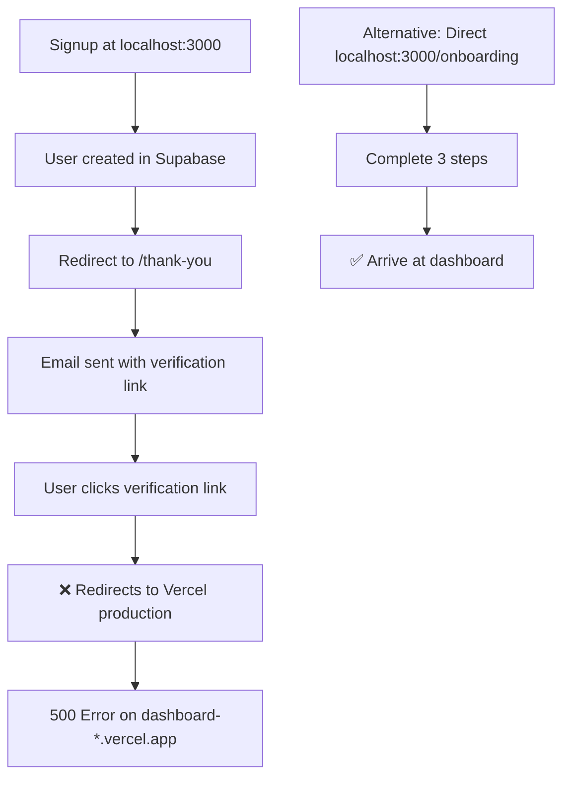

# Auth Flow Actual Behavior - Critical Findings

## The Real Auth Flow (As Discovered)

### Current Flow with Email Verification



### What Actually Happens

1. **Signup** (localhost:3000/sign-up)
   - ✅ Creates user in Supabase
   - ✅ Redirects to /thank-you
   - ✅ Sends verification email

2. **Email Verification**
   - ✅ Email arrives with verification link
   - ❌ Link redirects to PRODUCTION (vercel.app) not localhost
   - ❌ Production dashboard throws 500 error
   - ❌ User stuck, can't complete onboarding

3. **Login Without Verification**
   - ❌ Cannot proceed to onboarding
   - ✅ This is correct security behavior

4. **Login After Verification**
   - ✅ Can access localhost:3001/onboarding
   - ✅ Complete onboarding steps successfully
   - ✅ Arrive at dashboard properly
   - Note: Email link goes to production, but local flow works via localhost:3001

## Critical Issues Identified

### Issue 1: Email Verification Redirect Configuration
**Problem**: Supabase email template redirects to production Vercel URL
**Expected**: Should redirect to localhost:3000 during development
**Impact**: Can't test full auth flow locally

### Issue 2: Production Dashboard 500 Error
**URL**: https://dashboard-c9507elln-briankims-projects.vercel.app/
**Problem**: Production deployment not configured properly
**Impact**: Even production users would be stuck

### Issue 3: Missing Environment Configuration
The auth system is mixing environments:
- Signup happens on localhost
- Email verification goes to production
- Production is broken

## Working Path (Confirmed)

The complete working flow:
1. Sign up at localhost:3001/sign-up
2. Receive email and click verification link (even though it goes to production error)
3. Navigate to localhost:3001/onboarding 
4. Complete 3-step onboarding successfully
5. Arrive at dashboard properly

**Key Finding**: Auth gateway runs on port 3001, not 3000!

## Test Strategy Implications

### For Local Testing
```javascript
// Updated test approach
async function testAuthFlowLocal() {
    // 1. Signup
    await signup(page, testUser);
    
    // 2. Skip email verification for local testing
    // Instead, manually navigate to onboarding
    await page.goto('http://localhost:3000/onboarding');
    
    // 3. Complete onboarding steps
    await completeOnboarding(page);
    
    // 4. Verify dashboard access
    await verifyDashboard(page);
}
```

### For Production Testing
Need to fix:
1. Supabase redirect URL configuration
2. Vercel deployment environment variables
3. Dashboard production build

## Environment Configuration Fixes Needed

### 1. Supabase Email Templates
```sql
-- Check current redirect URL
SELECT * FROM auth.config WHERE key = 'SITE_URL';

-- Update for local development
UPDATE auth.config 
SET value = 'http://localhost:3000' 
WHERE key = 'SITE_URL';
```

### 2. Environment Variables
```bash
# .env.local (for development)
NEXT_PUBLIC_SITE_URL=http://localhost:3000
NEXT_PUBLIC_DASHBOARD_URL=http://localhost:3002

# .env.production (for Vercel)
NEXT_PUBLIC_SITE_URL=https://your-auth-domain.vercel.app
NEXT_PUBLIC_DASHBOARD_URL=https://your-dashboard-domain.vercel.app
```

### 3. Supabase Auth Settings
In Supabase Dashboard:
- Authentication → URL Configuration
- Site URL: `http://localhost:3000` (for dev)
- Redirect URLs: Add `http://localhost:3000/*`

## Recommendations

### Immediate (For Testing)
1. **Use manual navigation** to localhost:3000/onboarding after signup
2. **Skip email verification** in local tests
3. **Document this as known limitation**

### Short Term (Fix Local Dev)
1. Configure Supabase to use localhost URLs in development
2. Add environment detection to handle dev vs prod
3. Create `.env.test` with test-specific URLs

### Long Term (Fix Production)
1. Debug Vercel 500 error
2. Properly configure production environment
3. Set up staging environment for testing

## Updated Test Plan

### Phase 1: Local Testing (Without Email)
```javascript
const localTestFlow = {
    signup: 'localhost:3000/sign-up',
    skipEmail: true,
    manualNav: 'localhost:3000/onboarding',
    onboarding: ['step1', 'step2', 'step3'],
    dashboard: 'localhost:3002/dashboard'
};
```

### Phase 2: Production Testing (After Fixes)
```javascript
const prodTestFlow = {
    signup: 'production-url/sign-up',
    emailVerification: true,
    autoRedirect: 'production-url/onboarding',
    dashboard: 'production-dashboard-url'
};
```

## Impact on Priority 1 Implementation

### What This Changes
1. **Auth tests need branching logic** for local vs production
2. **Email verification can't be fully tested** locally without config fixes
3. **Onboarding tests** become more important (currently untested)

### What Stays the Same
1. Core test framework still valid
2. Puppeteer MCP approach correct
3. Other feature tests unaffected

---

*This discovery reveals that the auth system works but has environment configuration issues that prevent proper local testing of the full email verification flow.*