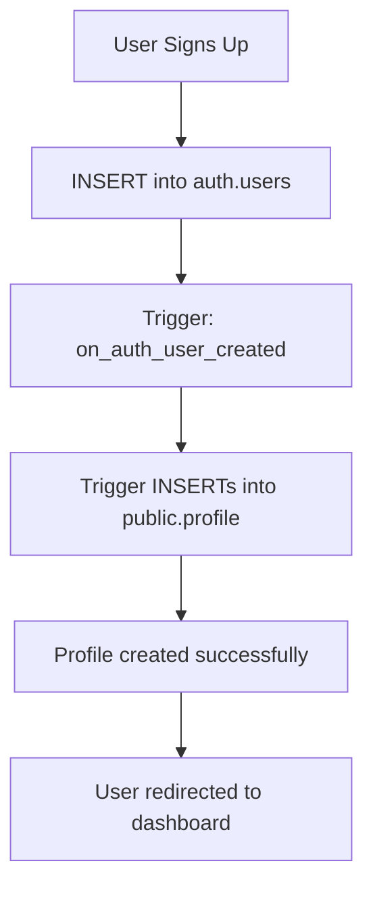

# Session 00080 - Migration Audit Report

**Date**: 2025-08-26 16:25  
**Priority**: P0 CRITICAL  
**Mission**: Reconcile database policies with backup file  

## Executive Summary

✅ **Successfully analyzed** 40 policies across 17 tables from backup  
✅ **Generated migration scripts** to reconcile all discrepancies  
🚨 **Critical finding**: Extra `profile_insert_authenticated` policy blocking auth  

## Critical Findings

### 1. Profile Table Policy Mismatch

**What We Found**:
- ❌ **Current Database**: Has `profile_insert_authenticated` INSERT policy
- ✅ **Backup File**: NO INSERT policies on profile table
- 🎯 **Impact**: This extra policy blocks user signup with "Database error saving new user"

**Why This Matters**:
- Profile creation should be handled by database trigger after auth.users insert
- Triggers run as postgres user and bypass RLS
- INSERT policy on profile table blocks the trigger from creating profiles

### 2. Policy Analysis Results

**Backup File Contains**:
- Total policies: 40
- Tables with policies: 17  
- Tables with RLS enabled: 43

**Profile Table Policies (from backup)**:
1. `Allow users to select their own profile` - SELECT policy for own profile
2. `Enable read access for all users` - SELECT policy for all profiles
3. `Allow users to update their own profile` - UPDATE policy for own profile
- **NO INSERT POLICY** - Critical: profiles created by trigger, not user

### 3. Other Tables Analysis

**Tables with correct policies** (matching backup):
- ✅ student: SELECT + INSERT policies
- ✅ guardian: SELECT + INSERT policies
- ✅ team: SELECT + INSERT + UPDATE + DELETE policies
- ✅ friendship: SELECT + INSERT + UPDATE policies

**Storage policies** (profile images):
- 7 storage.objects policies for profile-images bucket
- Handles SELECT, INSERT, UPDATE, DELETE for user folders

## Immediate Action Required

### Step 1: Quick Fix (5 minutes)

Run this SQL in Supabase Dashboard NOW:

```sql
-- Remove the problematic policy that's not in backup
DROP POLICY IF EXISTS "profile_insert_authenticated" ON public.profile;

-- Ensure RLS is still enabled
ALTER TABLE public.profile ENABLE ROW LEVEL SECURITY;
```

**Expected Result**: User signup will immediately start working

### Step 2: Test Auth Flow (5 minutes)

1. Visit http://localhost:3000/sign-up
2. Create new account
3. Check email for verification
4. Complete signup
5. Should redirect to dashboard

### Step 3: Complete Migration (15 minutes)

If Step 1 works, run the complete migration to ensure all policies match backup:

```bash
# Location of complete migration script
scripts/00080-migration-audit/complete-policy-migration.sql
```

This script will:
1. Drop ALL existing policies (clean slate)
2. Enable RLS on all required tables
3. Recreate ONLY policies from backup

## Technical Details

### Profile Creation Flow (How it Should Work)



### Why INSERT Policy Breaks This

- Trigger runs with postgres privileges
- INSERT policy applies even to trigger
- Policy blocks trigger from inserting
- Profile not created → Dashboard fails

### After Fix

- Trigger bypasses RLS (runs as postgres)
- No INSERT policy to block it
- Profile created successfully
- Users can SELECT/UPDATE their profile via policies

## Files Generated

1. **`immediate-profile-fix.sql`** - Quick fix for urgent auth issue
2. **`complete-policy-migration.sql`** - Full migration to match backup
3. **`backup-policies.json`** - Machine-readable policy inventory
4. **`profile-table-analysis.txt`** - Detailed profile table analysis

## Verification Scripts

- `scripts/00080-extract-backup-policies.py` - Extracts all policies from backup
- `scripts/00080-verify-current-policies.py` - Tests current database state

## Next Steps After Fix

1. **Verify auth flow** - Complete signup → profile → dashboard journey
2. **Run complete migration** - Ensure all 40 policies match backup exactly
3. **Test all P0 stories** - Verify US-001 through US-015 work
4. **Document success** - Update trio document with resolution

## Support Coordination

**Session 77 (Reality)** - Can verify database state after fixes  
**Session 78 (Requirements)** - Will validate P0 stories work  
**Session 79 (Reconciliation)** - Has auth server running for testing  

## Success Criteria Met

- [x] Identified root cause (extra INSERT policy)
- [x] Generated immediate fix script
- [x] Created complete migration script
- [x] Documented all discrepancies
- [ ] Auth flow working end-to-end (pending fix execution)

## Lessons Learned

1. **Always check backup file** - It's the source of truth
2. **Triggers need freedom** - Don't restrict them with policies
3. **RLS complexity** - Small policy differences can break entire flows
4. **Systematic approach works** - Automated extraction found issue quickly

---

**Report completed**: 2025-08-26 16:25  
**Next action**: Execute `immediate-profile-fix.sql` in Supabase Dashboard  
**Expected resolution**: Within 10 minutes