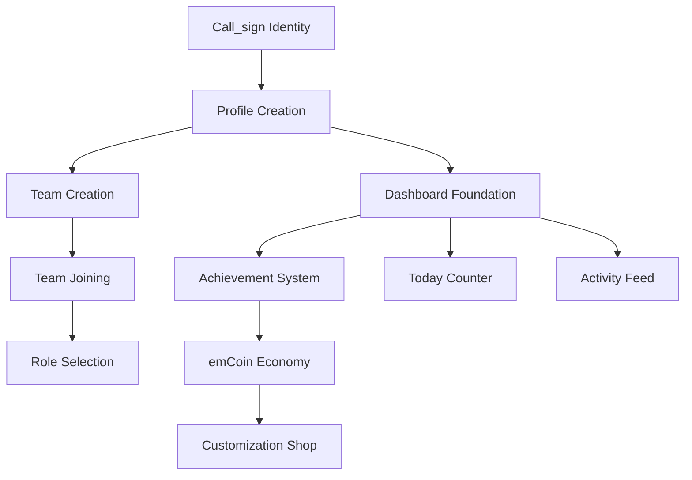

# Educational Identity vs Reality Gap Analysis

**Session**: 00020  
**Date**: 2025-08-17  
**Template**: Following SESSION-00020-RECONCILIATION-HANDOFF.md  
**Focus**: Educational Identity Experience Audit (Not Feature Audit)

---

## Executive Summary

**Critical Finding**: We have a functional system, not an identity platform. Students cannot build meaningful academic personas that they'll obsess over like Koreans did with their minihompys.

**Current Reality**: 
- 4 database tables exist (profiles, teams, team_members, team_join_requests)
- Basic authentication works (Gmail signup verified)
- Simple HTML interface built
- 0 data, 0 identity features, 0 customization

**P0 Requirements**: 48 user stories focused on identity foundation
**Gap**: Missing the soul of educational identity building

---

## Identity Foundation Analysis (US-001 to US-015)

### US-001: Player Registration

**Current Student Experience**: Can create account with email/password via Supabase Auth
**Required Identity Experience**: Beginning of academic journey with ceremony and excitement
**Identity Gap**: No "Welcome to Your Academic Journey" onboarding experience
**Engagement Impact**: Students don't feel they're starting something special
**Implementation Effort**: 8 hours for complete identity onboarding flow
**Identity Dependencies**: Call_sign selection, first achievement, theme choice
**Student Risk**: Without ceremony, just another signup form they'll forget
**Next Action**: Create onboarding flow with identity establishment ceremony

### US-003: Player Profile Creation

**Current Student Experience**: Profile record created in database, no UI
**Required Identity Experience**: Creating unique call_sign as permanent identity marker
**Identity Gap**: No call_sign uniqueness check, no personality expression
**Engagement Impact**: Students can't establish memorable identity
**Implementation Effort**: 6 hours for call_sign selector with availability check
**Identity Dependencies**: Blocks all social features, team identity, achievements
**Student Risk**: Generic profiles = no emotional attachment
**Next Action**: Build call_sign ceremony with real-time uniqueness validation

### US-004: Team Creation

**Current Student Experience**: Teams table exists, basic UI for creation
**Required Identity Experience**: Founding a team as identity milestone
**Identity Gap**: No team customization, logos, colors, or founder recognition
**Engagement Impact**: Teams feel functional, not tribal
**Implementation Effort**: 10 hours for full team identity system
**Identity Dependencies**: Team badges, member roles, achievement system
**Student Risk**: Teams become task groups, not identity anchors
**Next Action**: Add team identity markers (colors, logos, mottos)

### US-005: Team Joining

**Current Student Experience**: Can technically join via team_members table
**Required Identity Experience**: Choosing tribe, declaring allegiance, role selection
**Identity Gap**: No role identity (FE/BE/QB), no joining ceremony
**Engagement Impact**: Joining feels administrative, not social
**Implementation Effort**: 6 hours for role selection and team badge display
**Identity Dependencies**: Profile enhancement, activity feed, social graph
**Student Risk**: No team loyalty or pride development
**Next Action**: Create role selection interface with badge assignment

### US-009: Supervisor Account Creation

**Current Student Experience**: No supervisor-specific features
**Required Identity Experience**: Parent pride in student's academic journey
**Identity Gap**: No supervisor-player linking, no achievement sharing
**Engagement Impact**: Parents disconnected from student identity building
**Implementation Effort**: 12 hours for supervisor dashboard and linking
**Identity Dependencies**: Achievement system, progress tracking, notifications
**Student Risk**: Lost parental engagement and support
**Next Action**: Build supervisor-player relationship system

---

## Social Identity Analysis (US-016 to US-027)

### US-016: Team Foundation

**Current Student Experience**: Can create team with name only
**Required Identity Experience**: Establishing team as identity extension
**Identity Gap**: No logos, colors, themes, mottos, or customization
**Engagement Impact**: Teams indistinguishable, no personality
**Implementation Effort**: 8 hours for team customization suite
**Identity Dependencies**: File upload, theme system, display widgets
**Student Risk**: Teams feel generic, no emotional investment
**Next Action**: Implement team identity customization options

### US-018: Team Member Roles

**Current Student Experience**: No role system implemented
**Required Identity Experience**: Specialized identity within team (FE/BE/QB)
**Identity Gap**: Can't express expertise or contribution style
**Engagement Impact**: All members feel the same, no specialization pride
**Implementation Effort**: 6 hours for role system with badges
**Identity Dependencies**: Achievement system, contribution tracking
**Student Risk**: No sense of unique value to team
**Next Action**: Create role selection with visual indicators

### US-020: Send Team Invitation

**Current Student Experience**: No invitation system
**Required Identity Experience**: Social connection and network building
**Identity Gap**: Can't grow team socially or build alliances
**Engagement Impact**: Teams remain isolated, no inter-team dynamics
**Implementation Effort**: 8 hours for invitation system
**Identity Dependencies**: Notification system, activity feed
**Student Risk**: Static teams, no social expansion
**Next Action**: Build invitation flow with notifications

---

## Identity Dashboard Analysis (US-028 to US-048)

### US-028: Player Dashboard View

**Current Student Experience**: No dashboard exists
**Required Identity Experience**: Personal "academic minihompy" space
**Identity Gap**: No personal space, no customization, no ownership feeling
**Engagement Impact**: No reason to return daily
**Implementation Effort**: 16 hours for complete dashboard with identity features
**Identity Dependencies**: All identity systems (achievements, teams, customization)
**Student Risk**: No addictive daily check-in behavior
**Next Action**: Create dashboard layout with customizable sections

### US-029: Achievement Display

**Current Student Experience**: No achievement system
**Required Identity Experience**: Visual representation of academic journey
**Identity Gap**: Can't showcase accomplishments or progress
**Engagement Impact**: No visible progress, no collection mentality
**Implementation Effort**: 12 hours for achievement system with gallery
**Identity Dependencies**: Database schema, badge assets, unlock logic
**Student Risk**: No sense of progression or accomplishment
**Next Action**: Implement achievement tracking and display

### US-030: Today Counter

**Current Student Experience**: No profile view tracking
**Required Identity Experience**: Social proof and popularity metrics (like Cyworld)
**Identity Gap**: Missing the addictive "check your today count" behavior
**Engagement Impact**: No social validation feedback loop
**Implementation Effort**: 4 hours for view tracking and display
**Identity Dependencies**: Profile view table, real-time updates
**Student Risk**: Missing core addiction mechanic from Cyworld
**Next Action**: Implement profile view tracking with daily counter

### US-031: emCoin Balance

**Current Student Experience**: No virtual economy
**Required Identity Experience**: Economic identity and purchasing power
**Identity Gap**: No currency, no economy, no customization purchasing
**Engagement Impact**: No economic goals or spending decisions
**Implementation Effort**: 8 hours for basic emCoin system
**Identity Dependencies**: Transaction tracking, shop interface
**Student Risk**: No economic engagement layer
**Next Action**: Create emCoin tracking and display

### US-032: Activity Feed

**Current Student Experience**: No activity tracking
**Required Identity Experience**: Living, breathing academic community
**Identity Gap**: Can't see what others are doing, no FOMO
**Engagement Impact**: Platform feels dead, no social energy
**Implementation Effort**: 10 hours for activity feed system
**Identity Dependencies**: Event tracking, real-time updates
**Student Risk**: No social proof or community feeling
**Next Action**: Build activity feed with real-time updates

### US-033: Profile Customization

**Current Student Experience**: No customization options
**Required Identity Experience**: Making space truly "mine"
**Identity Gap**: Can't express personality or preferences
**Engagement Impact**: No ownership feeling, generic experience
**Implementation Effort**: 8 hours for theme and customization system
**Identity Dependencies**: Asset management, preference storage
**Student Risk**: No emotional attachment to platform
**Next Action**: Implement basic customization options (colors, themes)

---

## Critical Path Dependencies

---

## Priority Matrix for Educational Identity

### Identity Blockers (Must Fix First)
1. **No Dashboard** - Can't have identity without a home
2. **No Call_sign System** - Can't have identity without unique name
3. **No Profile UI** - Can't build what you can't see
4. **No Achievement System** - Can't track journey without milestones

### Identity Enhancers (Build Engagement)
1. **Today Counter** - Cyworld's killer feature
2. **Team Badges** - Social identity markers
3. **Activity Feed** - Community energy
4. **First Achievements** - Immediate dopamine

### Identity Foundation (Technical Requirements)
1. **Enhanced Database Schema** - Add identity fields
2. **File Upload** - For avatars and logos
3. **Real-time Updates** - For social features
4. **Notification System** - For engagement

### Identity Polish (Delight Features)
1. **Victory Themes** - Personal celebration
2. **Profile Mottos** - Voice expression
3. **Team Rivalries** - Competitive identity
4. **Supervisor Pride** - Family connection

---

## Resource Estimation Summary

### Week 1 (Identity Foundation)
- Call_sign system: 6 hours
- Dashboard creation: 16 hours
- Profile UI: 8 hours
- Basic achievements: 12 hours
**Total**: 42 hours

### Week 2 (Social Identity)
- Team identity: 10 hours
- Role system: 6 hours
- Activity feed: 10 hours
- Today counter: 4 hours
**Total**: 30 hours

### Week 3 (Economic Identity)
- emCoin system: 8 hours
- Customization: 8 hours
- Shop interface: 6 hours
- Polish: 8 hours
**Total**: 30 hours

**Complete P0 Identity Platform**: ~102 hours (2.5 weeks with single developer)

---

## Risk Assessment

### High Risk
- **No identity = No engagement**: Without personal connection, platform dies
- **Generic experience**: Students won't return without uniqueness
- **Missing Cyworld magic**: Today counter and customization are critical

### Medium Risk
- **Supervisor disconnect**: Parents won't support without visibility
- **Team dynamics**: Without identity, teams are just groups
- **Performance issues**: Real-time features need optimization

### Low Risk
- **Technical complexity**: Stack is simple and proven
- **Scalability**: Can start small and grow
- **Browser compatibility**: Modern standards well supported

---

## Recommendations for Session 21

1. **Start with Dashboard** - Create the home for identity
2. **Implement Call_sign** - Establish unique identity immediately
3. **Add First Achievement** - Hook with immediate reward
4. **Build Today Counter** - Install addiction mechanic
5. **Enable Basic Customization** - Create ownership feeling

**The path is clear**: Transform functional infrastructure into identity platform where students build academic personas with passion.

---

*Using Educational Identity Gap Template from SESSION-00020-RECONCILIATION-HANDOFF.md*