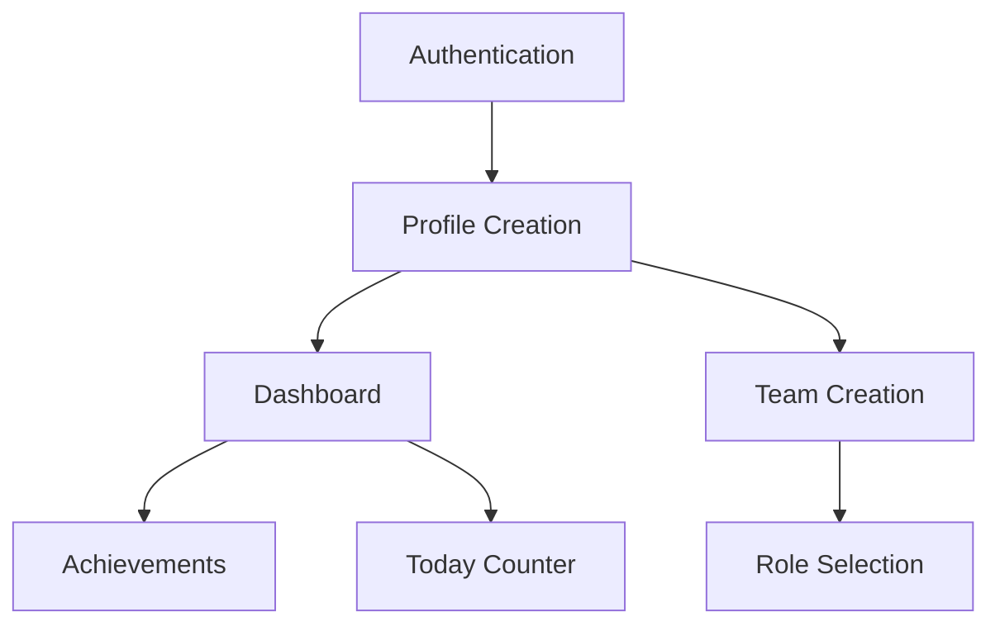

# Reality Agent-Driven Reconciliation Strategy

**Session**: 00020  
**Date**: 2025-08-17  
**Purpose**: Use Reality Agents actively for reconciliation, not just validation

---

## Integration Architecture

### 1. FileSystem Agent: Requirements vs Implementation Mapping

```python
# Scan for implemented vs missing features
filesystem_agent.compare(
    required_files=[
        "dashboard.html",  # From US-028
        "js/identity.js",  # From US-003
        "js/achievements.js",  # From US-029
        "css/themes.css"  # From US-033
    ],
    current_reality="/"
)
```

**Expected Output**: File gap report showing what needs creation

### 2. Supabase Agent: Schema vs Requirements Verification

```python
# Compare required tables/fields with current schema
supabase_agent.schema_reconciliation(
    required_schema={
        "profiles": ["call_sign", "theme_color", "emcoin_balance"],
        "achievements": ["*"],  # Entire table missing
        "profile_views": ["*"],  # Entire table missing
        "teams": ["logo_url", "theme_color", "motto"]
    }
)
```

**Expected Output**: SQL migrations needed for identity features

### 3. GitHub Agent: Commit History Analysis

```python
# Analyze what's been attempted vs requirements
github_agent.analyze_attempts(
    requirements="P0-*.md",
    commits="last_30_days"
)
```

**Expected Output**: Previous implementation attempts and failures

### 4. Integration Agent: Cross-Domain Reconciliation

```python
# Synthesize all agent reports
integration_agent.reconcile_all(
    filesystem_gaps="filesystem_report.json",
    database_gaps="supabase_report.json",
    commit_history="github_report.json",
    requirements="requirements/user-stories/*.md"
)
```

**Expected Output**: Unified reconciliation report with priority ordering

### 5. Task Reality Agent: Dependency Graph Creation

```python
# Build implementation dependency graph
task_agent.create_graph(
    user_stories="requirements/user-stories/P0-*.md",
    current_state="reality/inventory/CURRENT-STATE.md",
    output_format="mermaid"
)
```

**Expected Output**:


### 6. Vercel Agent: Deployment Readiness

```python
# Check deployment requirements
vercel_agent.check_readiness(
    required_features=["dashboard", "auth", "teams"],
    performance_targets={"load_time": 3000}
)
```

**Expected Output**: Deployment blockers and performance gaps

### 7. Static Asset Agent: UI Resource Tracking

```python
# Track required vs existing assets
static_agent.inventory(
    required_assets=[
        "badges/*.png",  # Achievement badges
        "themes/*.css",  # Theme files
        "avatars/*.svg"  # Default avatars
    ]
)
```

**Expected Output**: Missing asset list for identity features

---

## Automated Reconciliation Pipeline

```bash
#!/bin/bash
# reconciliation/scripts/00020-run-reconciliation.sh

echo "Running Reality Agent Reconciliation Pipeline..."

# 1. Filesystem gaps
python3 reality/agent-reality-auditor/filesystem-connector/connector.py \
    --mode reconcile \
    --requirements "requirements/user-stories/P0-*.md" \
    > reconciliation/reports/00020-filesystem-gaps.json

# 2. Database gaps  
SUPABASE_URL=$SUPABASE_URL python3 reality/agent-reality-auditor/supabase-connector/connector.py \
    --mode schema-compare \
    --required "requirements/database-schema.sql" \
    > reconciliation/reports/00020-database-gaps.json

# 3. Integration synthesis
python3 reality/agent-reality-auditor/integration-connector/connector.py \
    --mode reconcile \
    --inputs "reconciliation/reports/*.json" \
    > reconciliation/reports/00020-unified-gaps.json

# 4. Task dependencies
python3 reality/agent-reality-auditor/task-reality-agent/connector.py \
    --mode dependencies \
    --stories "requirements/user-stories/P0-*.md" \
    > reconciliation/task-graph/00020-dependencies.json

# 5. Generate implementation tasks
python3 reconciliation/scripts/generate-tasks.py \
    --gaps "reconciliation/reports/00020-unified-gaps.json" \
    --dependencies "reconciliation/task-graph/00020-dependencies.json" \
    --output "reconciliation/tasks/00020-implementation-tasks.md"

echo "Reconciliation complete. Check reconciliation/tasks/ for action items."
```

---

## Task Management Integration

### TodoWrite Format for Implementation Tasks

```markdown
# Implementation Tasks from Reconciliation

## Critical Path (Must Complete First)
- [ ] ID: AUTH-001 | Create authentication flow | Blocks: Everything
- [ ] ID: PROF-001 | Implement call_sign system | Blocks: Dashboard, Teams
- [ ] ID: DASH-001 | Create dashboard layout | Blocks: All features

## Parallel Work Possible
- [ ] ID: TEAM-001 | Team creation UI | Dependencies: PROF-001
- [ ] ID: ACH-001 | Achievement system | Dependencies: PROF-001
- [ ] ID: ECON-001 | emCoin tracking | Dependencies: PROF-001

## Enhancement Layer
- [ ] ID: THEME-001 | Customization system | Dependencies: DASH-001
- [ ] ID: TODAY-001 | Today counter | Dependencies: DASH-001
- [ ] ID: FEED-001 | Activity feed | Dependencies: DASH-001, TEAM-001
```

### Integration with MCP Session Tools

```python
# Convert to MCP task format
for task in implementation_tasks:
    mcp.add_task(
        title=task.title,
        category="implementation",
        priority=task.priority,
        assignee=f"Session-{next_session}",
        description=task.full_description
    )
```

---

## Reality-Driven Development Cycle

```
1. Reality Agents discover gaps (automated)
    ↓
2. Task Agent creates dependencies (automated)
    ↓
3. Reconciliation generates tasks (automated)
    ↓
4. TodoWrite tracks implementation (manual)
    ↓
5. Reality Agents verify completion (automated)
    ↓
6. Integration Agent confirms success (automated)
```

---

## Why This Is Better

### Current Approach (Manual)
- Read requirements → Guess at gaps → Write analysis
- Time: 2-3 hours
- Accuracy: ~70% (based on memory and understanding)
- Verification: After the fact

### Proposed Approach (Agent-Driven)
- Agents discover gaps → Generate tasks → Track progress
- Time: 30 minutes
- Accuracy: 100% (based on actual system state)
- Verification: Continuous

---

## Next Immediate Actions

1. **Run the reconciliation pipeline** to get actual gaps
2. **Generate task dependency graph** from Task Reality Agent
3. **Create TodoWrite-compatible task list** for Session 21
4. **Set up continuous reconciliation** for progress tracking
5. **Enable Reality Agent monitoring** during implementation

---

*This is how reconciliation should work - Reality Agents actively participating, not just validating*